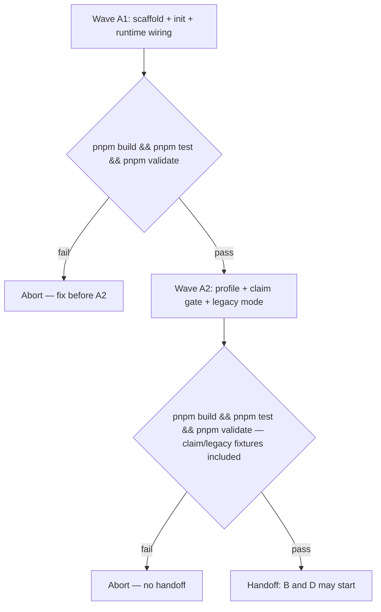

# Wolven harness A — Core (Code spec)

- **Source PRD:** docs/prds/archived/wolven-ai-assisted-dev-harness/wolven-ai-assisted-dev-harness-prd.md (`Executor: code`, `stable`, grilling addendum 2026-09-24)
- **Projeto:** docs/prds/archived/wolven-ai-assisted-dev-harness/wolven-ai-assisted-dev-harness-project.md — Entrega A; grilling decisions Q1–Q22 live in its `## References`
- **Siblings:** docs/specs/archived/wolven-harness-b-wizard/wolven-harness-b-wizard-spec.md · docs/specs/archived/wolven-harness-d-code-lane/wolven-harness-d-code-lane-spec.md · docs/specs/archived/wolven-harness-c-dogfood/wolven-harness-c-dogfood-spec.md
- **Artifact rule:** Implementation lands in `WolvenTech/wolven-harness`. One-Man-Team (OMT) is read-only extract source.
- **Next:** Approved 2026-09-24 → `code-plan` (docs/specs/archived/wolven-harness-a-core/wolven-harness-a-core-plan.md) → `code-execute`, Waves **A1 → A2** (A green by 2026-10-09). B and D start only after A2 PASS.
- **Named proof (structural gate):** `proof-wha-spec-obligations`

## Spec-session decisions (2026-09-24)

Closes the stub's open items. Grilling decisions Q1–Q22 are not reopened.

| # | Decision | Basis |
|---|----------|-------|
| S1 | Runtime wiring: only `claude` gets a symlink (`.claude/skills → ../.agents/skills`). `codex` and `cursor` read `.agents/skills/` natively — no symlink, no runtime directory | Current official docs, fetched 2026-09-24 — see R1.5 |
| S2 | Wave A1/A2 execute runs in a local session using the Human's `gh` auth; `rafiti052` has `push: true` on `WolvenTech/wolven-harness` (verified 2026-09-24: public, empty, default branch `main`). Claude GitHub App on WolvenTech is deferred | Human choice (recommended option) |
| S3 | `validate` skips paths listed in an optional `ignore` key of `.wolven-harness.json` (prefix globs `<dir>/**` only); ignored paths are printed. The package repo ignores `templates/**` and `test/**` | Human choice (recommended option) — the package self-validates while shipping ADR templates and claim fixtures |
| S4 | Node ≥22 (Node 20 reached end-of-life 2026-04-30) | Fact |
| S5 | Spec grilling (2026-09-24): `CLAUDE.md` holds only `@AGENTS.md` (Q1); `ignore` may not cover `docs/` or `.agents/` (Q2); config `version` is schema integer `1` (Q3); `init` runs only at the git top-level (Q4); v0 supports macOS/Linux only (Q5); Cursor may list skills twice with `claude`+`cursor`, accepted on OMT precedent (Q6); legacy mode prints one line per legacy ADR, `--verbose` per claim (Q7); `adr-000` seed stays `stable` (Q8); `validate` resolves from the git top-level (Q9) | Human choices (recommended options) |

## Term challenge

Shared by all four specs.

| Term | Resolution |
|------|------------|
| **Package repo** | `WolvenTech/wolven-harness` — builds and publishes `@wolventech/wolven-harness`. |
| **Consumer** | A repo that runs `wolven-harness init`. The first one is `WolvenTech/agentic-mkt` (Entrega C). |
| **`init`** | The CLI command. Deterministic, creates only missing paths, never edits an existing `AGENTS.md`/`CLAUDE.md`. |
| **`WOLVEN.md`** | The full harness entry the CLI writes at the consumer root. Transient: the wizard integrates it into `AGENTS.md` and deletes it, except in mention-only mode (spec B). |
| **Init wizard** | The agent skill `harness-init` (spec B). Not the CLI. |
| **Source tree** | `.agents/` in the consumer — skills, rules, hooks. Only runtimes that cannot read `.agents/skills/` get symlinks (S1). |
| **Architecture claim** | An ADR reference token in a tracked file (R3.1). Unmarked prose is not a claim. |
| **Profile ADR** | `docs/adrs/adr-NNN-<kebab-slug>.md`, held to R2.2. |
| **Legacy ADR** | An ADR-like file outside `docs/adrs/` (R3.3). Its presence puts `validate` in legacy mode. |
| **Legacy mode** | Validate state while legacy ADRs exist: claims resolving only to a legacy ADR warn; claims resolving to nothing fail. |
| **Ticket / Idea / Area / Routine** | OMT operating vocabulary — never shipped in the package. |

## Repository grounding

| Surface | Present today | Role for Entrega A |
|---------|---------------|--------------------|
| OMT `AGENTS.md`, `CLAUDE.md` | yes | Extract source for the `WOLVEN.md` and `CLAUDE.md` templates — board, Area, Wayfinding, ClickUp stripped |
| OMT `.claude/skills → ../.agents/skills` | yes | Directory symlink Claude Code already loads in OMT — the S1 `claude` wiring |
| OMT `.cursor/`, `.codex/` | yes — no skill symlinks in either | OMT already relies on Cursor and Codex reading `.agents/skills/` natively; Cursor also sees `.claude/skills/` (legacy path) in the same layout |
| OMT `.agents/skills/qmd/`, `.agents/skills/pragmatic-guard/` | yes | Extract source for the two seed skills (R1.8) |
| OMT `.agents/rules/qmd-first.md`, `.agents/rules/yagni-strict.md` | yes | Extract source for the two standing rules (R1.8) — both cite `docs/canon` / `docs/deferrals`, which the rewrite adapts |
| OMT `.agents/hooks/README.md` | yes | Extract source for the hooks placeholder |
| OMT `scripts/validate-harness.ts` | yes | Pattern for required paths and skill-frontmatter checks — rewritten, not copied |
| OMT `scripts/okf-lint.ts` | yes | Pattern for the four profile rules |
| OMT `.qmd/index.yml` | yes | Pattern for consumer QMD collections |
| OMT `docs/adrs/adr-*.md` frontmatter | yes | Pattern for the profile ADR shape |
| `WolvenTech/agentic-mkt` `adrs/adr-001.md` … `adr-009.md` + `adrs/README.md` (Nygard, `## Status`, no frontmatter) | yes (read-only, verified 2026-09-24) | Real legacy-ADR shape — fixture model for R3.3/R3.4 |
| `WolvenTech/wolven-harness` | yes — public, empty; push verified for `rafiti052` | Mutate surface for Waves A1/A2 (S2) |
| Codex skill discovery | docs: https://learn.chatgpt.com/docs/build-skills (redirect from developers.openai.com/codex/skills) | `$CWD/.agents/skills` up to `$REPO_ROOT/.agents/skills`; follows symlinks |
| Cursor skill discovery | docs: https://cursor.com/docs/context/skills | `.agents/skills/`, `.cursor/skills/`; legacy `.claude/skills/`, `.codex/skills/` |
| Claude Code skill discovery | docs: https://code.claude.com/docs/en/skills | `.claude/skills/` only; follows symlinks |

## Surface walk

- **In scope (package repo):** `package.json`, `src/cli.ts`, `src/init/**`, `src/validate/**`, `templates/**`, `test/**`, `test/fixtures/**`, own `AGENTS.md`, `CLAUDE.md`, `.wolven-harness.json`, `docs/adrs/adr-001-claim-path.md`, `README.md`.
- **Template slots for later Entregas:** `templates/.agents/skills/` is manifest-driven, so B and D add skills by adding template folders only — no `init` code change.
- **Out of mutate scope (unchanged):** all OMT paths (`scripts/**`, `.agents/**`, `AGENTS.md`, `.qmd/**`, `.cursor/**`, `.codex/**`, `docs/canon/**`, `docs/adrs/**`); any consumer repo, including `WolvenTech/agentic-mkt` (Entrega C); the package registry (Entrega C).

## Waves

| Wave | Scope | Gate | Abort |
|------|-------|------|-------|
| **A1** | R0, R1 | `pnpm build && pnpm test && pnpm validate` in the package repo | Do not start A2 |
| **A2** | R2, R3, R4 | Same command; tests include every `claim-*` and `legacy-*` fixture | Do not hand off to B/D |

In A1, `validate` only needs to exist and exit 0 on the package repo; the R2–R4 checks switch on in A2. Do not mix A2 work into the A1 batch.

## Requirements (obligation ↔ proof)

Commands run in the package repo.

### R0 — Scaffold

| ID | Obligation | Named proof | Evidence shape |
|----|------------|-------------|----------------|
| R0.1 | Package `@wolventech/wolven-harness`, `engines.node` `>=22`, TypeScript; scripts `build` (tsc → `dist/`), `test` (`tsx --test test/**/*.test.ts`), `validate` (runs the built CLI's `validate` on the repo itself); one `bin` `wolven-harness` with subcommands `init` and `validate`; runtime deps limited to `yaml`; prompts use `node:readline` | `proof-wha-scaffold` | Inspect `package.json`; `pnpm build && pnpm test && pnpm validate` exit 0 |
| R0.2 | No OMT residue in `src/` or `templates/`: no ClickUp/board, Area, Wayfinding, `okf-qmd-kit`, `docs/canon`, `pragmatic-guard.config`; no `LICENSE` (Q22) | `proof-wha-no-residue` | `rg -i "clickup\|board-\|area-context\|wayfind\|okf-qmd-kit\|docs/canon\|pragmatic-guard.config" src templates` empty; `LICENSE` absent |

### R1 — `init`

| ID | Obligation | Named proof | Evidence shape |
|----|------------|-------------|----------------|
| R1.1 | `init` asks, one at a time, git host (`gh` \| `bit`) and runtimes (multi-select of `claude`, `codex`, `cursor`, at least one). Flags `--git-host` and `--runtimes` skip the prompts. With no TTY and a missing flag it exits 1 naming the missing flag. Before any prompt, `init` exits 1 unless the working directory is the output of `git rev-parse --show-toplevel` (S5/Q4) | `proof-wha-init-prompts` | Tests: flags-only run succeeds; no-TTY without flags exits 1 with message; run from a subdirectory and from a non-git dir each exit 1 and create nothing |
| R1.2 | `init` writes `.wolven-harness.json` `{ "version": 1, "gitHost", "runtimes" }` — `version` is the config schema version, not the package version (S5/Q3). On re-run with the file present, its values are the defaults and no prompt is shown unless a flag overrides. `init` never writes or removes the `ignore` key (S3) | `proof-wha-init-config` | Test: second run without flags reads the file, asks nothing; a hand-added `ignore` survives the re-run |
| R1.3 | `init` creates only missing paths from the template manifest: `WOLVEN.md`; `.agents/skills/<each template skill>/**`; `.agents/rules/{qmd-first,yagni-strict}.md`; `.agents/hooks/README.md`; `docs/WRITING-PROFILE.md`; `docs/adrs/adr-000-record-architecture-decisions.md` (`stable`); `docs/{specs,notes,deferrals}/.gitkeep`; `.qmd/index.yml` (collections `adrs`, `specs`, `notes`, `deferrals`, pattern `*.md`) | `proof-wha-init-surfaces` | Test: `init` into an empty fixture; created list equals manifest |
| R1.4 | `init` never overwrites, edits, or deletes an existing path, and never creates or edits `AGENTS.md`. It prints `created:` and `skipped (exists):` lists, then a closing line telling the Human to run the `harness-init` skill, and exits 0. A second run creates nothing | `proof-wha-init-skip` | Test: fixture with existing `AGENTS.md`, `CLAUDE.md`, `.claude/skills/` → byte-identical after run; skip list names them; closing line present; re-run creates nothing |
| R1.5 | Runtime wiring (S1): `claude` → directory symlink `.claude/skills` → `../.agents/skills` and, only if absent, `CLAUDE.md` containing `@AGENTS.md`; `codex` and `cursor` → no files, because both read `.agents/skills/` natively. If the symlink cannot be created, `init` exits 1 with a message naming the platform limit; v0 supports macOS and Linux only, stated in `README.md` (S5/Q5). Package `README.md` cites the three discovery-doc URLs from Repository grounding | `proof-wha-runtime-wiring` | Tests: `--runtimes claude` yields the symlink (resolves to `.agents/skills`) and `CLAUDE.md`; `--runtimes codex,cursor` creates no `.claude/`, `.codex/`, or `.cursor/` path; README greps for the three URLs and the macOS/Linux line |
| R1.6 | With a consumer `package.json`, `init` adds `"harness:validate": "wolven-harness validate"` only if that key is absent; no other key changes | `proof-wha-init-script` | Test: `package.json` diff is exactly one added key |
| R1.7 | `WOLVEN.md` template carries: first line telling the agent to run `harness-init` step 0; entry router; "before you answer from memory" (QMD first); skills table (all installed skills); standing rules; architecture-claim rule (R3); validate command | `proof-wha-wolven-template` | Test: section and name assertions on the rendered file |
| R1.8 | Seed extract, rewritten portable: `qmd` skill and `qmd-first` rule search `-c adrs` first, then widen, with no OMT collection names; `pragmatic-guard` skill and `yagni-strict` rule record deferrals under `docs/deferrals/` (`type: deferral`) and cite no config file; `hooks/README.md` is a placeholder naming no hook | `proof-wha-seed-extract` | Inspect the five template files; `rg -n "canon\|concepts\|sources\|config.yml" templates/.agents` empty |

### R2 — Thin writing profile

| ID | Obligation | Named proof | Evidence shape |
|----|------------|-------------|----------------|
| R2.1 | `docs/WRITING-PROFILE.md` (template, ≤80 lines) documents the four rules and the profile ADR shape (`adr-NNN-<kebab-slug>.md`; `type: adr`, `title`, `description`, `status` ∈ `draft\|stable\|deprecated`; `superseded_by` required when `deprecated`) | `proof-wha-profile-doc` | Inspect template; line count ≤80 |
| R2.2 | `validate` enforces four rules on `docs/{adrs,specs,notes,deferrals}/*.md`: (a) frontmatter with non-empty `type`, `title`, `description`, `status`; (b) `status` ∈ `draft\|stable\|deprecated`; (c) `type` matches directory (`adr`, `spec`, `note`, `deferral`); (d) kebab-case ASCII filename. For `docs/adrs/`, also the `adr-NNN-<kebab-slug>.md` name and `superseded_by` when `deprecated` | `proof-wha-profile-rules` | Tests: one failing fixture per rule (exit 1, rule named); clean fixture exit 0 |

### R3 — ADR claim gate

| ID | Obligation | Named proof | Evidence shape |
|----|------------|-------------|----------------|
| R3.1 | A claim is a token matching `\bADR-\d{3}\b` or `\badr-\d{3}-[a-z0-9]+(?:-[a-z0-9]+)*` in any file from `git ls-files`, excluding ADR files themselves (profile and legacy), `node_modules/**`, paths containing `/archived/`, and `ignore` paths (R3.7). A bare `adr-NNN` without slug is not a claim | `proof-wha-claim-scan` | Test: tokens in `src/*.ts`, `AGENTS.md`, `docs/specs/*.md` reported; tokens inside ADR files and ignored paths not reported |
| R3.2 | Normal mode: a claim passes only if exactly one profile ADR with that number exists, it passes R2.2, and its `status` is `stable` (Q15). Missing, duplicate, invalid, `draft`, or `deprecated` (message names `superseded_by`) fails. An `adr-NNN-<slug>` token must match the filename slug | `proof-wha-claim-fail-closed` | Tests: `claim-missing`, `claim-duplicate`, `claim-draft`, `claim-deprecated`, `claim-slug-mismatch` exit 1 with file:line + ADR id; `claim-ok` exit 0 |
| R3.3 | Legacy detection: a legacy ADR is any tracked, non-ignored file outside `docs/adrs/` whose basename matches `/^adr-?\d{3}.*\.md$/i` (e.g. `adrs/adr-002.md` with a `## Status` section). Each legacy file is reported once as a **warning** naming the drift and pointing to the `harness-init` migration step (Q5), in the form `legacy ADR-NNN (<path>): <n> claims in <m> files — migrate via harness-init` (S5/Q7) | `proof-wha-legacy-detect` | Test: fixture modelled on agentic-mkt (`adrs/adr-00{1,2}.md` Nygard + `adrs/README.md`) → exactly two warning lines with claim counts, README not reported, exit 0 |
| R3.4 | Legacy mode: a claim whose number matches only a legacy ADR is a **warning** (Q6), counted in its ADR's R3.3 line and listed per file:line only with `validate --verbose` (S5/Q7); a claim matching no ADR at all **fails** (Q7); a number with both a profile and a legacy ADR fails as duplicate | `proof-wha-legacy-claims` | Tests: legacy fixture + `ADR-002` in `AGENTS.md` → warn, exit 0, file:line shown only with `--verbose`; + `ADR-999` → exit 1 |
| R3.5 | Outside a git work tree, `validate` exits 1 with "claim gate requires git". Inside one, it resolves every path from `git rev-parse --show-toplevel`, whatever the working directory (S5/Q9) | `proof-wha-claim-no-git` | Tests: non-git temp dir → exit 1; run from a subdirectory → same output as from the top-level |
| R3.6 | Package repo records the policy as `docs/adrs/adr-001-claim-path.md` (`stable`) and its `AGENTS.md` cites `ADR-001`; `validate` prints `claims: <n> ok, <n> legacy-warn, <n> fail` | `proof-wha-self-claim` | `pnpm validate` exit 0 and prints `claims: 1 ok` or more |
| R3.7 | `ignore` (S3): optional array in `.wolven-harness.json`; each entry must be `<relative-dir>/**` and must not cover `docs/` or `.agents/` (S5/Q2), otherwise `validate` exits 1 naming the entry. Ignored paths are skipped by R2.2, R3.1, and R3.3, and `validate` prints `ignored: <entries> (<n> files)`. The package repo sets `["templates/**", "test/**"]` | `proof-wha-ignore` | Tests: fixture with `ADR-999` under an ignored dir → exit 0 and `ignored:` line; malformed entry `*.md` → exit 1; `docs/**`, `docs/adrs/**`, and `.agents/**` → exit 1; package `.wolven-harness.json` inspected |

### R4 — Validate spine

| ID | Obligation | Named proof | Evidence shape |
|----|------------|-------------|----------------|
| R4.1 | `validate` fails when `.agents/skills/*/SKILL.md` lacks frontmatter `name` or `description`, or when a `.agents/rules/<name>.md` path cited in `WOLVEN.md` or `AGENTS.md` does not exist | `proof-wha-skill-frontmatter` | Tests: missing `name` fixture exit 1; cited-but-missing rule exit 1 |
| R4.2 | While `WOLVEN.md` exists and `AGENTS.md` is absent or does not mention `WOLVEN.md`, `validate` warns "harness-init step 0 pending" (exit 0) | `proof-wha-step0-pending` | Test: fresh `init` fixture → warning; after adding a mention → no warning |

## Nine-dimension landings

| Dimension | Landing kind | Landing |
|-----------|--------------|---------|
| validation | obligation / proof | R2.2 / `proof-wha-profile-rules`; R3.2 / `proof-wha-claim-fail-closed`; R3.7 / `proof-wha-ignore` — malformed ignore entries fail |
| failure modes | obligation / proof | R3.4 / `proof-wha-legacy-claims` — invented ADRs fail even in legacy mode; R3.5 / `proof-wha-claim-no-git` |
| idempotency and retry | obligation / proof | R1.4 / `proof-wha-init-skip` — re-run creates nothing; R1.2 / `proof-wha-init-config` — re-run reuses answers and keeps `ignore` |
| authorization | `n/a` | Unchanged surface: `init` and `validate` run with the invoking user's filesystem rights only; push rights are the Human's existing `gh` auth (S2); registry auth belongs to spec C |
| concurrency and ordering | `n/a` | Unchanged surface: single-process CLI over the working tree, no shared state or locks; wave order is carried by the Waves gates |
| data lifecycle | obligation / proof | R3.1 / `proof-wha-claim-scan` — `/archived/` excluded; R3.2 — `deprecated` ADRs fail with `superseded_by` |
| external-dependency failure | obligation / proof | R3.5 / `proof-wha-claim-no-git`; R1.1 / `proof-wha-init-prompts` — no TTY without flags fails loudly |
| state transitions | obligation / proof | R3.3 + R3.4 / `proof-wha-legacy-detect` — legacy mode → normal mode once no legacy ADR remains; R4.2 / `proof-wha-step0-pending` — `WOLVEN.md` pending → integrated |
| observability | obligation / proof | R3.6 / `proof-wha-self-claim` — claim counts printed; R3.7 — ignored paths printed; R1.4 — created/skipped lists |

## Unresolved

| Identifier | Decision needed | Owner | Blocking effect | Disposition |
|------------|------------------|-------|------------------|------------|
| `U-a-repo-create` | Repo exists and the execute session can push | Human | — | Resolved 2026-09-24: public, empty, `rafiti052` `push: true`; local `gh` session (S2) |
| `U-a-cloud-app` | Install the Claude GitHub App on WolvenTech for cloud execute sessions | Human (org admin) | Non-blocking for A | Defer — trigger: first execute or review run needs a cloud session on a WolvenTech repo |
| `U-a-codex-cursor-paths` | Codex and Cursor repo skill-discovery paths | — | — | Resolved 2026-09-24 from official docs (S1, R1.5) |

## Out of scope

- Wizard behaviour, stub warnings, ADR migration, `CLAUDE.md` edits after install (spec B)
- `adr` and `code-*` skills (spec D)
- Publish config, registry auth, and consumer install (spec C)
- Reading legacy ADR status (legacy ADRs only warn — Q5/Q6)
- `.cursor/skills/` or `.codex/skills/` wiring (native `.agents/skills/` reading makes them redundant — S1)
- `init` upgrade/migration between package versions; `docs/index.md` generator; wired hooks

## Pragmatic-guard refuses

- Config beyond `.wolven-harness.json` `{version, gitHost, runtimes, ignore?}`
- `ignore` shapes other than `<dir>/**`, or a glob-matcher dependency to support them
- Windows symlink fallbacks (copies or junctions) in v0
- Running `init` outside the git top-level, including monorepo subpackages
- More than four profile rules or OKF v0.2 conformance
- A prompt library dependency (use `node:readline`)
- Auto-editing `AGENTS.md` or an existing `CLAUDE.md` from the CLI
- Symlinks for runtimes that already read `.agents/skills/`

## Acceptance

Evidence: package `feat/a-core` at `29f8841`; Wave A1 and A2 gates PASS 2026-09-24 (`pnpm build && pnpm test && pnpm validate`, 114 tests). Test-name prefixes per proof, recorded in the plan (units 07 and 13). Squash-merged to `main` as `f33de1d` (WolvenTech/wolven-harness#1, 2026-09-25); `feat/a-core` SHAs are not on `main`.

### Wave A1

- [x] `proof-wha-scaffold` PASS — `cli` (5) + gate build
- [x] `proof-wha-no-residue` PASS — residue `rg` empty, no `LICENSE`
- [x] `proof-wha-init-prompts` PASS — `init-prompts:` (8)
- [x] `proof-wha-init-config` PASS — `init-config:` (6)
- [x] `proof-wha-init-surfaces` PASS — `init-surfaces:` (3)
- [x] `proof-wha-init-skip` PASS — `init-skip:` (5)
- [x] `proof-wha-runtime-wiring` PASS — `runtime-wiring:` (7)
- [x] `proof-wha-init-script` PASS — `init-script:` (4)
- [x] `proof-wha-wolven-template` PASS — `wolven-template:` (4)
- [x] `proof-wha-seed-extract` PASS — `seed-extract:` (7)

### Wave A2

- [x] `proof-wha-profile-doc` PASS — `profile-doc:` (2)
- [x] `proof-wha-profile-rules` PASS — `profile-rules:` (13)
- [x] `proof-wha-claim-scan` PASS — `claim-scan:` (6)
- [x] `proof-wha-claim-fail-closed` PASS — `claim-fail-closed:` (7)
- [x] `proof-wha-legacy-detect` PASS — `legacy-detect:` (2)
- [x] `proof-wha-legacy-claims` PASS — `legacy-claims:` (4)
- [x] `proof-wha-claim-no-git` PASS — `claim-no-git:` (3)
- [x] `proof-wha-self-claim` PASS — `self-claim:` (1) + package `pnpm validate` → `claims: 2 ok, 0 legacy-warn, 0 fail`
- [x] `proof-wha-ignore` PASS — `ignore:` (7) + `ignore-guard:` (8)
- [x] `proof-wha-skill-frontmatter` PASS — `skill-frontmatter:` (7)
- [x] `proof-wha-step0-pending` PASS — `step0-pending:` (2)

### Pre-merge closure

Closure for the initiative (archive specs/plans/PRD, ADRs `stable`, `pnpm docs:index && pnpm validate`) lives in spec C. Entrega A closes when the Wave A2 gate PASS is recorded in the TAP.

## Eval / gates

| Gate | Command / check | When | PASS | Abort |
|------|-----------------|------|------|-------|
| Package integrity | `pnpm build && pnpm test && pnpm validate` | End of A1, A2 | exit 0 | Fix before next wave |
| Claim gate | `pnpm test` covering all `claim-*`, `legacy-*`, and `ignore-*` fixtures | End of A2 | failing fixtures exit 1, warn fixtures exit 0 | Do not hand off to B/D |
| OMT integrity | `pnpm validate` in OMT | After OMT doc writes | exit 0 | Fix OMT docs |
| Spec obligations | `proof-wha-spec-obligations` — each acceptance box names one proof; each proof in exactly one R row; nine landings; every `n/a` cites an unchanged surface | Before `code-plan` | all hold | Do not plan |

## Cross-domain leak ID

| Leak | Refuse |
|------|--------|
| Board/ClickUp Tickets | Executor is code |
| Wizard or Code lane work inside A | Specs B and D |
| Publish or agentic-mkt install inside A | Spec C |
| OMT harness edits "to match" | OMT unchanged |
| Catalogue picker / sales-charter / OSS release | Deferrals under `docs/deferrals/wolven-harness-*` and Q22 stay authoritative |
| Executable plan from this skill | `code-plan` only |

## ADR

- **OMT:** none — OMT wiring unchanged.
- **Package repo:** `adr-001-claim-path.md` (R3.6) records the claim gate, legacy mode, and the `ignore` escape hatch (S3).
