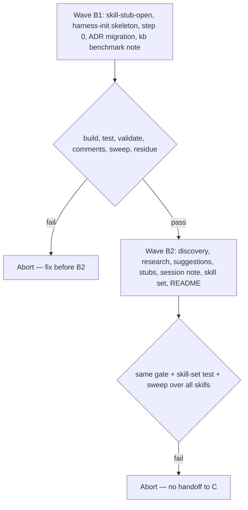

# Wolven harness B — Init wizard (Code spec)

- **Source PRD:** docs/prds/archived/wolven-ai-assisted-dev-harness/wolven-ai-assisted-dev-harness-prd.md (`Executor: code`, `stable`; grilling addendum 2026-09-24; notes "shipped-artifact language" and "merges, versions, and changelog")
- **Projeto:** docs/prds/archived/wolven-ai-assisted-dev-harness/wolven-ai-assisted-dev-harness-project.md — Entrega B; grilling decisions Q1–Q22 in its `## References`
- **Siblings:** docs/specs/archived/wolven-harness-a-core/wolven-harness-a-core-spec.md (`stable`, merged as `f33de1d`) · docs/specs/archived/wolven-harness-d-code-lane/wolven-harness-d-code-lane-spec.md (`stable`, merged as `d495802`) · docs/specs/archived/wolven-harness-c-dogfood/wolven-harness-c-dogfood-spec.md
- **Artifact rule:** Implementation lands in `WolvenTech/wolven-harness`, on a branch cut from `origin/main` (`d495802`). One-Man-Team holds the records and the benchmark note.
- **Next:** Done — WolvenTech/wolven-harness#3 squash-merged as `4af0e7c` (2026-09-28), gate green on `main` (440 tests). C starts from its stub; initiative closure lives in spec C.
- **Named proof (structural gate):** `proof-whb-spec-obligations`

## Spec-session decisions (2026-09-26)

Closes the stub's open items. Grilling decisions Q1–Q22 and spec D's D-Q decisions are not reopened.

| # | Decision | Basis |
|---|----------|-------|
| B-Q1 | **Runtime playbook, not a scripted fix.** `harness-init` gives the agent rules for what it will meet in an unknown repo: `harness:validate` output is the feedback loop, anything ambiguous goes to the Human as a question, and nothing is special-cased for a known consumer. The skill ships no migration code or CLI. A claim that starts failing after migration is expected input for the agent to work through with the Human, not a defect of the skill | Human (2026-09-26: "we don't solve for this case, we strengthen the agent possibilities of facing it in runtime") |
| B-Q2 | One skill, `harness-init`, **model-invocable**. The Human starts it, prompted by `init`'s closing line and the `step0-pending` warning (agents read `AGENTS.md`, not `WOLVEN.md`), and being model-invocable lets a plain ask like "set up the harness" match it. Each writing step waits for the Human's choice and shows the diff before writing, so there is a person in the loop without the ask-only flag | Recommended; reasoning corrected by the Human after the walkthrough |
| B-Q3 | Step order: **0** entry integration → **1** legacy ADR migration (optional; offered only when `validate` reports `legacy-adr`) → **2** discovery → **3** research → **4** suggest 2–4 skills → **5** write stubs → **6** session note and hand-back. Re-runs skip what is already done: step 0 when `WOLVEN.md` is gone or `AGENTS.md` already mentions it (and, per B-Q18, a refresh offer instead of a second fold when `AGENTS.md` already holds the harness section), step 1 when there are no legacy warnings | Recommended; B-Q18 |
| B-Q4 | Step 0 modes. **Full:** the `WOLVEN.md` body (without its first line) goes into `AGENTS.md` as a `## Wolven harness` section, its H1 dropped and its other headings demoted one level (B-Q18); with no `AGENTS.md`, `WOLVEN.md` becomes `AGENTS.md`. **Light:** `AGENTS.md` gets a short `## Wolven harness` block (where skills and rules live, the standing-rule citations, the architecture-claims rule, QMD first, the validate command) and no router or skills table. **Mention-only:** `AGENTS.md` gets one line pointing at `WOLVEN.md`, and `WOLVEN.md` stays without its first line. `WOLVEN.md` is deleted in full and light (Q11). The agent recommends a mode from what it reads (no `AGENTS.md` or a short one → full; a long, curated one → light), and the Human picks | Q11 + recommended block contents |
| B-Q5 | Step 0 also checks, generically: existing `AGENTS.md` content is never removed or rewritten without the Human's OK, and overlaps (a second router, a clashing rule) are listed as questions; a `CLAUDE.md` that does not import `AGENTS.md` gets an offer to add `@AGENTS.md`; and `git check-ignore` on `.agents/`, `docs/`, and the wired runtime paths — an ignored harness path is reported with its `.gitignore` line, and the Human decides | Recommended (spec A left `CLAUDE.md` edits to B) |
| B-Q6 | Migration rules: keep the legacy number (claims keep resolving) and stop on a collision with an existing profile ADR; `git mv` to `docs/adrs/adr-NNN-<slug>.md`, with the slug derived from the title; prepend frontmatter (`type: adr`, `title`, a one-sentence `description`, mapped `status`) and keep the body verbatim. Status mapping: `Accepted` → `stable`; `Proposed` → `draft`; `Superseded by <ADR>` → `deprecated` with `superseded_by` set to the successor's new filename. Everything else (superseded with no successor, deprecated, rejected, amended, several statuses, or no status) is a question for the Human, offering only options that pass `validate`. The agent never guesses | Recommended |
| B-Q7 | Migration closure: recompute every relative link **into** a moved file and every relative link **out of** one (its depth changed). A non-ADR file in the legacy folder, such as an index, is never moved into `docs/adrs/` (the profile would fail it); the Human chooses to delete it or keep it with its links rewritten. Then run `harness:validate` and resolve each failing claim with the Human: repoint it, reword it, or record a new decision through `adr`. The step is done when validate exits 0 with `0 legacy-warn`, after which the agent points to the repo's own test and lint commands, since links in source files moved. The Human reviews the whole diff | Recommended; B-Q1 |
| B-Q8 | Discovery reads what the repo shows (manifests, lockfiles, README, `AGENTS.md`, CI config, `docs/adrs/`, installed skills, top-level layout) and asks the Human only for what files cannot show: lifecycle stage (prototype, MVP, production, maintenance) and decisions not yet visible in code. It produces three lists: context, lifecycle, and decided tools | Recommended; PRD Q4=A |
| B-Q9 | Research: repo and QMD first. Web research is optional, runs only on the Human's OK, is capped at 5 primary-source fetches, and covers decided tools only; every finding is cited in the session note. For depth on one tool the agent offers the `research` skill (D-Q19). If the web is unavailable, it continues repo-only and says so in the note | Recommended |
| B-Q10 | Suggest 2–4 architectural skills, each named for a decided tool or field, citing the discovery evidence, and never duplicating an installed skill. If the evidence supports fewer than 2, the agent says so rather than padding. The Human picks any subset; there is no catalogue pick (deferral docs/deferrals/skills-catalogue/skills-catalogue-deferral.md) | PRD Q5=A, Q3 carve-out |
| B-Q11 | A stub is `.agents/skills/<name>/SKILL.md` plus `agents/openai.yaml`, rendered from `references/stub-template.md`. Its frontmatter has `name`, a `description` that says it is a stub, `metadata: { wolven-harness: stub }`, and `disable-model-invocation: true`; `openai.yaml` sets `policy.allow_implicit_invocation: false`. A half-written skill therefore never fires on its own. The body holds the discovery evidence and headed prompts for the Human's instructions. An existing folder is never overwritten. Defining the skill means writing the body and removing the marker (and the ask-only flags, if wanted) | Recommended (`metadata` is the Agent Skills spec's free map, so strict runtimes accept it) |
| B-Q12 | `validate` gains the spine rule `skill-stub-open`: a warning (exit 0) for each `.agents/skills/*/SKILL.md` whose frontmatter has `metadata.wolven-harness: stub`. It is a warning, not an error; C's zero-warning bar covers legacy warnings only | Stub scope ("`validate` warns on open stubs") |
| B-Q13 | The session note is `docs/notes/harness-init-<yyyy-mm-dd>/harness-init-<yyyy-mm-dd>-note.md` (D-Q21 layout; a second run on the same day adds `-2`), with `type: note`. It is created as `draft` at the start of step 0; each phase adds its section before that phase's commit offer, so each phase commit carries its part of the note, and it turns `stable` at hand-back in the setup phase. An interrupted run leaves a `draft` note that the next run resumes from. Sections: Entry integration, ADR migration, Discovery, Research, Suggestions, Stubs, and Next steps for the Human | Recommended |
| B-Q14 | Proof shape: skill-contract tests (as in spec D), fixture tests that render the skill's own examples (the light block, a migrated ADR, a stub, the session note) and run `validate` on them, and a spine test for `skill-stub-open`. No scripted transcript; the live run is spec C's dogfood | Recommended |
| B-Q15 | `harness-init` joins the D-Q1 exclusion in the PRD sweep, since it teaches "the Human" in the same voice as the Code lane skills. The template skill set becomes 16, and the ask-only set stays at 4 | Recommended |
| B-Q16 | The compozy/kb benchmark is a One-Man-Team note, `docs/notes/archived/wolven-harness-kb-benchmark/wolven-harness-kb-benchmark-note.md`, citing kb at `d7c8261`. It only compares: each kb codebase capability (analysis of symbols and dependencies, complexity and blast radius, `inspect`, QMD index) is marked **adopt as a discovery prompt** or **out of scope**, and kb may come up as a decided tool a consumer already uses. Nothing is vendored, and it never ships in the package | Stub; PRD Q0 |
| B-Q17 | **Phased commits.** The run has three writing phases: **entry** (step 0), **migration** (step 1), and **setup** (steps 2–6 — the stubs and the final note). At the end of each phase, after `harness:validate` exits 0 (with `0 legacy-warn` for migration), the agent offers one commit of that phase through `code-commit` and commits only on the Human's yes. Never one commit at the end, and never a commit per file, ADR, claim, or stub. A declined commit leaves the phase uncommitted, and the next phase's offer covers only its own paths, so the phases stay separate | Human (after the walkthrough, 2026-09-26) |
| B-Q18 | **PR review fixes.** Full mode drops the `WOLVEN.md` body's H1 and demotes its other headings one level under `## Wolven harness` (the no-`AGENTS.md` case keeps the H1 as the title). An `AGENTS.md` that already holds the harness section (a `## Wolven harness` heading, or the router's `# Wolven harness — entry router` title) was integrated by an earlier run: when `init` brings `WOLVEN.md` back, step 0 never folds twice; it shows the diff, asks whether to refresh the section, then deletes `WOLVEN.md`. The light block also names the doc layout and `docs/WRITING-PROFILE.md`. `validate` reads each `SKILL.md` once for `skill-frontmatter` and `skill-stub-open` (same output) | WolvenTech/wolven-harness#3 review (2026-09-28), fixed at `5182624` |
| B-Q19 | **Ignored harness paths fail.** `validate` gains the spine rule `harness-ignored`, an **error** for each harness path present on disk (`.agents/skills`, `.agents/rules`, `.agents/hooks`, `.qmd`, `docs`, `.claude/skills`, `AGENTS.md`, `CLAUDE.md`, `.wolven-harness.json`) that an ignore rule excludes, naming the rule and its source (`git check-ignore --stdin -z -v -n`; a `!` re-include as the last match is fine, and tracked files are never reported). Amends B-Q5's check 4: step 0 never deletes the repo's ignore lines. It proposes re-include rules appended after them (re-include the folder, ignore its contents, re-include each harness path; `!.claude/skills` without a trailing slash because it is a symlink), shows the diff, writes them only on the Human's yes, and says that `validate` stays red on a no. Rules from personal excludes files are pointed out, not edited | Human (2026-09-28): pre-mortem F2 — an ignored `.agents/` passed on the installing machine while every other clone got `rule-missing`; the fix is to make it loud and fix it with `.gitignore` rules, not to widen the filter (the spine already reads from disk) |
| B-Q20 | **Existing doc folders.** An existing `docs/` collides with the harness only through the five doc folders the writing profile governs; the rest of `docs/` is left alone. Step 0 gains a fifth check: content the harness did not write under `docs/{adrs,prds,specs,notes,deferrals}/` is listed, and each item is a question (reshape into the doc-folder layout, or move it out). A configurable docs root (`init --docs-dir`) is deferred with triggers: docs/deferrals/docs-root/docs-root-deferral.md | Human (2026-09-28, after the pre-mortem); scratch run: a flat `docs/specs/*.md` fails `profile-flat-layout`, while `docs/getting-started.md` and `docs/api/**` pass |
| B-Q21 | **Honest migration (last B round; B-owned text only).** (1) The status table gains an ask row: when the ADR or an index of the legacy folder says part of a superseded ADR still applies, offer splitting the still-binding part into a new ADR through `adr` and then deprecating, or keeping it `stable` with the Human's decision recorded; `Superseded by` maps directly only when nothing says so. (2) Before writing a status other than `stable`, search the whole repo, tests included, for the ADR's tokens and treat each forced test edit as a claim to work through. (3) Closure reads each claim to a touched ADR against its title and asks about each mismatch. (4) The session note's ADR migration section carries a per-ADR table (number, title, legacy status, mapped status, evidence, decision) and the claims worked through, naming ADRs by bare number and title only, since the claim scan reads `docs/notes/` and a claim to a deprecated ADR fails. The `validate` fixes from the same grilling go to spec C | Human (grilling, 2026-09-28) on pre-mortem F1/F3: agentic-mkt's ADR-001 is superseded yet partly binding and pinned by its contract tests; its renumbered ADR-003 citations resolve to the wrong decision |

## Term challenge

Inherits spec A and spec D's tables. Added:

| Term | Resolution |
|------|------------|
| **Init wizard** | The skill `harness-init`, an agent session (Q2=B); not a CLI. |
| **Entry integration** | Step 0: merging `WOLVEN.md` into `AGENTS.md` in one of three **modes**, `full`, `light`, or `mention-only` (B-Q4). |
| **Legacy ADR** | Spec A's definition, unchanged: a tracked file outside `docs/adrs/` whose basename matches `adr-?NNN*.md`. |
| **Migration** | Step 1: turning legacy ADRs into profile ADRs, closed by `harness:validate` (B-Q6, B-Q7). |
| **Decided tool** | A tool or platform the repo already committed to, seen in code or confirmed by the Human (B-Q8). |
| **Stub** | An ask-only skill folder written by step 5 and carrying `metadata.wolven-harness: stub` until the Human defines it (B-Q11). |
| **Session note** | The record of one `harness-init` run (B-Q13). |

## Repository grounding

| Surface | Present today | Role for Entrega B |
|---------|---------------|--------------------|
| Package `src/validate/spine.ts` — `skill-frontmatter`, `rule-missing`, `step0-pending` | yes, on `main` `d495802` | Gains `skill-stub-open` (B-Q12). `step0-pending` already clears once `WOLVEN.md` is gone or `AGENTS.md` mentions it, so the modes need no change there |
| Package `src/validate/{legacy,claims}.ts` — legacy detection, `legacy-adr` and `legacy-claim` warnings, `claim-deprecated` / `claim-draft` failures | yes | Unchanged. The migration step reads their output; the `legacy-adr` message already says "migrate via harness-init" |
| Package `templates/WOLVEN.md` — first line "run the `harness-init` skill, step 0"; router; claims rule | yes | Source text for the full and light modes; skills table picks up `harness-init` on its own (`render-wolven.ts`) |
| Package `src/init/index.ts` — closing line "run the harness-init skill"; `src/init/runtimes.ts` — `CLAUDE.md` = `@AGENTS.md` only when absent | yes | Unchanged; step 0 handles an existing `CLAUDE.md` (B-Q5) |
| Package `templates/docs/adrs/adr-000-record-architecture-decisions.md` | yes | The number collision rule in B-Q6 covers it |
| Package `templates/.agents/skills/{adr,research,grilling,qmd}` | yes (spec D) | `adr` records new decisions during the claim loop; `research` for depth; `grilling` shape for one-question-at-a-time asks; `qmd` for repo-first search |
| Package `test/ask-only.test.ts` (15 skills, 4 ask-only), `test/helpers/skill-contract.ts` (`readSkill`, `assertSkillBasics`, `renderInto`, `minimalValidateFixture`) | yes | Set grows to 16; helpers reused for the fixture proofs |
| Consumer shape (read-only, for realism only): `WolvenTech/agentic-mkt` `origin/main` `531652f` — `adrs/adr-001…009.md` in Nygard form (7 `Accepted`, `Superseded by [ADR-004]`, `Superseded` with no successor) plus `adrs/README.md`; 41 claim tokens in 16 files; a 388-line `AGENTS.md`; `.gitignore` ignores `.agents/`, `.claude/`, `.cursor/`, `.codex/` | yes | Checks that the rules cover the cases a real repo holds. Per B-Q1 nothing in the skill names or scripts this repo |
| compozy/kb `d7c8261` README — `kb ingest codebase` (symbols, files, dependencies, complexity, blast radius, coupling, dead code), 10 `inspect` subcommands, QMD index | yes — https://github.com/compozy/kb | Benchmark input (B-Q16) |
| Agent Skills frontmatter `metadata` map — https://agentskills.io/specification | yes | Stub marker (B-Q11) |

## Surface walk

- **In scope (package repo):**
  - `templates/.agents/skills/harness-init/**`: `SKILL.md` and `references/{entry-modes,adr-migration,discovery,stub-template,session-note-template}.md`
  - `src/validate/spine.ts` (`skill-stub-open`; `harness-ignored` per B-Q19)
  - `test/**` (new `skill-harness-init`, `stub-warn` cases; `ask-only` set to 16)
  - `README.md` (the wizard section)
- **In scope (OMT, record only):** this spec, its plan, `docs/notes/archived/wolven-harness-kb-benchmark/wolven-harness-kb-benchmark-note.md`, the PRD sweep exclusion (B-Q15), the TAP row for B.
- **Out of mutate scope (unchanged):**
  - `src/validate/{claims,legacy,profile,config,repo}.ts` and `src/init/**`
  - `templates/WOLVEN.md` and every spec D skill
  - OMT `.agents/**`, `scripts/**`, and `AGENTS.md`
  - publishing and release (spec C)
  - any consumer repo (spec C runs the wizard in agentic-mkt)

## Waves

| Wave | Scope | Gate (package repo) | Abort |
|------|-------|---------------------|-------|
| **B1** | R0, R1, R2, R3, R6 (OMT note) | `pnpm build && pnpm test && pnpm validate && pnpm comments` exit 0; PRD sweep (with B-Q15) and the residue grep empty | Do not start B2 |
| **B2** | R4, R5, R7 | Same, plus the skill-set test | No handoff to C |

Every builder runs the PRD note's final check (the built `comments` command plus the sweep over the files it touched), and the parent re-runs both over the package at each wave gate.

## Requirements (obligation ↔ proof)

Commands run in the package repo unless marked OMT. "Skill-contract test" means a test that reads the template skill files and asserts on frontmatter, required headings, and required phrases. "Fixture test" renders a skill example into a temp repo (`renderInto` / `minimalValidateFixture`) and runs `validate` on it.

### R0 — Open-stub warning

| ID | Obligation | Named proof | Evidence shape |
|----|------------|-------------|----------------|
| R0.1 | `validate` warns `skill-stub-open` (exit 0) once per `.agents/skills/<name>/SKILL.md` whose frontmatter has `metadata.wolven-harness: stub`, naming the file and saying to define the skill and then remove the marker. Any other `metadata` value, or none, gives no warning; `skill-frontmatter` rules are unchanged | `proof-whb-stub-warn` | Spine tests: stub fixture → one warning, exit 0; marker removed → none; `metadata: { other: x }` → none; two stubs → two warnings |
| R0.2 | `validate` fails `harness-ignored` once per harness path present on disk that an ignore rule excludes, naming the rule and its source; a path whose last matching rule is a `!` re-include, or no matching rule, raises nothing (B-Q19) | `proof-whb-harness-ignored` | Spine tests: ignored `.agents/` → one error per present path naming `.gitignore:<n>`; re-include block → none, with the rest of the folder still ignored; ignored `docs/` → error; unrelated ignores → none |

### R1 — `harness-init` skeleton

| ID | Obligation | Named proof | Evidence shape |
|----|------------|-------------|----------------|
| R1.1 | `SKILL.md` has `name: harness-init` and a description, with no ask-only flag and no `agents/openai.yaml` (B-Q2). It lists steps 0–6 in order with the re-run skips (B-Q3), including the refresh-not-refold rule for an already-integrated `AGENTS.md` (B-Q18), runs `harness:validate` after each writing step, shows a diff before each write, offers the phased commits of B-Q17 (three phases, each after validate exits 0, only on the Human's yes, through `code-commit`; never at the end only, never per file, ADR, claim, or stub), and links each step's reference | `proof-whb-skill-shape` | Skill-contract test: frontmatter; the seven step headings in order; the skip rules and the refresh-not-refold rule; the three phases, the validate precondition, the yes gate, and the "never per file" rule; links resolve |
| R1.2 | The runtime-playbook rules (B-Q1) are stated as hard gates: validate output drives what comes next; an ambiguity becomes a question to the Human, one at a time, with the recommended option first; the skill never invents a status, a successor, a mode, or a decision; and the skill names no specific consumer repo | `proof-whb-runtime-rules` | Skill-contract test: the four gates present; the residue grep (R7.2) finds no consumer names in the folder |

### R2 — Step 0, entry integration

| ID | Obligation | Named proof | Evidence shape |
|----|------------|-------------|----------------|
| R2.1 | `references/entry-modes.md` defines the three modes (B-Q4): what each writes (full mode dropping the body's H1 and demoting its headings, B-Q18), the no-`AGENTS.md` case, the already-integrated re-run (B-Q18), when `WOLVEN.md` is deleted or kept without its first line, and how the agent recommends a mode. It also covers the B-Q5 checks: existing content kept unless the Human agrees, overlaps asked, the `CLAUDE.md` import offer, and ignored harness paths (proposing re-include rules on a yes, never deleting ignore lines, B-Q19); plus the existing-doc-folder check (B-Q20) | `proof-whb-step0-modes` | Skill-contract test: the three mode headings; the heading demotion; the already-integrated rule; the deletion rule; the five checks, including the re-include and doc-folder rules |
| R2.2 | The light block in `entry-modes.md` is complete. A fixture with an existing `AGENTS.md`, the light block appended, and `WOLVEN.md` removed passes `validate`: every rule it cites exists and there is no `step0-pending`. The mention-only line in a fixture that keeps `WOLVEN.md` also clears `step0-pending`. The reference's re-include block, appended to a `.gitignore` that ignores `.agents/` and `.claude/`, clears `harness-ignored` and keeps the folders' other contents ignored (B-Q19) | `proof-whb-step0-fixture` | Fixture tests: light → exit 0, no `step0-pending`, no `rule-missing`; mention-only → no `step0-pending`; re-include block → before `harness-ignored`, after exit 0, harness paths tracked, private files untracked |

### R3 — Step 1, legacy ADR migration

| ID | Obligation | Named proof | Evidence shape |
|----|------------|-------------|----------------|
| R3.1 | `references/adr-migration.md` carries the B-Q6 rules: keep the number and stop on a collision; `git mv`; the slug rule; the frontmatter prepend; the verbatim body; and a status-mapping table with the three mapped values plus an "anything else → ask the Human, offering only options that pass `validate`" row; the partial-supersession ask row and the token search before a status other than `stable` (B-Q21) | `proof-whb-migrate-rules` | Skill-contract test: each rule present; the table has `Accepted`, `Proposed`, and `Superseded by` rows, the ask row, and the partial-supersession row; the token search |
| R3.2 | The same reference carries the B-Q7 closure: links recomputed in and out; non-ADR files in the legacy folder never moved into `docs/adrs/`; the claim loop (run validate, then repoint, reword, or record a new decision through `adr`, each with the Human); the claim-meaning check for touched ADRs (B-Q21); done only at validate exit 0 with `0 legacy-warn`; the pointer to the repo's own tests; the Human's review of the diff | `proof-whb-migrate-closure` | Skill-contract test: each closure item present, including the done condition in those words |
| R3.3 | The reference's worked example (a Nygard ADR and a file linking to it, before and after) is valid. In a fixture holding the "after" state, the migrated ADR passes the profile, a claim to it resolves `ok`, and a `Superseded by` pair yields `deprecated` + `superseded_by` without error. The "before" state yields `legacy-adr` | `proof-whb-migrate-example` | Fixture tests: before → `legacy-adr` warning and `1 legacy-warn`; after → exit 0, `0 legacy-warn`, claims ok |

### R4 — Steps 2–5, discovery to stubs

| ID | Obligation | Named proof | Evidence shape |
|----|------------|-------------|----------------|
| R4.1 | `references/discovery.md` lists the sources the agent reads, the two things it asks the Human (lifecycle stage and decisions not visible in code), and the three output lists: context, lifecycle, and decided tools (B-Q8). It includes the kb-derived prompts the benchmark marks "adopt" (R6.1) | `proof-whb-discovery` | Skill-contract test: the sources, the two asks, and the three output headings |
| R4.2 | Research (B-Q9): repo and QMD first; the web only on the Human's OK, at most 5 primary-source fetches, decided tools only; every finding cited in the session note; the `research` skill offered for depth; the repo-only fallback noted | `proof-whb-research-cap` | Skill-contract test: order, the OK gate, the cap of 5, the fallback |
| R4.3 | Suggestions (B-Q10): 2–4 skills, each named for a decided tool or field with its evidence cited, none duplicating an installed skill, fewer stated rather than padded, the Human picks, and no catalogue | `proof-whb-suggest` | Skill-contract test |
| R4.4 | `references/stub-template.md` renders a stub as described in B-Q11. A stub rendered into a fixture passes `skill-frontmatter`, raises exactly one `skill-stub-open`, and has `disable-model-invocation: true` and an `openai.yaml` with `allow_implicit_invocation: false`. The skill never overwrites an existing skill folder and ends by telling the Human to define each stub | `proof-whb-stub-template` | Fixture test plus skill-contract test (never overwrite; hand-back line) |

### R5 — Step 6, session note

| ID | Obligation | Named proof | Evidence shape |
|----|------------|-------------|----------------|
| R5.1 | `references/session-note-template.md` has the B-Q13 path rule and seven sections. A note rendered at `docs/notes/harness-init-2026-01-01/harness-init-2026-01-01-note.md` passes the `note` profile. The skill creates it as `draft` at the start of step 0, adds each phase's section before that phase's commit offer, sets `stable` at hand-back, and resumes from a `draft` note on re-run. The ADR migration section carries the per-ADR table, naming ADRs by bare number and title (B-Q21) | `proof-whb-session-note` | Fixture test: `validate` exit 0; a table row for a deprecated ADR passes by bare number and fails as a claim token; skill-contract test for the sections, the table, the naming rule, the per-phase update, and the status rule |

### R6 — Benchmark and records (OMT)

| ID | Obligation | Named proof | Evidence shape |
|----|------------|-------------|----------------|
| R6.1 | OMT `docs/notes/archived/wolven-harness-kb-benchmark/wolven-harness-kb-benchmark-note.md` (`type: note`) compares kb at `d7c8261` with the discovery bar (B-Q16). Each kb codebase capability is marked adopt-as-prompt or out of scope with a reason, and the note states that nothing is vendored. It is written before B2's discovery reference | `proof-whb-kb-benchmark` | Inspect; OMT `pnpm docs:index && pnpm validate` exit 0 |

### R7 — Package integration

| ID | Obligation | Named proof | Evidence shape |
|----|------------|-------------|----------------|
| R7.1 | The template skill set is 16 folders, with `harness-init` model-invocable and the ask-only set unchanged at 4. The rendered `WOLVEN.md` skills table lists `harness-init`. README has a wizard section (what the steps do; no dev-time ids) | `proof-whb-skill-set` | `ask-only:` tests updated to 16; a render test asserts the row; README inspect |
| R7.2 | No residue: spec D's R4.1 grep and R4.3 doc-path grep, both with `--hidden`, are empty over `templates src`, and the folder `templates/.agents/skills/harness-init/` names no consumer repo | `proof-whb-no-residue` | Both greps empty; `rg --hidden -i "agentic-mkt\|compozy\|kb ingest" templates` empty |
| R7.3 | The PRD sweep with the D-Q1 globs plus `--glob '!templates/.agents/skills/harness-init/**'` (B-Q15, recorded in the PRD note) is empty over the package | `proof-whb-sweep` | Sweep output empty (named hand-reviewed hits only) |

## Nine-dimension landings

| Dimension | Landing kind | Landing |
|-----------|--------------|---------|
| validation | obligation / proof | R0.1 / `proof-whb-stub-warn` — open stubs are always visible; R3.1 / `proof-whb-migrate-rules` — an unmapped status is asked, never guessed |
| failure modes | obligation / proof | R0.2 / `proof-whb-harness-ignored` — a harness that would stay on one machine fails loudly where it was installed; R3.2 / `proof-whb-migrate-closure` — validate failures after the move drive the claim loop until exit 0; R3.1 — a number collision stops the step |
| idempotency and retry | obligation / proof | R1.1 / `proof-whb-skill-shape` — re-runs skip finished steps, and a declined phase commit never merges into the next phase; R5.1 — an interrupted run resumes from its `draft` note; R4.4 / `proof-whb-stub-template` — an existing skill folder is never overwritten |
| authorization | obligation / proof | R2.1 / `proof-whb-step0-modes` — existing `AGENTS.md` content is kept unless the Human agrees; R4.2 / `proof-whb-research-cap` — web only on the Human's OK; R4.4 — stubs are ask-only until defined |
| concurrency and ordering | obligation / proof | R1.1 — fixed step order, with step 0 before any other write and migration before discovery, so discovery reads profile ADRs |
| data lifecycle | obligation / proof | R3.1 — `git mv` keeps history and bodies stay verbatim; R2.1 — `WOLVEN.md` deleted in full and light, kept in mention-only; R5.1 / `proof-whb-session-note` — the note persists as a `stable` record |
| external-dependency failure | obligation / proof | R4.2 — no web → repo-only, recorded in the note |
| state transitions | obligation / proof | R3.3 / `proof-whb-migrate-example` — Nygard status → profile status; R4.4 — stub open → defined by removing the marker; R5.1 — note `draft` → `stable` |
| observability | obligation / proof | R5.1 — every decision of the run is in the note; R0.1 — the warning names the file and the way out |

## Unresolved

| Identifier | Decision needed | Owner | Blocking effect | Disposition |
|------------|------------------|-------|------------------|------------|
| `U-b-consumer-ignores` | agentic-mkt's `.gitignore` ignores `.agents/`, `.claude/`, `.cursor/`, and `.codex/`, so installed skills would stay untracked there | Human | Non-blocking for B: `validate` now fails `harness-ignored` and step 0 proposes re-include rules (B-Q19) | Hand to spec C: the dogfood PR takes the re-include block, or `validate` stays red |
| `U-a-cloud-app` | Claude GitHub App on WolvenTech | Human (org admin) | Non-blocking | Carried from spec A — still deferred |

## Out of scope

- Consumer-specific handling of any kind (B-Q1); the agentic-mkt run itself (spec C)
- A migration script, a CLI wizard, or code that edits `AGENTS.md` (Q2=B; spec A constraint)
- Skills catalogue picker (docs/deferrals/skills-catalogue/skills-catalogue-deferral.md)
- Changes to claim, legacy, profile, or ignore behavior in `validate`
- Changes to `init`, `WOLVEN.md`, or spec D's skills
- Vendoring kb, or depending on it

## Pragmatic-guard refuses

- Special-casing a known consumer's ADR numbers, statuses, or files (B-Q1)
- One commit at the end of the run, a commit per file, ADR, claim, or stub, or any commit without the Human's yes (B-Q17)
- Auto-mapping an ambiguous status, or inventing a successor ADR, to make validate pass
- Moving non-ADR files into `docs/adrs/`
- Stubs that are model-invocable, or that overwrite an installed skill
- Suggesting more than 4 skills, or padding to 2 without evidence
- A benchmark that ships in the package or turns into a feature list

## Acceptance

### Wave B1

- [x] `proof-whb-stub-warn` PASS — 4 `stub-warn:` tests at `5c31732`; 5 at `5182624` (a stub missing its description raises both rules)
- [x] `proof-whb-harness-ignored` PASS — 4 `harness-ignored:` tests at `53d8211`; end-to-end scratch run: `init` into a repo ignoring `.agents/` and `.claude/` → 4 `harness-ignored` errors; the reference's block appended → `validate: ok`, `.agents/**` and the `.claude/skills` symlink (mode `120000`) tracked
- [x] `proof-whb-skill-shape` PASS — 8 `skill-shape:` tests; 9 at `5182624` (refresh-not-refold)
- [x] `proof-whb-runtime-rules` PASS — 4 `runtime-rules:` tests; the consumer-name grep over the folder empty
- [x] `proof-whb-step0-modes` PASS — 5 `step0-modes:` tests; 7 at `5182624` (heading demotion, already-integrated); 9 at `53d8211` (re-include and doc-folder checks)
- [x] `proof-whb-step0-fixture` PASS — 2 `step0-fixture:` tests (light and mention-only fixtures clear `step0-pending`); 3 at `53d8211` (the re-include block clears `harness-ignored`)
- [x] `proof-whb-migrate-rules` PASS — 5 `migrate-rules:` tests; 7 at `1fb7818` (partial supersession, token search)
- [x] `proof-whb-migrate-closure` PASS — 6 `migrate-closure:` tests; 7 at `1fb7818` (claim-meaning check)
- [x] `proof-whb-migrate-example` PASS — 3 `migrate-example:` tests (before `2 legacy-warn`; after `2 ok, 0 legacy-warn, 0 fail`)
- [x] `proof-whb-kb-benchmark` PASS — `docs/notes/archived/wolven-harness-kb-benchmark/wolven-harness-kb-benchmark-note.md` inspected: kb at `d7c8261`, 8 capabilities marked, 1 adopted (the QMD-index prompt); OMT validate ok

### Wave B2

- [x] `proof-whb-discovery` PASS — 5 `discovery:` tests at `44c3684`
- [x] `proof-whb-research-cap` PASS — 7 `research-cap:` tests
- [x] `proof-whb-suggest` PASS — 5 `suggest:` tests
- [x] `proof-whb-stub-template` PASS — 9 `stub-template:` tests (rendered stub → one `skill-stub-open`, both ask-only flags)
- [x] `proof-whb-session-note` PASS — 6 `session-note:` tests (note passes as `draft` and `stable`); 8 at `1fb7818` (5 `session-note:`, 3 `session-note-fixture:`; the per-ADR table passes by bare number and fails as a token)
- [x] `proof-whb-skill-set` PASS — 9 `skill-set:` tests (`renderWolven` row, 16 skills, 4 ask-only, README section)
- [x] `proof-whb-no-residue` PASS — R4.1 residue grep and R4.3 doc-path grep over `templates src` empty; `agentic-mkt\|compozy\|kb ingest` over `templates` empty; no `LICENSE`
- [x] `proof-whb-sweep` PASS — PRD sweep with the `harness-init` glob: only hand-reviewed hits (Code-lane tests unchanged from `main`; the consumer-name regex in the skill test)

### Pre-merge closure

Closure for the initiative (archive specs, plans, and PRD; ADRs `stable`; `pnpm docs:index && pnpm validate`) lives in spec C. Entrega B closes when the B2 gate PASS and the squash SHA on `main` are recorded in the TAP. Closed 2026-09-28: squash `4af0e7c` on `main`, recorded in the TAP.

## Eval / gates

| Gate | Command / check | When | PASS | Abort |
|------|-----------------|------|------|-------|
| Package integrity | `pnpm build && pnpm test && pnpm validate && pnpm comments` | End of B1 and B2 | exit 0 | Fix before next wave |
| Shipped language | PRD sweep (D-Q1 globs + B-Q15) and the R7.2 greps, all with `--hidden --glob '!.git'` | End of each wave; every builder return | empty (named hand-reviewed hits only) | Fix before next wave |
| OMT integrity | `pnpm docs:index && pnpm validate` in OMT | After OMT doc writes | exit 0 | Fix OMT docs |
| Spec obligations | `proof-whb-spec-obligations` — each acceptance box names one proof; each proof sits in exactly one R row; nine landings; no `n/a` | Before `code-plan` | all hold | Do not plan |

## Cross-domain leak ID

| Leak | Refuse |
|------|--------|
| Board/ClickUp Tickets | Executor is code |
| Running the wizard in agentic-mkt inside B | Spec C |
| Release, versions, and publish inside B | Spec C |
| Editing spec D skills "to fit" the wizard | Spec D is merged; file a follow-up |
| Skills catalogue picker | docs/deferrals/skills-catalogue/skills-catalogue-deferral.md |
| Executable plan from this skill | `code-plan` only |

## ADR

- **OMT:** none. OMT wiring is unchanged.
- **Package repo:** none required. The stub marker is a validate convention documented in the skill and README. Offer an ADR at execute time if consumers start claiming the migration rules.
