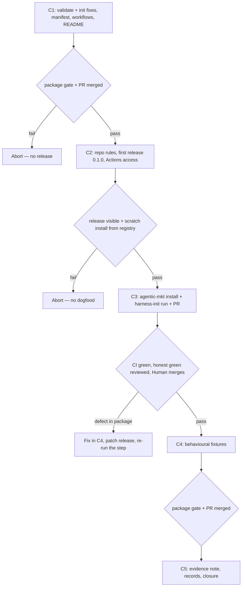

# Wolven harness C — Distribution and dogfood (Code spec)

- **Source PRD:** docs/prds/archived/wolven-ai-assisted-dev-harness/wolven-ai-assisted-dev-harness-prd.md (`Executor: code`, `stable`; grilling addendum 2026-09-24; notes "shipped-artifact language" and "merges, versions, and changelog")
- **Projeto:** docs/prds/archived/wolven-ai-assisted-dev-harness/wolven-ai-assisted-dev-harness-project.md — Entrega C; grilling decisions Q1–Q22 in its `## References`
- **Siblings:** docs/specs/archived/wolven-harness-a-core/wolven-harness-a-core-spec.md (merged as `f33de1d`) · docs/specs/archived/wolven-harness-d-code-lane/wolven-harness-d-code-lane-spec.md (merged as `d495802`) · docs/specs/archived/wolven-harness-b-wizard/wolven-harness-b-wizard-spec.md (merged as `4af0e7c`)
- **Artifact rule:** Package work lands in `WolvenTech/wolven-harness`, on branches cut from `origin/main`. The dogfood lands in `WolvenTech/agentic-mkt` through one PR. One-Man-Team holds the records, the evidence note, and the closure (PR #30).
- **Next:** Approved 2026-09-28 → `code-plan` approved 2026-09-28 (docs/specs/archived/wolven-harness-c-dogfood/wolven-harness-c-dogfood-plan.md) → `code-execute`, waves **C1 → C2 → C3 → C4 → C5**.
- **Handed off (2026-10-06):** C1, C2 and C4 shipped, and C3 merged as WolvenTech/agentic-mkt#6, but traps (g) and (h) failed. The rest of C3 (re-run on 0.3.1 with `adr-status-mismatch`) and C5 (evidence and closure) is tracked in [#46](https://github.com/WolvenTech/wolven-harness/issues/46). This record moved here from One-Man-Team.
- **Named proof (structural gate):** `proof-whc-spec-obligations`

## Spec-session decisions (2026-09-28)

C-Q1–C-Q6 come from spec B's pre-mortem grilling, which recorded them in this stub. C-Q7–C-Q12 close the stub's open items. C-Q13 comes from grounding, and C-Q14 is the Human's cost constraint. Grilling Q1–Q22, D-Q and B-Q decisions are not reopened.

| # | Decision | Basis |
|---|----------|-------|
| C-Q1 | **`superseded_by` must resolve.** A deprecated ADR's `superseded_by` must name an existing `docs/adrs/<value>.md`. A successor that is itself deprecated is allowed, so chains still work | B pre-mortem grilling (2026-09-28) |
| C-Q2 | **Legacy detection skips `archived/` paths**, as the claim scan already does, so an archived legacy copy no longer turns every reference into `claim-duplicate` | Same |
| C-Q3 | **`adr-unrecognized` warning.** A tracked folder named `adr`, `adrs` or `decisions` holding `NNNN-*.md` files gets one warning per folder instead of silently switching the claim check off. Full 4-digit support is deferred (docs/deferrals/adr-4digit/adr-4digit-deferral.md) | Same |
| C-Q4 | **Install and version.** The documented flow is `pnpm add -D @wolventech/wolven-harness`, then `pnpm exec wolven-harness init`. `init` warns when the package is missing from `devDependencies`, without writing it, and records `packageVersion` in `.wolven-harness.json`. Drift checking is deferred (docs/deferrals/setup-drift-check/setup-drift-check-deferral.md) | Same |
| C-Q5 | **Expected questions and honest green.** The run must raise each known agentic-mkt trap as a question to the Human, and acceptance fails if the wizard doesn't ask; the answers are decided live. Green means `validate` exit 0 with `0 legacy-warn` **plus** the session note's per-ADR table and the claims worked through, reviewed against the ADR bodies before the dogfood PR merges | Same |
| C-Q6 | **Behavioural fixtures.** Each case the run meets becomes a package fixture test with expected `validate` output, named for the case, never for the consumer. The phrase-level skill tests stay. URL false positives and per-line waivers stay deferred (docs/deferrals/claim-waivers/claim-waivers-deferral.md) | Same |
| C-Q7 | **Superseded by spec E (docs/specs/archived/wolven-harness-e-distribution/wolven-harness-e-distribution-spec.md):** the package is public on npmjs.org as `@wolven-tech/harness`, published through OIDC trusted publishing from a separate `publish` job, and merging the release PR no longer publishes: a manual `release` run with an empty tag creates the Release and publishes. Original text kept for the record: **release-please.** One workflow on push to `main` keeps a release PR (version bump and `CHANGELOG.md` from the Conventional Commit squash titles). Merging it tags `vX.Y.Z`, creates the GitHub Release, and publishes to GitHub Packages in the same job with `GITHUB_TOKEN` (`packages: write`), after build and test. No extra secret. The package stays **private** (the GitHub default); it is never made public, since that cannot be undone and the OSS gate (G2/OQ5) is closed | Human (2026-09-28) |
| C-Q8 | **First version 0.1.0, 0.x until an explicit call.** release-please is bootstrapped so the first release PR publishes `0.1.0` with a changelog of the squash commits on `main`. Before 1.0: a breaking change bumps the minor, `feat` the minor, `fix` the patch (`bump-minor-pre-major`). 1.0.0 is a later explicit decision (OSS gate or a second consumer) | Human (2026-09-28) |
| C-Q9 | **Repo rules.** C's package PR adds a PR-title workflow (Conventional Commits). An org admin turns rebase merge off, turns delete-branch-on-merge on, and adds a ruleset on `main` that requires that check (squash on, merge commits off, and squash title = PR title already hold). The Human has WRITE, not ADMIN, so the admin applies it | Human (2026-09-28); `gh api` 2026-09-28 |
| C-Q10 | **Superseded by spec E (docs/specs/archived/wolven-harness-e-distribution/wolven-harness-e-distribution-spec.md):** consumers install with `pnpm add -D @wolven-tech/harness` and need no `.npmrc`, token, `packages: read` or Actions access grant. Original text kept for the record: **Consumer auth.** agentic-mkt commits an `.npmrc` holding only `@wolventech:registry=https://npm.pkg.github.com`. The token line `//npm.pkg.github.com/:_authToken=${NODE_AUTH_TOKEN}` goes in user-level config, because current pnpm (11.24.0) ignores it in a committed `.npmrc`. Locally it goes in `~/.npmrc`; in CI, `actions/setup-node` writes it from `registry-url` and `scope`. Every CI job that installs gets `permissions: packages: read` and `NODE_AUTH_TOKEN` from `GITHUB_TOKEN`, and an admin grants agentic-mkt Actions read access on the package. Locally, `NODE_AUTH_TOKEN` comes from a token with `read:packages` (e.g. `gh auth refresh -s read:packages`, then `gh auth token`). The package README documents all of it | Human (2026-09-28); amended by the Human at unit 11 (2026-09-28) after the scratch install; GitHub Packages docs |
| C-Q11 | **`harness:validate` wiring in agentic-mkt is decided live.** Whether it gets a CI job, joins `pnpm validate`, or stays local is an expected question in the run, answered by the Human and recorded | Human (2026-09-28) |
| C-Q12 | **Runtimes and entry mode are decided live.** `init` asks for runtimes and step 0 recommends a mode (a 388-line curated `AGENTS.md` → light per B-Q4). The Human answers in the run, and the answers are recorded. agentic-mkt's `AGENTS.md` rule that `.agents/` and `.claude/` are "never versioned" local adapters joins the expected questions as a step 0 overlap | Human (2026-09-28) |
| C-Q13 | **`init` keeps config keys it doesn't own.** `init` rewrites `.wolven-harness.json` and today keeps only `version`, `gitHost`, `runtimes` and `ignore`, so a re-run drops `comments`. Adding `packageVersion` touches that writer, so it now carries every existing key forward | Grounding: scratch run on `4af0e7c` (2026-09-28) dropped `comments.paths` |
| C-Q14 | **No cost to the org.** Everything in C stays inside GitHub's free tier: Actions is free on both public repos; the package (~94 KB packed) is far under the 500 MB storage quota; installs through Actions with `GITHUB_TOKEN` don't count as data transfer, and local installs use a fraction of the 1 GB/month; rulesets are free on public repos; no new seats. The admin checks that Packages and Actions have a $0 budget (or no payment method), so going over the quota blocks usage instead of billing. Making either repo private would end the free Actions and rulesets, so that reopens this decision | Human (2026-09-28); GitHub billing docs for Packages and Actions; `pnpm pack` on `4af0e7c` = 93,995 bytes |

## Term challenge

Inherits specs A, B and D. Added:

| Term | Resolution |
|------|------------|
| **Release** | A `vX.Y.Z` tag, a GitHub Release, a `CHANGELOG.md` entry and a published package version, all made by merging a release-please PR (C-Q7). |
| **Dogfood run** | One `harness-init` session in agentic-mkt after `init`, ending in one PR the Human merges. |
| **Expected question** | A known trap in agentic-mkt that the run must put to the Human; its answer is decided live (C-Q5). |
| **Honest green** | `validate` exit 0 with `0 legacy-warn`, plus the per-ADR table and claim record reviewed against the ADR bodies (C-Q5). |
| **Evidence note** | The OMT `type: note` recording the run: versions, SHAs, questions and answers, outputs. |

## Repository grounding

| Surface | Present today | Role for Entrega C |
|---------|---------------|--------------------|
| Package `main` `4af0e7c`; `package.json` `@wolventech/wolven-harness` `0.1.0`, `files: [dist, templates]`, `engines.node >=22` | yes | Gains `publishConfig.registry` and `repository` (R2.1). No tag, no Release, nothing published |
| Package `.github/` | **absent** | Gains the release and PR-title workflows (R2.2, R2.3) |
| Package `src/validate/profile.ts` — `profile-superseded-by` only checks the field is present | yes | Also checks it resolves (R0.1) |
| Package `src/validate/legacy.ts` — skips only `docs/adrs/` | yes | Also skips `archived/` (R0.2) |
| Package `src/validate/claims.ts` — `isExcludedFromScan` already skips archived paths | yes | Pattern for R0.2 |
| Package `src/init/{config,options,index,package-script}.ts` — `writeConfig` writes 4 known keys; `init` rewrites the config each run | yes | `packageVersion`, carry-forward (C-Q13), devDependency warning (R1) |
| Package `README.md` — "Install" is a clone-and-build section | yes | Becomes the registry install (R1.3) |
| Repo settings (`gh api`, 2026-09-28, after the owner's changes): squash on with `PR_TITLE`, merge commit off, rebase off, delete-branch-on-merge on, Actions may create PRs, 0 rulesets; `rafiti052` repo admin (outside collaborator on WolvenTech) | yes | R2.4 left with the ruleset only |
| GitHub Packages npm docs — a first publish is private; public cannot be reverted; repos in other workflows need "Manage Actions access"; every install needs auth | yes — docs.github.com/en/packages | C-Q7, C-Q10 |
| agentic-mkt `main` `531652f`, public, Human WRITE; pnpm 11.5.1, `engines.node >=20`, CI on Node 24; `ci.yml` jobs lint/test/workflow-check each run `pnpm install --frozen-lockfile`; `pnpm validate` = tests + workflow check + vendor gate when env is set | yes | Install, auth, and the live wiring question (R3.1, C-Q11). Its Node ≥20 range is below the package's ≥22, which is harmless on Node 24 CI; the run notes it |
| agentic-mkt `adrs/adr-001…009.md` + `adrs/README.md` (index); ADR-001 "Superseded by ADR-004 … idempotency/dedup-deferral decision below is still the source of truth"; ADR-003 "Superseded", no successor; `tests/contracts/harness.test.ts` asserts `adr-001` / `ADR-001`; README says ADRs were "renumbered into one sequence" | yes | The expected questions (R3.2) |
| agentic-mkt `.gitignore` ignores `.agents/`, `.claude/`, `.cursor/`, `.codex/`; `AGENTS.md` (388 lines) "Local-Adapter Policy": these adapters "are never versioned" | yes | `harness-ignored` plus the policy overlap (R3.2) |
| agentic-mkt `agents/skills/*.md` (pipeline prompts, not Agent Skills); no `docs/` | yes | Discovery context; the doc-folder check has nothing to list |
| OMT pre-merge closure (`.claude/skills/code-pr/references/pre-merge-closure.md`); `docs/specs/archived/`, `docs/prds/archived/` | yes | Initiative closure (R5.3) |

## Surface walk

- **In scope (package repo):**
  - `src/validate/{profile,legacy,index}.ts` (and a new check module if cleaner)
  - `src/init/{config,options,index}.ts`
  - `package.json` (`publishConfig`, `repository`)
  - `.github/workflows/{release,pr-title}.yml`, the release-please config and manifest
  - `CHANGELOG.md` (written by release-please)
  - `README.md`
  - `test/**` (new cases and the behavioural fixtures)
- **In scope (org/repo settings, admin):** the wolven-harness merge settings and ruleset; the package's Actions access for agentic-mkt.
- **In scope (agentic-mkt, one PR):**
  - `.npmrc`, `package.json`, `pnpm-lock.yaml`, `.github/workflows/ci.yml` (auth; plus any wiring chosen live)
  - `.gitignore` (re-include rules, if chosen)
  - `AGENTS.md` / `CLAUDE.md` (step 0)
  - `adrs/**` → `docs/adrs/**` and the files whose links or claims move
  - `docs/**`, `.agents/**`, the runtime wiring, `.wolven-harness.json`
  - the session note
- **In scope (OMT):** this spec and its plan, the evidence note, the PRD acceptance ticks, the TAP, closure.
- **Out of mutate scope (unchanged):**
  - `harness-init` skill text and every spec D skill: a gap the run exposes is a follow-up fix in C4, not a rewrite in C1
  - `src/comments/**`
  - `templates/**` other than what R1.3's README mention needs
  - agentic-mkt source (`src/`, `scripts/`, `integrations/`) beyond links and claims the migration moves
  - OMT `.agents/**`, `scripts/**`, and `AGENTS.md`

## Waves

| Wave | Scope | Gate | Abort |
|------|-------|------|-------|
| **C1** | R0, R1, R2.1–R2.3, R6 | Package: `rm -rf dist && pnpm build && pnpm test && pnpm validate && pnpm comments` exit 0; sweep and residue greps empty; PR squash-merged by the Human | No release |
| **C2** | R2.5 (R2.4's settings are applied; its ruleset lands at the end of C1) | `gh release view v0.1.0` exists; `pnpm add -D @wolventech/wolven-harness@0.1.0` in a scratch repo with `NODE_AUTH_TOKEN` succeeds and `pnpm exec wolven-harness init` runs | No dogfood |
| **C3** | R3 | agentic-mkt PR: CI green; `pnpm harness:validate` exit 0 with `0 legacy-warn`; honest green reviewed; the Human merges | A package defect → C4 fix and patch release first, then resume the run from its `draft` note |
| **C4** | R4, R6 | Package gate as C1; PR merged | No closure |
| **C5** | R5 | OMT `pnpm docs:index && pnpm validate` exit 0 | Initiative not closed |

Every builder runs the PRD note's final check (`pnpm comments` plus the sweep over the files it touched). The parent re-runs both at every package gate.

## Requirements (obligation ↔ proof)

Commands run in the package repo unless marked. A "fixture test" builds a temp git repo (`makeRepo` / `minimalValidateFixture`) and runs the CLI on it.

### R0 — `validate` fixes

| ID | Obligation | Named proof | Evidence shape |
|----|------------|-------------|----------------|
| R0.1 | A deprecated ADR whose `superseded_by` names no existing `docs/adrs/<value>.md` fails `profile-superseded-by`, naming the value. A successor that exists, even one itself deprecated, passes (C-Q1) | `proof-whc-superseded-resolves` | Fixture tests: missing successor → error; existing successor → none; deprecated → deprecated → stable chain → none |
| R0.2 | Legacy detection skips any path with an `archived` segment, so an archived legacy copy raises no `legacy-adr` and causes no `claim-duplicate` (C-Q2) | `proof-whc-legacy-archived` | Fixture test: `adrs/adr-001.md` plus `adrs/archived/adr-001.md` and a claim → one `legacy-adr`, the claim `legacy-warn`, no `claim-duplicate` |
| R0.3 | A tracked folder named `adr`, `adrs` or `decisions` holding `NNNN-*.md` files raises one `adr-unrecognized` warning (exit 0) naming the folder, the file count, and that 4-digit numbering is not checked. 3-digit legacy sets and profile ADRs raise none (C-Q3) | `proof-whc-adr-unrecognized` | Fixture tests: `docs/decisions/0001-x.md`, `0002-y.md` → one warning; `adrs/adr-001.md` → none; `docs/adrs/adr-000-*.md` → none |

### R1 — Install and version

| ID | Obligation | Named proof | Evidence shape |
|----|------------|-------------|----------------|
| R1.1 | When `package.json` exists and `@wolventech/wolven-harness` is not in its `devDependencies`, `init` prints a warning saying to run `pnpm add -D @wolventech/wolven-harness`. It writes nothing for it and still exits 0. No `package.json` → no warning (C-Q4) | `proof-whc-init-devdep` | Fixture tests: missing → warning, `package.json` deps unchanged; present → none; no `package.json` → none |
| R1.2 | `init` writes `packageVersion` (the running package's version) to `.wolven-harness.json` on every run and carries every existing key forward, `comments` and unknown keys included. `readConfig` accepts `packageVersion` as a string (C-Q4, C-Q13) | `proof-whc-init-config` | Fixture tests: fresh → `packageVersion` equals `package.json`'s version; a config with `comments.paths` and an extra key survives a re-run unchanged apart from `packageVersion` |
| R1.3 | **Superseded by spec E (docs/specs/archived/wolven-harness-e-distribution/wolven-harness-e-distribution-spec.md):** the README install is `pnpm add -D @wolven-tech/harness` then `pnpm exec wolven-harness init`, with no registry or token text (spec E R1.4, `proof-whe-readme-install`). Original text kept for the record: README's install section documents the registry flow: the committed registry line and the user-level token line (C-Q10), `NODE_AUTH_TOKEN` locally (`read:packages`) and in CI (`GITHUB_TOKEN`, `packages: read`, the package's Actions access), `pnpm add -D`, and `pnpm exec wolven-harness init`. A contributor section keeps clone-and-build. No dev-time ids (C-Q10) | `proof-whc-readme-install` | Test asserting the phrases; sweep over README empty |

### R2 — Release and repo rules

| ID | Obligation | Named proof | Evidence shape |
|----|------------|-------------|----------------|
| R2.1 | **Superseded by spec E (docs/specs/archived/wolven-harness-e-distribution/wolven-harness-e-distribution-spec.md):** the registry clause only; `publishConfig` is `{ "access": "public" }` on npmjs.org (spec E R1.1). The tarball also holds `LICENSE`. Original text kept for the record: `package.json` has `publishConfig.registry: https://npm.pkg.github.com` and `repository.url: https://github.com/WolvenTech/wolven-harness.git`; the packed tarball holds only `dist/`, `templates/`, `package.json`, `README.md`, and, once release-please writes it, `CHANGELOG.md` | `proof-whc-package-manifest` | Test reading `package.json`; `pnpm pack --dry-run` listing inspected |
| R2.2 | **Superseded by spec E (docs/specs/archived/wolven-harness-e-distribution/wolven-harness-e-distribution-spec.md):** the permissions and publish clauses; publishing runs in its own job with `contents: read` and `id-token: write`, no stored secret (spec E R1.2, E-Q5). Original text kept for the record: `.github/workflows/release.yml` runs release-please on push to `main` (`release-type: node`, `bump-minor-pre-major: true`, bootstrapped so the first release is `0.1.0`). When a release is created, the same job installs, builds, tests and publishes with `GITHUB_TOKEN`. Permissions are only `contents: write`, `pull-requests: write`, `packages: write`. No secret beyond `GITHUB_TOKEN` (C-Q7, C-Q8) | `proof-whc-release-workflow` | Inspect the workflow and config; the first release run (R2.5) green |
| R2.3 | `.github/workflows/pr-title.yml` checks on `pull_request` (`opened`, `edited`, `synchronize`, `reopened`) that the title is a Conventional Commit, with `pull-requests: read` only. Events made with `GITHUB_TOKEN` start no workflows, so the check never runs on its own on the release PR: the README's release section says to close and reopen the release PR before merging it, so the required check runs on its head (C-Q9) | `proof-whc-pr-title` | The check runs on C1's own PR; a bad title fails it (edited, then restored); at C2 the reopened release PR shows the check green |
| R2.4 | Admin settings applied: rebase merge off, merge commit off, squash on with PR-title titles, delete-branch-on-merge on, Actions allowed to create pull requests (repo and org), members allowed to create private packages (org), and a ruleset on `main` requiring the PR-title check (C-Q9) | `proof-whc-repo-settings` | `gh api repos/WolvenTech/wolven-harness` fields and `gh api …/rulesets` output pasted into the plan's resume |
| R2.5 | **Superseded by spec E (docs/specs/archived/wolven-harness-e-distribution/wolven-harness-e-distribution-spec.md):** the privacy clause and the agentic-mkt grant; `0.1.0`/`0.1.1` stay on GitHub Packages (`U-e-ghp-cleanup`), and `0.2.0` is public on npmjs with provenance (spec E R2.3). Original text kept for the record: The first release exists: tag `v0.1.0`, a GitHub Release, a `CHANGELOG.md` entry, and `@wolventech/wolven-harness@0.1.0` published **private**. agentic-mkt has Actions read access to the package (C-Q7, C-Q10) | `proof-whc-first-release` | `gh release view v0.1.0`; a scratch install with `NODE_AUTH_TOKEN` succeeds; the package settings page shows private visibility and the agentic-mkt grant, and the org billing page shows a $0 Packages/Actions budget or no payment method (Human confirms) |

### R3 — Dogfood run in agentic-mkt

| ID | Obligation | Named proof | Evidence shape |
|----|------------|-------------|----------------|
| R3.1 | **Superseded by spec E (docs/specs/archived/wolven-harness-e-distribution/wolven-harness-e-distribution-spec.md):** the auth clause; the branch adds `@wolven-tech/harness` with `pnpm add -D` and commits no `.npmrc`, and CI jobs need no `packages: read`, `NODE_AUTH_TOKEN`, `registry-url` or `scope`. Original text kept for the record: The dogfood branch (cut from agentic-mkt `origin/main`) commits `.npmrc` per C-Q10, adds the package with `pnpm add -D` (lockfile updated), gives every installing CI job `packages: read`, `NODE_AUTH_TOKEN` and `setup-node`'s `registry-url` and `scope`, and runs `pnpm exec wolven-harness init` with the runtimes the Human picks (C-Q12). `.wolven-harness.json` records `packageVersion`. The PR's CI is green | `proof-whc-dogfood-install` | PR checks green; `init` output and the config in the evidence note |
| R3.2 | The run puts each expected question to the Human, and the session note records the question and the answer: (a) `harness-ignored` on `.agents/` and `.claude/`, and the re-include rules; (b) the `AGENTS.md` "never versioned" local-adapter rule as a step 0 overlap; (c) the entry mode and (d) the `harness:validate` wiring (C-Q11, C-Q12); (e) ADR-001, superseded by ADR-004 while its idempotency deferral still applies (partial-supersession row); (f) the tokens `tests/contracts/harness.test.ts` pins (token search); (g) ADR-003, superseded with no successor (ask row); (h) citations from before the renumbering that resolve to the wrong decision (claim-meaning check); (i) `adrs/README.md`, a non-ADR index (delete, or keep with links rewritten). A trap that surfaces without its question fails acceptance (C-Q5) | `proof-whc-expected-questions` | Evidence note checklist (a)–(i), each citing the session-note line with the question and the answer |
| R3.3 | Honest green: in the dogfood branch, `pnpm harness:validate` exits 0 with `claims: … 0 legacy-warn, 0 fail`. The session note's per-ADR table has all 9 rows (number, title, legacy status, mapped status, evidence, decision) and lists each claim repointed, reworded, or left as is. Before merge the agent cross-checks every row against its ADR body, and the Human reviews the table (C-Q5) | `proof-whc-honest-green` | `validate` output in the evidence note; the review recorded in the PR (comment or body section) |
| R3.4 | Claim-path proof: a scratch file claiming `ADR-999`, added in the dogfood working tree and never committed, makes `harness:validate` exit 1 with `claim-missing`; removing it returns to exit 0 | `proof-whc-adr999` | Both outputs in the evidence note |
| R3.5 | Wizard landing: the session note is `stable` with its seven sections; 2–4 stubs are written from discovery evidence (fewer only with the B-Q10 reason recorded), each raising one `skill-stub-open`; the run's phased commits (entry, migration, setup) are on the PR branch as the Human approved them. The Human merges the PR | `proof-whc-wizard-landing` | PR commits listed; `skill-stub-open` count in the `validate` output; the merge SHA on agentic-mkt `main` |

### R4 — Behavioural fixtures

| ID | Obligation | Named proof | Evidence shape |
|----|------------|-------------|----------------|
| R4.1 | Every case (a)–(i) the run met whose outcome `validate` can show becomes a package fixture test with the expected `validate` output. Examples: an ignored adapter folder before and after re-include; a partly binding superseded ADR mapped each way the Human can choose; a test file pinning a deprecated ADR's token → `claim-deprecated`; an index file left in the legacy folder. Tests are named for the case, never the consumer (C-Q6) | `proof-whc-behaviour-fixtures` | Tests pass; a mapping table in the plan's resume (case → test name); `rg -i agentic-mkt test` empty |
| R4.2 | A package defect the run exposed is fixed on the same C4 branch as a `fix:` commit, released as a patch through release-please, and the affected step of the run is re-run from the `draft` note. Or there were none, and the evidence note says so | `proof-whc-run-defects` | Evidence note "Defects" section: each defect → fix SHA → patch version → re-run, or "none" |

### R5 — Evidence, records and closure (OMT)

| ID | Obligation | Named proof | Evidence shape |
|----|------------|-------------|----------------|
| R5.1 | `docs/notes/wolven-harness-agentic-mkt-dogfood.md` (`type: note`) records: package version(s), agentic-mkt PR and merge SHA, the live answers (runtimes, mode, wiring), the (a)–(i) checklist, the per-ADR table summary, the `validate` and ADR-999 outputs, the stubs, and defects | `proof-whc-evidence-note` | Inspect; OMT `pnpm docs:index && pnpm validate` exit 0 |
| R5.2 | Records ticked with evidence: the PRD's acceptance boxes (brownfield install, claim-path run, install surfaces, wizard session, the agentic-mkt migration line), the TAP's "C pronta" milestone and closing condition, and this spec's acceptance | `proof-whc-records` | Inspect each box's cite |
| R5.3 | Initiative pre-merge closure on OMT PR #30: specs A–D and their plans moved to `docs/specs/archived/`, the PRD folder to `docs/prds/archived/`, all `status: archived`, active-path pointers fixed; no initiative ADR in OMT; `pnpm docs:index && pnpm validate` exit 0 | `proof-whc-closure` | `git mv` diff; validate output |

### R6 — Shipped language (package)

| ID | Obligation | Named proof | Evidence shape |
|----|------------|-------------|----------------|
| R6.1 | Spec D's R4.1 residue grep and R4.3 doc-path grep, with `--hidden`, are empty over `templates src .github`; `rg --hidden -i "agentic-mkt\|compozy\|kb ingest" templates src test .github README.md` is empty. ~~No `LICENSE`~~ — dropped: the Human added an MIT `LICENSE` in spec E's PR #11 (docs/specs/archived/wolven-harness-e-distribution/wolven-harness-e-distribution-plan.md, E1 resume) | `proof-whc-no-residue` | Grep output empty at C1 and C4 gates |
| R6.2 | The PRD sweep (D-Q1 globs plus the B-Q15 glob) is empty over the package at C1 and C4, except for named hand-reviewed hits | `proof-whc-sweep` | Sweep output with hits named |

## Nine-dimension landings

| Dimension | Landing kind | Landing |
|-----------|--------------|---------|
| validation | obligation / proof | R0.1 / `proof-whc-superseded-resolves`: a dangling successor fails. R0.3 / `proof-whc-adr-unrecognized`: an unchecked ADR set is visible. R3.3 / `proof-whc-honest-green`: green is reviewed against the ADR bodies, not taken from the exit code |
| failure modes | obligation / proof | R3.2 / `proof-whc-expected-questions`: an unasked trap fails acceptance. R4.2 / `proof-whc-run-defects`: a package defect stops the run, becomes a patch release, and the run resumes. R3.4 / `proof-whc-adr999`: a missing ADR fails closed |
| idempotency and retry | obligation / proof | R1.2 / `proof-whc-init-config`: an `init` re-run keeps every config key. R4.2: an interrupted run resumes from its `draft` note (B-Q13). R2.2: release-please re-runs on each push without duplicate releases |
| authorization | obligation / proof | R2.2 / `proof-whc-release-workflow`: `GITHUB_TOKEN` with minimal permissions, no stored secret. R2.4 / `proof-whc-repo-settings` and R2.5: org-level changes by a WolvenTech owner, repo-level ones by the repo admin. R3.1: CI reads the package through the Actions grant; the Human merges both PRs |
| concurrency and ordering | obligation / proof | Waves C1 → C5 with abort gates: no release before the fixes merge, no dogfood before the release installs. Within the run, B-Q3's step order and B-Q17's phased commits apply (R3.5 / `proof-whc-wizard-landing`) |
| data lifecycle | obligation / proof | R2.5 / `proof-whc-first-release`: the package stays private (public can't be reverted). R3.4: the ADR-999 file is never committed. R5.3 / `proof-whc-closure`: specs, plans and PRD are archived; the evidence note stays active |
| external-dependency failure | obligation / proof | GitHub Packages auth: R2.5's scratch install gate catches a missing grant or token before C3. R3.1 / `proof-whc-dogfood-install`: CI green proves the Actions grant. Web unavailable in the run → repo-only research, noted (B-Q9) |
| state transitions | obligation / proof | R2.5: release PR → tag + Release + publish. R3.5: session note `draft` → `stable`, stubs open. R5.3: spec `draft` → `stable` on approval → `archived` at closure |
| observability | obligation / proof | R5.1 / `proof-whc-evidence-note`: every live answer, output and SHA recorded. R1.2: `packageVersion` shows which version a consumer installed. R0.3: the warning names the folder |

## Unresolved

| Identifier | Decision needed | Owner | Blocking effect | Disposition |
|------------|------------------|-------|------------------|------------|
| `U-c-org-admin` | Admin steps on WolvenTech. `rafiti052` is an outside collaborator there (a member only of WolvenDev), so a WolvenTech owner did the org-level steps. **Done 2026-09-28:** Actions may create PRs (org and repo; `can_approve_pull_request_reviews: true`), rebase merge off, delete-branch-on-merge on, `rafiti052` raised to repo admin on `wolven-harness` (verified with `gh api`); private package creation and the $0 Packages/Actions budget confirmed by the Human (org pages the token can't read). **Left:** the `main` ruleset (repo admin, once C1's PR has run the title check) and agentic-mkt's Actions access on the package (after the first publish) | Human (repo admin) | Non-blocking: both left steps fall inside C1 and C2 | Do them in C1 (ruleset) and C2 (package access), with `gh api` output as evidence |
| `U-a-cloud-app` | Claude GitHub App on WolvenTech | Human (org admin) | Non-blocking | Carried from spec A, still deferred |

The live answers (C-Q11, C-Q12, and (a)–(i)) are not Unresolved: this spec deliberately leaves them to the run and records them in the evidence note.

## Out of scope

- Changing `harness-init` or spec D skill text in C1 (a gap the run finds is fixed in C4 with a fixture)
- 4-digit ADR support, per-line waivers, URL false positives, `init --check` drift, `--docs-dir` (deferrals)
- 1.0.0 (C-Q8). Publishing publicly and a `LICENSE` moved into spec E
- Changes to agentic-mkt product code, its vendor gate, or its `pnpm validate` beyond what the live wiring answer adds
- A second consumer; Bitbucket CI parity for publishing

## Pragmatic-guard refuses

- Special-casing agentic-mkt in the package or skill, including fixtures named for it (B-Q1, C-Q6)
- Answering an expected question in advance, or scripting the run
- A long-lived PAT in CI, or any secret in `.npmrc` (C-Q10)
- Making the package public "to simplify auth"
- Anything that adds cost to the org: paid runners, larger runners, a budget above $0, a paid plan to get a feature, or making a repo private while it relies on free Actions or rulesets (C-Q14)
- Committing the ADR-999 scratch file
- Declaring green from the exit code alone (C-Q5)
- Merging any PR on the Human's behalf

## Acceptance

### Wave C1

- [x] `proof-whc-superseded-resolves` PASS — 4 tests on `main` `3f424b3`
- [x] `proof-whc-legacy-archived` PASS — 3 tests
- [x] `proof-whc-adr-unrecognized` PASS — 6 tests
- [x] `proof-whc-init-devdep` PASS — 4 tests
- [x] `proof-whc-init-config` PASS — 9 tests
- [x] `proof-whc-readme-install` PASS — 9 tests
- [x] `proof-whc-package-manifest` PASS — 2 tests
- [x] `proof-whc-release-workflow` PASS (inspect at C1; green run at C2) — first-version setting fixed in `42325f8`, the release test in `cf6c2ed`; green release run 36465035308 (tests and publish pass) for `v0.1.1`
- [x] `proof-whc-pr-title` PASS — 3 tests, plus the live fail and pass runs 36450170557 and 36450272292

### Wave C2

- [x] `proof-whc-repo-settings` PASS — `gh api` output in the plan's C2 resume
- [x] `proof-whc-first-release` PASS — at `v0.1.1` (the Human's call, plan discrepancy (8)): Release, `CHANGELOG.md`, package private; scratch install and `init` pass; the Human confirmed the agentic-mkt grant and a $0 budget or no payment method

### Wave C3

- [ ] `proof-whc-dogfood-install` PASS
- [ ] `proof-whc-expected-questions` PASS
- [ ] `proof-whc-honest-green` PASS
- [ ] `proof-whc-adr999` PASS
- [ ] `proof-whc-wizard-landing` PASS

### Wave C4

- [ ] `proof-whc-behaviour-fixtures` PASS
- [ ] `proof-whc-run-defects` PASS
- [ ] `proof-whc-no-residue` PASS (C1 and C4 gates)
- [ ] `proof-whc-sweep` PASS (C1 and C4 gates)

### Wave C5 and pre-merge closure

- [ ] `proof-whc-evidence-note` PASS
- [ ] `proof-whc-records` PASS
- [ ] `proof-whc-closure` PASS: specs A–D, plans and PRD archived with `status: archived`; no OMT ADR for this initiative; `pnpm docs:index && pnpm validate` PASS

## Eval / gates

| Gate | Command / check | When | PASS | Abort |
|------|-----------------|------|------|-------|
| Package integrity | `rm -rf dist && pnpm build && pnpm test && pnpm validate && pnpm comments` | C1, C4, and any patch fix | exit 0 | Fix before PR |
| Shipped language | PRD sweep (D-Q1 + B-Q15 globs) and the R6.1 greps, all `--hidden --glob '!.git'` | C1, C4; every builder return | empty (named hand-reviewed hits only) | Fix before PR |
| Release | `gh release view v0.1.0`; scratch `pnpm add -D @wolventech/wolven-harness@0.1.0` with `NODE_AUTH_TOKEN` + `pnpm exec wolven-harness init` | End of C2 | both succeed | No C3 |
| Consumer | agentic-mkt PR checks; `pnpm harness:validate` in the branch | End of C3 | CI green; exit 0, `0 legacy-warn` | Fix, or C4 patch first |
| OMT integrity | `pnpm docs:index && pnpm validate` in OMT | After OMT writes; C5 | exit 0 | Fix OMT docs |
| Spec obligations | `proof-whc-spec-obligations`: each acceptance box names one proof; each proof sits in exactly one R row (23); nine landings; no `n/a` | Before `code-plan` | all hold | Do not plan |

## Cross-domain leak ID

| Leak | Refuse |
|------|--------|
| Board/ClickUp Tickets (agentic-mkt is a ClickUp pipeline repo) | Executor is code; the run never calls ClickUp or the vendor gate |
| Fixing agentic-mkt product issues found in discovery | Record them in the session note's next steps; not this PR |
| Reworking the wizard mid-run | C4 fix with a fixture, patch release, resume |
| Skills catalogue picker | docs/deferrals/skills-catalogue/skills-catalogue-deferral.md |
| 1.0.0 or an OSS announcement | G2/OQ5 gate (public npm and `LICENSE` shipped through spec E) |
| Executable plan from this skill | `code-plan` only |

## ADR

- **OMT:** none. OMT wiring is unchanged.
- **Package repo:** none required. Release policy lives in the PRD note and this spec. The consumer's ADRs are the run's own output.
- **agentic-mkt:** the run may record new decisions through `adr` (a split ADR-001, or a successor to ADR-003) if the Human chooses that live.
