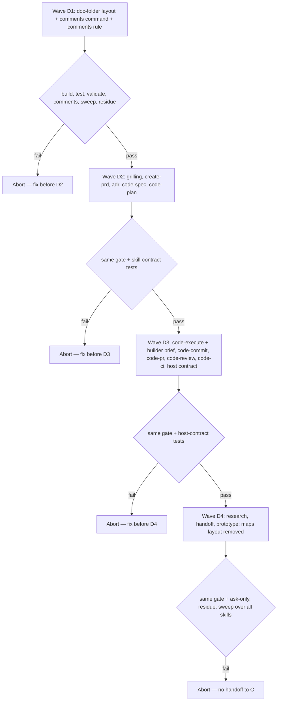

# Wolven harness D — Portable Code lane (Code spec)

- **Source PRD:** docs/prds/archived/wolven-ai-assisted-dev-harness/wolven-ai-assisted-dev-harness-prd.md (`Executor: code`, `stable`; grilling addendum 2026-09-24; notes "shipped-artifact language" and "merges, versions, and changelog")
- **Projeto:** docs/prds/archived/wolven-ai-assisted-dev-harness/wolven-ai-assisted-dev-harness-project.md — Entrega D; grilling decisions Q1–Q22 in its `## References`
- **Siblings:** docs/specs/archived/wolven-harness-a-core/wolven-harness-a-core-spec.md (`stable`, merged as `f33de1d`) · docs/specs/archived/wolven-harness-b-wizard/wolven-harness-b-wizard-spec.md · docs/specs/archived/wolven-harness-c-dogfood/wolven-harness-c-dogfood-spec.md
- **Deferral consumed:** docs/deferrals/wolven-harness-comment-ruleset.md — its "spec D frozen" trigger fires with this spec (D-Q9–D-Q12)
- **Artifact rule:** Implementation lands in `WolvenTech/wolven-harness`, on a branch cut from `origin/main`. One-Man-Team is the read-only extract source.
- **Next:** Approved 2026-09-25 → `code-plan` (docs/specs/archived/wolven-harness-d-code-lane/wolven-harness-d-code-lane-plan.md) → `code-execute`, Waves **D1 → D2 → D3 → D4**. Runs in parallel with B; C needs D green.
- **Named proof (structural gate):** `proof-whd-spec-obligations`

## Spec-session decisions (2026-09-25)

Closes the stub's open items. Grilling decisions Q1–Q22 are not reopened, except where noted.

| # | Decision | Basis |
|---|----------|-------|
| D-Q1 | Shipped Code lane skills keep their own vocabulary: units, waves, proofs, builders, obligation ids, and "the Human" (the person steering the agent; "user" means the product's end user). The PRD sweep excludes the Code lane and utility skill template folders (`code-*`, `adr`, `create-prd`, `grilling`, `wayfinder`, `research`, `handoff`, `prototype`). Consumer-facing docs, runtime messages, and code stay under the sweep and the comment gate | Human |
| D-Q2 | Host access: MCP first (GitHub MCP; Atlassian Rovo MCP for Bitbucket), then `gh` on GitHub and the Bitbucket REST API. One shared `host-operations.md` maps each operation for both hosts | Human (recommended) |
| D-Q3 | Bitbucket proof: a structural contract test over `host-operations.md` and the skills. Bugs get fixed when a Bitbucket consumer arrives (Q18) | Human (recommended) |
| D-Q4 | Builder instructions live in `code-execute/references/builder-brief.md`. The parent pastes the brief into any runtime's subagent prompt (Q17: no dedicated agent) | Human (recommended) |
| D-Q5 | Consumers get the comment gate as a shipped `wolven-harness comments` command; `init` adds a `harness:comments` script | Human (recommended) |
| D-Q6 | The profile gains `docs/prds/` (`type: prd`) and a new `create-prd` skill. `code-spec` takes a PRD or a Code-shaped ask the Human confirms. Pre-merge closure archives the spec, plan, and PRD. This extends Q12/Q13's 11 skills to 12, and D-Q16 brings the total to 17 | Human |
| D-Q7 | The portable `code-pr` always titles PRs as Conventional Commits. It makes no other assumption about squash merges | Human (recommended) |
| D-Q8 | `adr` creates, promotes, and supersedes profile ADRs. Legacy migration stays in `harness-init` (spec B) | Human (recommended) |
| D-Q9 | `comments` has built-in JS/TS syntax; other languages come from `.wolven-harness.json` config, patched during the brownfield dogfood | Human |
| D-Q10 | A `/** */` block directly above a declaration passes the tag rule; only the leak rules apply to it. Any other `/** */` block needs a tag | Human (recommended) |
| D-Q11 | Style hints ship as the standing rule `.agents/rules/comments.md`, installed by `init` and cited in `WOLVEN.md` | Human (recommended) |
| D-Q12 | `comments` checks every tracked or untracked file with a known syntax, minus `ignore` dirs; `comments.paths`, when set, replaces that default | Human (recommended; "replaces" lets the package keep checking `test/`, which its `ignore` hides from the claim scan) |
| D-Q13 | `create-prd` writes one lean PRD: problem statement, goals and non-goals, user stories with Given/When/Then acceptance, scope, and open questions. No Cynefin, DICE, Executor, or separate problem-statement skill. It is a lean port of One-Man-Team's `create-prd`, which derives from the TLC and Compozy discovery skills | Human (recommended) |
| D-Q14 | ~~PRDs are flat: `docs/prds/<slug>.md`~~ — superseded by D-Q21–D-Q24 | Human (recommended) |
| D-Q15 | The package gate `scripts/comment-gate.ts` becomes the shipped command. The package runs it on itself, and `.comment-gate.json` with its stale `baseline` is deleted. This replaces the baseline item in spec C | Human (recommended) |
| D-Q16 | The package also ships utility skills ported from One-Man-Team. `grilling` joins wave D2, since `create-prd` calls it; `wayfinder`, `research`, `handoff`, and `prototype` form wave D4 (D-Q26 drops `wayfinder`) | Human (recommended split) |
| D-Q17 | `create-prd` opens by grilling the problem through `grilling`, with no question cap, until a single problem statement is agreed | Human |
| D-Q18 | ~~Wayfinder maps are local markdown: `docs/maps/<slug>/`, with one file per ticket. The same on both hosts. D-Q25 puts the map doc (not the tickets) in the profile~~ — superseded by D-Q26/D-Q27 | Human (recommended) |
| D-Q19 | A lean `research` skill ships (QMD first, primary sources, cited note under `docs/notes/`). Wayfinder research tickets use it (dropped with `wayfinder`, D-Q26), and spec B's wizard research step can reuse it | Human (recommended) |
| D-Q20 | `grilling` is model-invocable so that `create-prd` and `wayfinder` can call it. `wayfinder` and `handoff` are ask-only; `prototype` and `research` are model-invocable (D-Q26 drops `wayfinder`) | Human (recommended) |
| D-Q21 | Every doc-writing skill and rule writes `docs/<type-folder>/<slug>/<slug>-<type>.md`. ADRs are the exception and stay flat as `docs/adrs/adr-NNN-<slug>.md`, because claim tokens map to that filename | Human (layout); ADR exception recommended |
| D-Q22 | A plan sits next to its spec: `docs/specs/<slug>/<slug>-spec.md` and `docs/specs/<slug>/<slug>-plan.md`, both `type: spec`. One folder per initiative; closure archives the folder whole | Human (recommended) |
| D-Q23 | Type folders stay plural (`prds`, `specs`, `notes`, `deferrals`, `maps`); the file suffix is the singular frontmatter `type` (`-prd`, `-spec`, `-note`, `-deferral`, `-map`); D-Q27 removes `maps` | Human (recommended) |
| D-Q24 | `validate` requires exactly one main doc per folder (plus `<slug>-plan.md` in specs) and applies the profile rules to it. Other files in the folder are allowed and not checked. A `.md` directly under a type folder (the flat layout) fails, naming the expected path | Human (recommended) |
| D-Q25 | ~~The map doc `<slug>-map.md` is profile-checked as `type: map` (`draft` while in use, `stable` once the way is clear); ticket files are folder extras~~ — superseded by D-Q27 | Human (recommended) |
| D-Q26 | `wayfinder` is dropped for now; `grilling` stays as the only interviewing skill. D4 keeps `research`, `handoff`, and `prototype`; `prototype` records its verdict on the PRD. R5.1 and R5.2 and their two proofs leave the spec (26 proofs remain), and the ask-only set is `code-commit`, `code-pr`, `code-review`, `code-ci`, and `handoff` over 15 template skills (D-Q28 removes `code-commit`) | Human (execute, 2026-09-25) |
| D-Q27 | The maps doc-folder that D1 shipped (`maps` → `map` in `validate`, `docs/maps/.gitkeep`, the `maps` QMD collection, the router row, and the writing-profile and README lines) is removed, since nothing writes there. Revisit through docs/deferrals/wayfinder-maps/wayfinder-maps-deferral.md | Human (recommended; execute, 2026-09-25) |
| D-Q28 | `code-commit` is model-invocable, following One-Man-Team `2e5a33e` (which landed before this spec froze and was missed). `code-execute` reads the consumer opt `.agents/code-commit.config.yml` (`autocommit`: `true`\|`false`, default `false`; `autocommit-rule`: `unit`\|`wave`, default `wave`; an absent file or key takes the default; any other value fails closed) and invokes `code-commit` only when the opt says so, after a PASS; builders never commit. `init` ships no config file, so the default keeps a person in the loop. The ask-only set becomes `code-pr`, `code-review`, `code-ci`, and `handoff` (4 of 15). `code-pr` also takes the rest of the current One-Man-Team contract: pre-merge closure is not needed to open or amend, the found or created PR and the resolved base are printed, and a filled verification example | Human (PR review, 2026-09-25) |

## Term challenge

Inherits spec A's table. Added:

| Term | Resolution |
|------|------------|
| **Code lane** | The 9 authoring and ship skills: `create-prd`, `adr`, `code-spec`, `code-plan`, `code-execute`, `code-commit`, `code-pr`, `code-review`, and `code-ci`. |
| **Utility skills** | `grilling`, `research`, `handoff`, and `prototype` (D-Q16, D-Q26). |
| **Doc folder** | `docs/<type-folder>/<slug>/`, holding one main doc `<slug>-<type>.md` (and `<slug>-plan.md` for specs) plus any extras (D-Q21–D-Q24). ADRs have no folder. |
| **Map** | ~~A wayfinder plan: `docs/maps/<slug>/<slug>-map.md` plus one markdown file per decision ticket (D-Q18, D-Q25).~~ Dropped with `wayfinder` (D-Q26, D-Q27). |
| **Host** | The git host, read from `gitHost` in `.wolven-harness.json`: `gh` (GitHub) or `bit` (Bitbucket Cloud). |
| **Host operation** | One abstract step a ship skill performs on the host, such as opening a PR or listing unresolved threads. Each is defined once, in `host-operations.md`. |
| **Builder brief** | The paste-in prompt a parent agent gives a subagent that implements one plan unit. It is not a registered agent. |
| **Ask-only skill** | A skill that runs only on explicit invocation: `code-pr`, `code-review`, `code-ci`, or `handoff` (D-Q20, D-Q26, D-Q28). |
| **the Human / user** | Skills say "the Human" for the person steering the agent. "User" means the product's end user (D-Q1). |

## Repository grounding

| Surface | Present today | Role for Entrega D |
|---------|---------------|--------------------|
| OMT `.agents/skills/code-{spec,plan,execute,commit,pr,review,ci}/**` | yes — ~1,800 lines, 14 files | Extract source; the map below sets what each keeps and drops |
| OMT `.agents/skills/create-prd/**` | yes — 176-line SKILL + 9 references | Extract source for the lean `create-prd` (the `user-stories-template.md` and `acceptance-criteria-template.md` patterns) |
| OMT `.agents/skills/{grilling,wayfinder,research,handoff,prototype}/**` | yes — 57, 155, 181, 107, and 234 lines; `grilling`, `wayfinder`, and `handoff` are ask-only there | Extract source for the utility skills; the map below sets what each keeps and drops |
| OMT `.agents/agents/builder.md` | yes — 69 lines | Extract source for `builder-brief.md` (priorities, parent-prepended fields, return shape) |
| OMT `code-spec` "ADR read / write" section | yes | Pattern for the `adr` skill (numbering, supersession) |
| OMT ask-only skills | `disable-model-invocation: true` on code-pr, code-review, and code-ci; `code-commit` is model-invocable under `.agents/code-commit.config.yml` since `2e5a33e` | The same three stay ask-only (D-Q28) |
| Package `scripts/comment-gate.ts`, `scripts/comment-leak-rules.ts`, `test/comment-gate.test.ts` (17 tests) | yes — on `main` `f33de1d` | Moves into `src/comments/**` as the shipped command (D-Q15) |
| Package `src/validate/profile.ts` (`adrs\|specs\|notes\|deferrals`, direct children only) | yes | Keeps ADRs flat; gains `prds` → `prd` (and `maps` → `map` until D-Q27 removes it); every non-ADR folder switches to the doc-folder layout (D-Q21–D-Q25). No consumer has run `init` yet (spec C is the first), so nothing needs migrating |
| Package `templates/.qmd/index.yml` (`pattern: "*.md"`), `templates/.agents/skills/pragmatic-guard/SKILL.md` and `rules/yagni-strict.md` (write `docs/deferrals/<name>.md`) | yes | Collections switch to `!(archived)/**/*.md` (one glob per collection, the pattern One-Man-Team's `.qmd/index.yml` uses); deferral paths switch to the doc-folder layout |
| Package `src/init/**` template manifest | yes — manifest-driven (spec A surface walk) | New skills and rules land as template folders; `init` code changes only for the `harness:comments` script |
| Package `templates/WOLVEN.md` (skills table rendered from `SKILL.md` frontmatter) | yes | New skills appear automatically; the standing rules and router rows need edits |
| Claude Code / Cursor ask-only | `disable-model-invocation: true` in `SKILL.md` — https://code.claude.com/docs/en/skills, https://cursor.com/docs/context/skills | Ask-only frontmatter |
| Codex ask-only | `agents/openai.yaml` → `policy.allow_implicit_invocation: false` — https://learn.chatgpt.com/docs/build-skills | Extra file per ask-only skill |
| GitHub MCP | Remote `https://api.githubcopilot.com/mcp/`, OAuth or PAT; `create_pull_request`, `pull_request_read` (incl. review threads, check runs), `pull_request_review_write` (incl. resolve thread), `get_job_logs` — https://github.com/github/github-mcp-server | GitHub MCP column of `host-operations.md` |
| Bitbucket via Rovo MCP | Since 2026-04; API token only (no OAuth); `createPullRequest`, `getPullRequestDetails`, `getPullRequestComments`, `addPullRequestComment`, `getPullRequestTasks`, `analyzePullRequestCommitStatusFailures`, `analyzePipelineStepFailure`; no tool to resolve threads or read raw logs — https://support.atlassian.com/bitbucket-cloud/docs/interacting-with-bitbucket-via-mcp/ | Bitbucket MCP column; REST fallback fills the gaps |

### Extraction map

| Skill | Keeps | Drops or rewrites |
|---|---|---|
| `create-prd` | Draft → approve loop (`draft` → `stable` only on the Human's approval); problem grilling before drafting (through `grilling`, D-Q17); term challenge; the user-story and Given/When/Then patterns (happy path, edge, error); "requirements, not implementation"; deferrals through `pragmatic-guard` | Cynefin routing, DICE, Verdict, `Executor`/dual/Gates, the Idea/`problem.md` entry gate and `define-problem-statement`, Wayfinder maps, the stabilize brief, board handoff, OKF, nested PRD folders, and the slim-vs-detailed template split. Stories and acceptance move from separate optional artifacts into the PRD body. Story headers drop priority, estimate, and epic. Shape in `create-prd` shape below |
| `code-spec` | Obligation↔proof pairs, nine dimensions, typed Unresolved, waves, eval/gates, cross-domain leak table, ADR section (points to `adr`) | Input: a PRD or a confirmed ask (no `Executor` gate). Drops canon/Area term challenge (challenges terms against `docs/` and ADRs), OKF (becomes `WRITING-PROFILE.md`), Board/Wayfinder routing, and `harness:score`. `pnpm validate` → `harness:validate`. TEMPLATE and EXAMPLE rewritten without One-Man-Team cases |
| `code-plan` | Units table, depends, Owns, observable Done-when, wave stops, Unresolved rows, safety valve | Subagent column becomes `spawn` \| `inline` (no writer, ADR-004/005, or N threshold); drops `board-decompose` |
| `code-execute` | Seven-field resume section in the plan, pre-start print, validate before commit, plan mark in the same commit, the consumer commit opt (D-Q28) | Drops the writer/Fast-draft thresholds, `docs/index`, and `.agents/agents/*` loading; adds the builder brief and the final check |
| `code-commit` | Conventional Commits, atomic plan mark, split heuristics, failed-commit cleanup, invoked by `code-execute` only when the opt says so (D-Q28) | Examples rewritten without One-Man-Team paths |
| `code-pr` | Body template, push on every run, find-and-amend, checkbox reset, pre-merge closure not needed to open or amend, never merge, verification with real evidence and a filled example (D-Q28) | Conventional Commits title (D-Q7); host operations; portable pre-merge closure |
| `code-review` | Review grounded in the PR's cited refs, blocking vs nit, never merge | Drops Bugbot, Cursor, and ClickUp; host operations |
| `code-ci` | Conflicts → comments → CI → closure; inherited vs in-scope | Host operations, including the thread-resolve fallback |
| `grilling` | Design tree, frontier rounds, one question at a time with the recommended option first, pause for input, facts found by the agent and never asked of the Human, done only when the frontier is empty and the Human confirms | Area canon; the One-Man-Team rule file and the Cursor-only `AskQuestion` name (uses the runtime's question tool when it has one, otherwise markdown); references to `the-jury`, `the-fool`, and `idea-council`; the ask-only flag (D-Q20) |
| ~~`wayfinder`~~ (dropped, D-Q26) | Destination, "plan, don't do", map as an index (Decisions so far, Not yet specified, Out of scope), decision tickets typed research / prototype / grilling / task, claiming before work, blocking and frontier, fog of war, one non-research ticket per session, archive on completion | The tracker indirection and `/setup-matt-pocock-skills` (maps are local markdown, D-Q18), Area-scoped maps, Projeto/TAP handoff, board and Cynefin routing; hands off to `create-prd` or `code-spec` when the way is clear |
| `research` | Frame → QMD first → primary sources → cited note → verify → finalize; refuses secondary-only summaries | OKF (the note follows the writing profile, `type: note`), Area research, effort folders, `docs-writer` handoff; the note lands in `docs/notes/<slug>/<slug>-note.md` |
| `handoff` | Handoff document saved to the OS temp directory, never the repo; next-session goal, context bullets, artifact paths instead of pasted bodies, open decisions, suggested skills, cross-runtime notes, redaction | Area pointer, board skills, and Cowork in the template; cross-runtime notes cover Claude Code, Codex, and Cursor |
| `prototype` | Throwaway code that answers one question; LOGIC and UI branches; temp, scratch, or throwaway-branch locations; `PROTOTYPE` marking; discard or promote deliberately and record the verdict | Board references; the verdict is recorded on the PRD (D-Q26) |

### `create-prd` shape

**Files:** `SKILL.md` and `references/prd-template.md`. There is one template, not one per complexity level.

**Entry.** Any Code-shaped ask, issue, or notes the Human points to. There is no gate on a prior problem artifact.

**Workflow**

1. **Grill the problem.** Run `grilling` on the problem before anything else, with no question cap (D-Q17). The tree starts from who hurts, what the pain is, why now, and what evidence exists, and it keeps going until there is one problem: one set of users and one pain. Other problems it surfaces are split into their own PRDs or parked under Open questions. It ends with a one-sentence problem statement the Human confirms. Nothing unanswered is invented; it goes under Open questions.
2. **Term challenge.** Check the key terms against `docs/` and the ADRs (QMD first). Reuse existing names, and record a new term at its first use in the PRD.
3. **Draft.** Write `docs/prds/<slug>/<slug>-prd.md` from the template, with `status: draft`.
4. **Approve.** Revise in place until the Human approves, then set `status: stable`. The approved PRD is `code-spec`'s input, and approval does not authorize implementation.
5. **ADR offer.** If the PRD settles a durable architecture decision, offer the `adr` skill. The PRD itself is not an ADR.

**Template sections** (frontmatter `type: prd`, `title`, `description`, `status`)

| Section | Content |
|---------|---------|
| `## Problem` | **Who** (the users who hurt), **Pain** (what is wrong or missing today), **Why now**, and **Evidence** (links, data, or "none — assumption") |
| `## Goals` | Goals, each with an observable success signal, then **Non-goals** |
| `## User stories` | `US-<n>`: **As a** … **I want** … **so that** …, each followed by acceptance criteria `AC-<n>.<m>` in **Given / When / Then**. Each story covers its happy path and at least one edge or error case. Every story traces to a goal |
| `## Scope` | **In** and **Out** |
| `## Open questions` | Unresolved items with an owner, or "None" |
| `## Handoff` | "After approval → `code-spec`. This PRD does not authorize implementation." |

**Lifecycle.** `draft` → `stable` on approval. At pre-merge closure, `code-pr` moves the PRD folder to `docs/prds/archived/<slug>/`, and the spec folder with its plan to `docs/specs/archived/<slug>/` (R2.7).

**Refuses.** Complexity classification or scoring, an executor field, board or ticket steps, implementation detail (it belongs in `code-spec`), and stories emitted as separate files.

### Map layout (`wayfinder`) — dropped (D-Q26, D-Q27)

Kept for the deferral docs/deferrals/wayfinder-maps/wayfinder-maps-deferral.md; not in scope.

- `docs/maps/<slug>/<slug>-map.md` holds the map body: Destination, Notes, Decisions so far, Not yet specified, and Out of scope. It is profile-checked as `type: map` (D-Q25).
- Each ticket is `docs/maps/<slug>/<nn>-<ticket-slug>.md`. Its frontmatter has:
  - `title`
  - `ticket: research | prototype | grilling | task`
  - `status: open | claimed | closed`
  - `claimed_by`
  - `blocked_by` (a list of ticket file names)

  Its body holds `## Question`, and, once resolved, `## Resolution`.
- The frontier is every `open` ticket whose `blocked_by` entries are all `closed`. A session claims a ticket (`status: claimed`, `claimed_by`) before any work.
- Finished maps move to `docs/maps/archived/<slug>/`, which the claim scan already skips.
- Ticket files are folder extras, not profile-checked. `init` creates `docs/maps/.gitkeep` and a `maps` QMD collection.

## Surface walk

- **In scope (package repo):**
  - `templates/.agents/skills/{create-prd,adr,code-spec,code-plan,code-execute,code-commit,code-pr,code-review,code-ci}/**`
  - `templates/.agents/skills/{grilling,research,handoff,prototype}/**`
  - `templates/.agents/rules/comments.md`
  - `templates/WOLVEN.md` (router and standing rules)
  - `templates/docs/WRITING-PROFILE.md`, `templates/docs/prds/.gitkeep`, `templates/.qmd/index.yml` (and removing `templates/docs/maps/.gitkeep`, D-Q27)
  - `src/comments/**` (moved from `scripts/`), `src/cli.ts` (the `comments` subcommand)
  - `src/validate/profile.ts`, `src/init/package-script.ts`
  - `templates/.agents/skills/{pragmatic-guard,qmd}/SKILL.md` and `templates/.agents/rules/{yagni-strict,qmd-first}.md` (deferral paths and collection notes only)
  - `test/**`
  - `package.json` (`comments` script only), `.wolven-harness.json` (`comments.paths`)
  - delete `.comment-gate.json` and `scripts/comment-*.ts`
  - `README.md` and `AGENTS.md`
- **In scope (OMT, record only):** this spec, its plan, the PRD sweep glob in the PRD note (D-Q1), the TAP row for D, the comment-ruleset deferral, removing spec C's baseline item, and a layout line in the spec B stub (its session note follows D-Q21).
- **Out of mutate scope (unchanged):**
  - OMT `.agents/**`, `scripts/**`, `AGENTS.md`
  - claim/legacy/ignore logic in `src/validate/{claims,legacy,config,repo}.ts`
  - `init` prompts and runtime wiring (`src/init/{options,runtimes,config}.ts`)
  - `harness-init` (spec B)
  - publishing and release workflow (spec C)
  - any consumer repo

## Waves

| Wave | Scope | Gate (package repo) | Abort |
|------|-------|---------------------|-------|
| **D1** | R0, R1 | `pnpm build && pnpm test && pnpm validate && pnpm comments` exit 0; PRD sweep (D-Q1 globs) and `proof-whd-no-residue` grep empty | Do not start D2 |
| **D2** | R2.1–R2.4, R2.11 | Same, plus the skill-contract tests for these skills | Do not start D3 |
| **D3** | R2.5–R2.9, R3 | Same, plus the host-contract tests | Do not start D4 |
| **D4** | R5.3–R5.5, R2.10, the maps removal in R0.1–R0.2 (D-Q27), R4 (the R4 greps also run at D1–D3) | Same, plus the ask-only test over every template skill | No handoff to C |

Every builder in every wave runs the PRD note's final check. Until D1 lands, the check is `pnpm comments` plus the sweep; after D1 it is the built `comments` command plus the sweep.

## Requirements (obligation ↔ proof)

Commands run in the package repo. "Skill-contract test" means a test that reads the template skill files and asserts on their frontmatter, required headings, and required phrases.

### R0 — Doc-folder layout

| ID | Obligation | Named proof | Evidence shape |
|----|------------|-------------|----------------|
| R0.1 | `validate` checks the doc-folder layout (D-Q21–D-Q25). The folders map to types `prds` → `prd`, `specs` → `spec`, `notes` → `note`, and `deferrals` → `deferral`; `docs/maps/` is not a doc folder (D-Q27). Each `docs/<folder>/<slug>/` must hold exactly one `<slug>-<type>.md`, with `<slug>` kebab-case. `docs/specs/<slug>/` may also hold `<slug>-plan.md` (`type: spec`). The main docs get the four profile rules; other files in the folder are not checked. A `.md` directly under `docs/<folder>/` fails with a message naming `docs/<folder>/<name>/<name>-<type>.md`. `docs/<folder>/archived/**` is skipped. ADRs keep spec A's flat rules unchanged | `proof-whd-doc-layout` | Tests: `docs/prds/x/x-prd.md` with `type: prd` → exit 0; with `type: spec` → exit 1 naming the rule; flat `docs/specs/y.md` → exit 1 naming `docs/specs/y/y-spec.md`; folder missing its main doc → exit 1; `docs/specs/z/z-plan.md` next to `z-spec.md` → exit 0; `docs/notes/n/sources.md` without frontmatter next to `n-note.md` → exit 0; `docs/maps/m/m-map.md` → not profile-checked; `docs/notes/archived/a/a.md` → not checked; ADR fixtures from spec A still pass |
| R0.2 | `init` creates `docs/{prds,specs,notes,deferrals}/.gitkeep` and no `docs/maps/` (D-Q27); `.qmd/index.yml` has one collection per folder, with `pattern: "!(archived)/**/*.md"` for the four doc-folder types and `"*.md"` for `adrs`. `WRITING-PROFILE.md` documents the layout and the type map and stays ≤80 lines. The `WOLVEN.md` router shows `docs/<folder>/<slug>/<slug>-<type>.md`. `pragmatic-guard` and `yagni-strict` write deferrals to `docs/deferrals/<slug>/<slug>-deferral.md`. README describes the layout | `proof-whd-init-layout` | Tests: `init` into an empty fixture creates the paths; `.qmd/index.yml`, `WRITING-PROFILE.md`, and `WOLVEN.md` assertions; the deferral path grep in the two templates |

### R1 — `wolven-harness comments`

| ID | Obligation | Named proof | Evidence shape |
|----|------------|-------------|----------------|
| R1.1 | `wolven-harness comments [--base <ref>]` resolves the git top-level, as `validate` does, and judges lines added since the base: `git diff <base>` plus untracked files. The default base is the merge-base of `HEAD` with `origin/HEAD`, falling back to `origin/main` and then `main`. It exits 1 outside git, or when no base resolves, naming `--base`. It prints each finding as `<file>:<line>: [<kind>] <message>` and ends with `comments: ok (0 findings)` or `comments: <n> finding(s)`, exiting 1 on any finding | `proof-whd-comments-cli` | Tests: non-git dir → exit 1; repo with no `origin` or `main` → exit 1 naming `--base`; clean branch → exit 0 and the ok line |
| R1.2 | Rules carried over from the ported gate: an added comment must be `why:` / `hazard:` / `invariant:` (≤4 lines), or a `/** */` block directly above a declaration (D-Q10). Leak rules apply to added lines only: change narration, dead citation, review vantage, reviewer-addressed, flow narration, planning id, and `@todo`. An edit inside a block comment is judged on the whole enclosing block | `proof-whd-comments-rules` | The existing 17 `comment-gate:` cases move and pass; new cases: JSDoc above a function passes, a `/** */` block above a statement fails untagged, `@todo` in JSDoc fails, an interior JSDoc edit passes |
| R1.3 | Scope (D-Q9, D-Q12): tracked or untracked files whose extension has a syntax. `.ts .tsx .js .jsx .mjs .cjs` are built in. `comments.languages` in `.wolven-harness.json` maps an extension to `{ "line": "<marker>", "block"?: ["<open>", "<close>"] }`; JSDoc handling applies to the built-ins only. `ignore` dirs are excluded. `comments.paths` (an array of `<dir>` prefixes), when set, replaces the default set. A malformed `comments` key exits 1 naming it. The summary line counts files skipped for having no syntax | `proof-whd-comments-config` | Tests: `.py` untagged `#` comment is ignored by default, then flagged once `.py` maps to `#`; a file under an `ignore` dir is not judged; `comments.paths: ["src"]` skips `lib/`; `languages: {".py": {}}` → exit 1 |
| R1.4 | `init` adds `"harness:comments": "wolven-harness comments"` only when the key is absent, next to `harness:validate`. It installs `.agents/rules/comments.md`, which gives the style hints (explain why, not what; prefer a better name to a comment; ≤4 lines; no change narration; no planning ids) and names the command. `WOLVEN.md` cites it under Standing rules | `proof-whd-comments-install` | Tests: `package.json` diff adds exactly the two harness keys on a fresh fixture, and none on re-run; rule file created; `WOLVEN.md` cites `.agents/rules/comments.md`; `validate` spine passes on the fixture |
| R1.5 | The package runs the shipped command on itself: `scripts/comment-*.ts` and `.comment-gate.json` are gone; `pnpm comments` is `node dist/cli.js comments`; `.wolven-harness.json` sets `comments.paths: ["src", "test"]` | `proof-whd-comments-self` | Inspect; `pnpm build && pnpm comments` exit 0 on the D1 branch |

### R2 — Skills

Every skill lives in `templates/.agents/skills/<name>/`, with a `SKILL.md` carrying `name` and `description` and references under `references/`. Each obligation below also requires that the skill checks with `harness:validate`, never `pnpm validate`, and that its local links resolve.

| ID | Obligation | Named proof | Evidence shape |
|----|------------|-------------|----------------|
| R2.1 | `create-prd` matches `create-prd` shape: the problem grilling through `grilling` (no cap; one problem statement confirmed; other problems split or parked), term challenge, `draft` → `stable` only on the Human's approval, the ADR offer, and a single `references/prd-template.md` with the six sections, `US-<n>` stories, and `AC-<n>.<m>` Given/When/Then criteria | `proof-whd-skill-create-prd` | Skill-contract test: the five workflow steps and the six template headings are present; the template has one `US-1` and one `AC-1.1` example; a PRD rendered from the template passes the `prd` profile (R0.1); `rg -i "cynefin\|dice\|executor\|board\|ticket"` over the skill is empty |
| R2.2 | `adr`: creates the next free `docs/adrs/adr-NNN-<slug>.md` as `draft` in the profile shape; promotes it to `stable` only on the Human's confirmation; supersedes by setting the old ADR to `deprecated` with `superseded_by` and repointing its claims (`ADR-NNN`, `adr-NNN-<slug>`) to the new ADR; runs `harness:validate` after each operation | `proof-whd-skill-adr` | Skill-contract test: the three operations and the validate step are present; a fixture ADR written from the skill's template passes `validate` |
| R2.3 | `code-spec` follows the extraction-map row and writes `docs/specs/<slug>/<slug>-spec.md`: its input is a PRD or a confirmed ask; TEMPLATE and EXAMPLE are generic; its ADR section points to `adr` | `proof-whd-skill-code-spec` | Skill-contract test: sections named in the extraction map; links resolve |
| R2.4 | `code-plan` follows its extraction-map row and writes `docs/specs/<slug>/<slug>-plan.md` next to its spec; the Subagent column takes `spawn` \| `inline` | `proof-whd-skill-code-plan` | Skill-contract test |
| R2.5 | `code-execute` follows its extraction-map row, and `references/builder-brief.md` carries at minimum: the unit row verbatim; Owns and must-not-touch; tests only (no build, commit, or push); the final check (`harness:comments` and `harness:validate`, both outputs pasted); and the return shape (files, checklist, check outputs, blockers). `code-execute` tells the parent to paste the brief and re-run the final check at every wave gate | `proof-whd-builder-brief` | Skill-contract test over the SKILL and the brief |
| R2.6 | `code-commit` follows its extraction-map row | `proof-whd-skill-code-commit` | Skill-contract test |
| R2.7 | `code-pr`: the PR title is always `type(scope): summary` (D-Q7). `references/pre-merge-closure.md` moves the spec folder (spec and plan) to `docs/specs/archived/<slug>/` and the PRD folder to `docs/prds/archived/<slug>/` (all `status: deprecated`), leaves new or amended ADRs `stable`, and runs `harness:validate` | `proof-whd-skill-code-pr` | Skill-contract test: title rule and closure steps present |
| R2.8 | `code-review` follows its extraction-map row | `proof-whd-skill-code-review` | Skill-contract test |
| R2.9 | `code-ci` follows its extraction-map row | `proof-whd-skill-code-ci` | Skill-contract test |
| R2.10 | Ask-only (D-Q28): `code-pr`, `code-review`, `code-ci`, and `handoff` carry `disable-model-invocation: true` and an `agents/openai.yaml` with `policy.allow_implicit_invocation: false`. The other skills carry neither | `proof-whd-ask-only` | Test over every template skill (15 after D4, D-Q26; `harness-init` from spec B is checked by spec B) |
| R2.11 | `grilling` follows its extraction-map row. The rules are one question per turn, the recommended option first, a stop after each question, and facts found by the agent. When the runtime has a question tool it is used; otherwise the question is asked in markdown in the same shape | `proof-whd-skill-grilling` | Skill-contract test: the rules present; no runtime-specific tool name outside a "when available" clause |

### R3 — Host contract

| ID | Obligation | Named proof | Evidence shape |
|----|------------|-------------|----------------|
| R3.1 | `code-pr/references/host-operations.md` lists each operation the ship skills use: push branch, open PR, read PR and diff, list unresolved threads, reply to a thread, resolve a thread, post a review comment, read check status, read a failing log. Each row gives the GitHub MCP tool, the `gh` fallback, the Rovo MCP tool (or "none"), and the Bitbucket REST route, with a doc URL per host. Skills read `gitHost` from `.wolven-harness.json`, try MCP first, and fall back without asking. Credentials come only from the MCP session or an environment variable named in the table, and are never written to the repo | `proof-whd-host-table` | Inspect; contract test parses the table |
| R3.2 | Contract: every operation row has a non-empty GitHub cell and Bitbucket cell and a doc URL for each host; no other skill file names a host tool or command (`gh `, a GitHub MCP tool name, a Rovo tool name, `api.bitbucket.org`) outside `host-operations.md` | `proof-whd-host-contract` | Test: the table is complete; a grep over `templates/.agents/skills/**` outside that file is empty |

### R4 — Residue and shipped language

| ID | Obligation | Named proof | Evidence shape |
|----|------------|-------------|----------------|
| R4.1 | No One-Man-Team residue in `templates/` or `src/` | `proof-whd-no-residue` | `rg --hidden -i "clickup\|board-\|area-context\|wayfinding-operations\|okf\|docs/canon\|docs/index\|harness:score\|\bwriter\b\|council\|the-jury\|the-fool\|idea-factory\|write-project-tap\|define-problem-statement\|docs-writer\|setup-matt-pocock\|projeto\|bugbot\|ADR-00[4-6]\|One-Man-Team\|\bOMT\b\|agentic-mkt\|pnpm validate" templates src` is empty, and `LICENSE` is absent |
| R4.2 | The PRD sweep, with the D-Q1 exclusions (`templates/.agents/skills/{code-*,adr,create-prd,grilling,wayfinder,research,handoff,prototype}/**`), is empty over the package | `proof-whd-sweep` | Sweep output empty (hits in `\bHuman\b` or `wave` prose, if any, are reviewed by hand and each is named) |
| R4.3 | Every skill, rule, and template that names a doc path outside `docs/adrs/` uses the doc-folder layout | `proof-whd-doc-paths` | `rg --hidden -n "docs/(prds\|specs\|notes\|deferrals\|maps)/[a-z0-9<>-]+\.md" templates` is empty |

### R5 — Utility skills

| ID | Obligation | Named proof | Evidence shape |
|----|------------|-------------|----------------|
| R5.1–R5.2 | Dropped with `wayfinder` and the maps layout (D-Q26, D-Q27): no obligation and no proof. Revisit through docs/deferrals/wayfinder-maps/wayfinder-maps-deferral.md | — | — |
| R5.3 | `research` follows its extraction-map row: QMD first; primary sources; every claim cited; the note is `docs/notes/<slug>/<slug>-note.md` with `type: note`, sources may sit beside it in the folder, and it passes the profile | `proof-whd-skill-research` | Skill-contract test; a note rendered from the skill's note template passes `validate` |
| R5.4 | `handoff` follows its extraction-map row: it saves to the OS temp directory, never the repo, and its template carries the goal, context, artifacts, open decisions, suggested skills, cross-runtime notes for Claude Code, Codex, and Cursor, and a redaction step | `proof-whd-skill-handoff` | Skill-contract test |
| R5.5 | `prototype` follows its extraction-map row, including `LOGIC.md` and `UI.md`, the location table, `PROTOTYPE` marking, and discard-or-promote, with the verdict recorded on the PRD (D-Q26) | `proof-whd-skill-prototype` | Skill-contract test |

## Nine-dimension landings

| Dimension | Landing kind | Landing |
|-----------|--------------|---------|
| validation | obligation / proof | R0.1 / `proof-whd-doc-layout` — flat docs and misnamed main docs fail; R1.3 / `proof-whd-comments-config` — a malformed `comments` key fails |
| failure modes | obligation / proof | R1.1 / `proof-whd-comments-cli` — no git or no base fails loudly; R3.1 / `proof-whd-host-table` — MCP absent → fallback, never a silent skip |
| idempotency and retry | obligation / proof | R1.4 / `proof-whd-comments-install` — script keys added only when absent, re-run adds nothing |
| authorization | obligation / proof | R3.1 / `proof-whd-host-table` — credentials only from the MCP session or a named environment variable; R2.10 / `proof-whd-ask-only` — ship skills never run without an explicit ask |
| concurrency and ordering | obligation / proof | R2.5 / `proof-whd-builder-brief` — parallel builders stay inside their Owns and never build, commit, or push; the parent owns the gates |
| data lifecycle | obligation / proof | R2.7 / `proof-whd-skill-code-pr` — closure archives spec, plan, and PRD; R2.2 / `proof-whd-skill-adr` — supersession keeps the old ADR as `deprecated` with `superseded_by`; R2.7 — closure moves whole folders under `archived/`; R5.4 / `proof-whd-skill-handoff` — handoffs never land in the repo |
| external-dependency failure | obligation / proof | R3.1, R3.2 / `proof-whd-host-contract` — every Rovo gap has a REST route |
| state transitions | obligation / proof | R2.2 — ADR `draft` → `stable` → `deprecated`; R2.1 / `proof-whd-skill-create-prd` — PRD `draft` → `stable` on approval |
| observability | obligation / proof | R1.1 — per-finding lines and a summary line; R2.5 — the builder return pastes both check outputs |

## Unresolved

| Identifier | Decision needed | Owner | Blocking effect | Disposition |
|------------|------------------|-------|------------------|------------|
| `U-d-bitbucket-live` | Run the ship skills against a real Bitbucket repo | Human | Non-blocking for D (D-Q3) | Defer — trigger: first Bitbucket consumer; fixes land as package patches (Q18) |
| `U-d-comment-languages` | Syntax entries beyond JS/TS | Human | Non-blocking (D-Q9) | Defer — trigger: brownfield dogfood in spec C hits another language |
| `U-a-cloud-app` | Claude GitHub App on WolvenTech | Human (org admin) | Non-blocking | Carried from spec A — still deferred |

## Out of scope

- `harness-init`, legacy ADR migration, and stub warnings (spec B)
- Publishing, versions, the changelog, the release workflow, and repo settings (spec C)
- Comment syntax beyond JS/TS built-ins (`U-d-comment-languages`)
- A dedicated builder agent file, or per-runtime subagent registration
- One-Man-Team's council, jury, fool, idea, and board skills
- Hooks that run `comments` automatically (spec A: no wired hooks)
- Changes to claim, legacy, or ignore behavior in `validate`
- `wayfinder` and the maps layout (D-Q26, D-Q27; docs/deferrals/wayfinder-maps/wayfinder-maps-deferral.md)

## Pragmatic-guard refuses

- Vendoring One-Man-Team skills or upstream TLC/Compozy trees verbatim; each skill is a portable rewrite
- A skill per host, or host commands scattered outside `host-operations.md`
- A `comments` baseline or grandfather file (the merge-base already covers existing code)
- Folding `comments` into `validate`
- A second valid layout (flat docs outside `docs/adrs/`), or folders for ADRs
- Issue-tracker maps on the host, or a tracker setting (D-Q18)
- Cynefin, DICE, Executor, or board steps in `create-prd`
- Merging, auto-merge, or reading host merge settings in `code-pr`/`code-ci`

## Acceptance

Evidence: package `feat/d-code-lane` at `9589232`, 2026-09-26: `rm -rf dist && pnpm build && pnpm test` → 344 pass, 0 fail; `pnpm validate` → `validate: ok`; `pnpm comments` → `comments: ok (0 findings)`. Counts are passing tests per prefix.

### Wave D1

- [x] `proof-whd-doc-layout` PASS — `doc-layout:` 7 (plus `profile-rules:` 14)
- [x] `proof-whd-init-layout` PASS — `init-layout:` 5
- [x] `proof-whd-comments-cli` PASS — `comments-cli:` 4
- [x] `proof-whd-comments-rules` PASS — `comments-rules:` 20
- [x] `proof-whd-comments-config` PASS — `comments-config:` 7
- [x] `proof-whd-comments-install` PASS — `comments-install:` 4
- [x] `proof-whd-comments-self` PASS — inspection (no `scripts/comment-*` or `.comment-gate.json`; `pnpm comments` = `node dist/cli.js comments`; `comments.paths: ["src", "test"]`) and `pnpm comments` → `comments: ok (0 findings)`

### Wave D2

- [x] `proof-whd-skill-grilling` PASS — `skill-grilling:` 10
- [x] `proof-whd-skill-create-prd` PASS — `skill-create-prd:` 12
- [x] `proof-whd-skill-adr` PASS — `skill-adr:` 8
- [x] `proof-whd-skill-code-spec` PASS — `skill-code-spec:` 15
- [x] `proof-whd-skill-code-plan` PASS — `skill-code-plan:` 11

### Wave D3

- [x] `proof-whd-builder-brief` PASS — `builder-brief:` 20 (incl. the D-Q28 commit-cadence tests)
- [x] `proof-whd-skill-code-commit` PASS — `skill-code-commit:` 14
- [x] `proof-whd-skill-code-pr` PASS — `skill-code-pr:` 16
- [x] `proof-whd-skill-code-review` PASS — `skill-code-review:` 12
- [x] `proof-whd-skill-code-ci` PASS — `skill-code-ci:` 13
- [x] `proof-whd-host-table` PASS — `host-table:` 4
- [x] `proof-whd-host-contract` PASS — `host-contract:` 1 (table completeness via `host-table:`)

### Wave D4

- [x] `proof-whd-skill-research` PASS — `skill-research:` 11
- [x] `proof-whd-skill-handoff` PASS — `skill-handoff:` 10
- [x] `proof-whd-skill-prototype` PASS — `skill-prototype:` 7
- [x] `proof-whd-ask-only` PASS — `ask-only:` 16 (4 ask-only of 15, D-Q28)
- [x] `proof-whd-no-residue` PASS — R4.1 `rg --hidden` over `templates src` empty; no `LICENSE`
- [x] `proof-whd-sweep` PASS — empty apart from the named hand-reviewed test names (`builder-brief:` prefix, "wave gate" in the `code-commit`/`code-execute` tests)
- [x] `proof-whd-doc-paths` PASS — R4.3 `rg --hidden` over `templates` empty

### Post-merge re-check (2026-09-28)

Package `main` at `6b2a362` (after B `4af0e7c`, C1–C2 `3f424b3`…`ee173aa`, #12 `c262c70` and E1 #11): `rm -rf dist && pnpm build && pnpm test` → 465 pass, 0 fail; `pnpm validate` → `validate: ok`; `pnpm comments` → `comments: ok (0 findings)`. Every test-backed D proof prefix still has passing tests. The counts dropped where #11's lean cut deduped skill-contract tests (for example `builder-brief:` 20 → 14). `ask-only:` now expects 16 template skills, since `harness-init` arrived with B, and the ask-only set is unchanged. The R4.1 grep and the R4.3 doc-path grep are empty, and there is still no `scripts/comment-*` or `.comment-gate.json`.

One clause no longer holds: R4.1's "`LICENSE` is absent". The Human added an MIT `LICENSE` in the lean cut before merging spec E's PR #11 (docs/specs/archived/wolven-harness-e-distribution/wolven-harness-e-distribution-plan.md, E1 resume). The license decision supersedes that clause. The boxes above stay as recorded at `9589232`.

### Pre-merge closure

Closure for the initiative (archive the specs, plans, and PRD; ADRs `stable`; `pnpm docs:index && pnpm validate`) lives in spec C. Entrega D closes when the D4 gate PASS and the squash SHA on `main` are recorded in the TAP.

## Eval / gates

| Gate | Command / check | When | PASS | Abort |
|------|-----------------|------|------|-------|
| Package integrity | `pnpm build && pnpm test && pnpm validate && pnpm comments` | End of D1–D4 | exit 0 | Fix before next wave |
| Shipped language | PRD sweep with D-Q1 globs + R4.1 residue grep, both with `--hidden` (skills live under `templates/.agents/`) | End of each wave; every builder return | empty (named hand-reviewed hits only) | Fix before next wave |
| Host contract | `pnpm test` covering `host-contract:` cases | End of D3 | pass | Do not start D4 |
| OMT integrity | `pnpm docs:index && pnpm validate` in OMT | After OMT doc writes | exit 0 | Fix OMT docs |
| Spec obligations | `proof-whd-spec-obligations` — each acceptance box names one proof; each proof sits in exactly one R row; nine landings; no `n/a` without an unchanged-surface cite | Before `code-plan` | all hold | Do not plan |

## Cross-domain leak ID

| Leak | Refuse |
|------|--------|
| Board/ClickUp Tickets | Executor is code |
| Wizard or legacy migration inside D | Spec B |
| Release, versions, and repo settings inside D | Spec C |
| OMT skill edits "to match" the port | OMT unchanged |
| Skills catalogue picker | docs/deferrals/skills-catalogue/skills-catalogue-deferral.md |
| Executable plan from this skill | `code-plan` only |

## ADR

- **OMT:** none. OMT wiring is unchanged.
- **Package repo:** none required. The comment gate is repo tooling that becomes a command. Offer an ADR at execute time if the host contract turns into a policy that consumers may claim.
