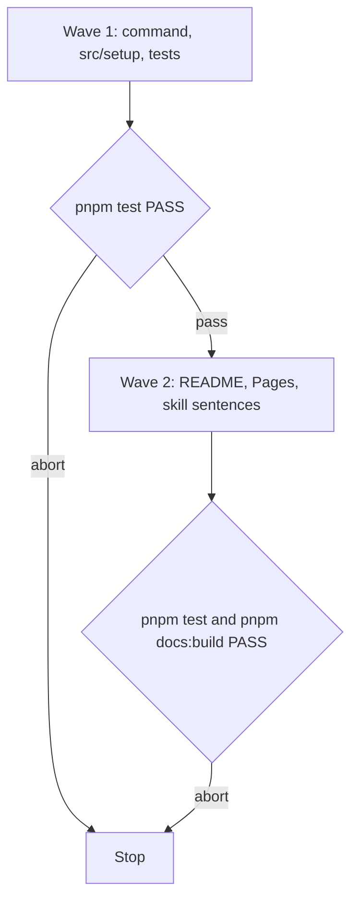

# Tell the CLI setup flow apart from harness-init

**Source:** confirmed ask — the public command is `setup`; every CLI name that is not the `harness-init` skill or its agentic flow is renamed; compound names may only be `setup-<something>` or `install-<something>`, so a reader can tell the CLI setup/install flow from `harness-init`.
**Next:** After approval → `code-plan` (below) → `code-execute`, wave 1 → 2.
**Named proof:** `proof-cli-setup-spec-obligations`

## Terms

- **setup** — the CLI command that scaffolds a consumer repo. Replaces the public command `init`. Recorded here at first use as the command name.
- **setup-&lt;something&gt;** / **install-&lt;something&gt;** — the only allowed shapes for a compound name that belongs to that CLI flow (test files, test titles).
- **harness-init** — the skill a person asks an agent to run after `setup` finishes. Already the name in [templates/.agents/skills/harness-init/SKILL.md](../../../templates/.agents/skills/harness-init/SKILL.md). Not renamed.
- **git init** — the git command. Unrelated. Stays.

Checked against [docs/adrs/adr-001-claim-path.md](../../adrs/adr-001-claim-path.md) and [docs/adrs/adr-002-public-npm-oidc.md](../../adrs/adr-002-public-npm-oidc.md). Neither ADR names this command. No new term collides with them.

## Repository grounding

- [src/cli.ts](../../../src/cli.ts) dispatches `case 'init'` to `runInit` today. Yes. This initiative changes that case to `setup`.
- [src/init/](../../../src/init/) holds the command implementation (`runInit`, `InitError`, `InitCancelled`). Yes. The folder moves to `src/setup/`. Files inside it (`ui.ts`, `options.ts`, `apply.ts`, and the rest) are not named `init` and stay.
- Nine test files are named `test/init-*.test.ts`. Yes. They move to `setup-<something>.test.ts`, except the package-install warning file, which moves to `install-devdep.test.ts`.
- `test/harness-init-*.test.ts`, [test/skill-harness-init.test.ts](../../../test/skill-harness-init.test.ts), [site/harness-init.md](../../../site/harness-init.md), and [templates/.agents/skills/harness-init/](../../../templates/.agents/skills/harness-init/) exist. Yes. They stay, except sentences that name the CLI command.
- [README.md](../../../README.md) pins `pnpm exec wolven-harness init` via [test/readme-install.test.ts](../../../test/readme-install.test.ts). Yes. The pin moves with the command.
- `pnpm test`, `pnpm validate`, and `pnpm docs:build` exist in [package.json](../../../package.json). Yes. They are the gates. This repo's integrity script is `pnpm validate`, not `harness:validate`.

## Surface walk

- **In scope:** [src/cli.ts](../../../src/cli.ts); [src/init/](../../../src/init/) renamed to `src/setup/`; importers in [src/validate/](../../../src/validate/) and [src/comments/](../../../src/comments/); the nine `test/init-*.test.ts` files; CLI mentions in [README.md](../../../README.md), [site/](../../../site/), and skill markdown that means the command.
- **Out of mutate scope:** the `harness-init` skill folder, its tests, [site/harness-init.md](../../../site/harness-init.md) title and step list, session-note slugs `harness-init-<date>`, `git init`, `initialValue` / `selectInitial`, Pages theme CSS, npm publish, and [docs/adrs/](../../adrs/).

## Name map

The command word is `setup`. There is no `init` alias.

Compound names that belong to the CLI use only these shapes:

- `setup-<something>` for command behavior (UI, options, apply, surfaces, layout, runtimes, skill sets, qmd ignore, config).
- `install-<something>` for the package-install warning (devDependency missing, listed under `dependencies`, or absent `package.json`).

| Today | After |
| --- | --- |
| `case 'init'`, `runInit` | `setup`, `runSetup` |
| `InitError`, `InitCancelled` | `SetupError`, `SetupCancelled` |
| `wolven-harness init:`, `[wolven-harness:init]` | `wolven-harness setup:`, `[wolven-harness:setup]` |
| `src/init/` | `src/setup/` |
| `test/init-ui.test.ts` and titles `init-ui:` | `test/setup-ui.test.ts`, `setup-ui:` |
| `test/init-options.test.ts` | `test/setup-options.test.ts` |
| `test/init-apply.test.ts` | `test/setup-apply.test.ts` |
| `test/init-surfaces.test.ts` | `test/setup-surfaces.test.ts` |
| `test/init-layout.test.ts` | `test/setup-layout.test.ts` |
| `test/init-runtimes.test.ts` | `test/setup-runtimes.test.ts` |
| `test/init-skill-sets.test.ts` | `test/setup-skill-sets.test.ts` |
| `test/init-qmd-ignore.test.ts` | `test/setup-qmd-ignore.test.ts` |
| `test/init-install.test.ts` titles `init-devdep:` | `test/install-devdep.test.ts`, `install-devdep:` |
| titles `init-config:` in that file | `setup-config:` (the config file the command writes, not the skill) |
| `run(['init', ...])` | `run(['setup', ...])` |

`git init` in [src/init/options.ts](../../../src/init/options.ts) stays. The same hint's "re-run init" becomes "re-run setup".

## Waves

A failed gate aborts before the next wave. The same stops are the plan's gate units.

## Requirements

### R1 — The command is setup

| ID | Obligation | Named proof | Evidence shape |
| --- | --- | --- | --- |
| R1.1 | `wolven-harness setup` runs the scaffold. `wolven-harness init` is an unknown command and exits 1. | `proof-cli-setup-dispatch` | `pnpm test` on the dispatch test; usage text lists `setup` and does not list a command named `init` |
| R1.2 | Errors and the debug tag say `wolven-harness setup:` and `[wolven-harness:setup]`. | `proof-cli-setup-stderr` | [test/setup-ui.test.ts](../../../test/setup-ui.test.ts) asserts the unknown-option line and the debug tag |
| R1.3 | `src/init/` is gone. `src/setup/` exports `runSetup`, `SetupError`, and `SetupCancelled`. No `runInit`, `InitError`, or `InitCancelled` remains under `src/`. | `proof-cli-setup-symbols` | `rg` of those three old symbols under `src/` is empty; `src/setup/` exists |

### R2 — Compound names use only the two prefixes

| ID | Obligation | Named proof | Evidence shape |
| --- | --- | --- | --- |
| R2.1 | No test file is named `init-*.test.ts`. Command-behavior files match `setup-*.test.ts`. The devDependency file is `install-devdep.test.ts`. | `proof-cli-setup-filenames` | `rg --files` under `test/` for `init-` matches nothing; the nine new names exist |
| R2.2 | Test titles that were `init-<topic>:` are `setup-<topic>:` or `install-devdep:`. | `proof-cli-setup-titles` | `rg "test\\('init-" test` is empty |

### R3 — Prose names the command setup and the skill harness-init

| ID | Obligation | Named proof | Evidence shape |
| --- | --- | --- | --- |
| R3.1 | The README install line is `pnpm exec wolven-harness setup`, still before any later mention, and still free of GitHub Packages residue. | `proof-cli-setup-readme` | [test/readme-install.test.ts](../../../test/readme-install.test.ts) |
| R3.2 | Pages and skill sentences that mean the CLI say `setup`. The skill name, folder, docs title "Setting up with harness-init", and `harness-init-<date>` slugs stay. | `proof-cli-setup-prose` | `rg "wolven-harness init" ` is empty; `rg "harness-init"` still hits the skill, its tests, and [site/harness-init.md](../../../site/harness-init.md) |
| R3.3 | The string `git init` remains in the not-a-repository hint and in test fixtures. | `proof-cli-setup-git-init` | `rg "git init" src test` still hits [src/setup/options.ts](../../../src/setup/options.ts) and [test/helpers/fixture.ts](../../../test/helpers/fixture.ts) |

## Nine-dimension landings

| Dimension | Landing kind | Landing |
| --- | --- | --- |
| validation | obligation ↔ proof | R1.1 / `proof-cli-setup-dispatch` — `init` is rejected; `setup` accepts the same flags `--git-host`, `--runtimes`, `--skills`, `--verbose`, `--debug` |
| failure modes | obligation ↔ proof | R1.2 / `proof-cli-setup-stderr` — a bad flag still exits 1 with `wolven-harness setup: unknown option` |
| idempotency and retry | n/a | Unchanged surface: re-run behavior in [src/init/apply.ts](../../../src/init/apply.ts) (skip existing paths, rewrite `packageVersion`). This initiative only renames it. |
| authorization | n/a | Unchanged surface: [src/cli.ts](../../../src/cli.ts) has no auth. Local process only. |
| concurrency and ordering | n/a | Unchanged surface: `main()` in [src/cli.ts](../../../src/cli.ts) runs one command per process. No new lock. |
| data lifecycle | n/a | Unchanged surface: [src/init/config.ts](../../../src/init/config.ts) still writes `.wolven-harness.json` with the same keys. |
| external-dependency failure | n/a | Unchanged surface: [package.json](../../../package.json) `dependencies` stay `yaml` and `@clack/prompts`. No new network call. |
| state transitions | n/a | Unchanged surface: the scaffold still only adds missing paths and does not edit `AGENTS.md` or commit. Behavior stays in `apply.ts`. |
| observability | obligation ↔ proof | R1.2 / `proof-cli-setup-stderr` — `--debug` and `WOLVEN_HARNESS_DEBUG=1` emit `[wolven-harness:setup] step …` on stderr only |

## Unresolved

| Identifier | Decision needed | Owner | Blocking effect | Disposition |
| --- | --- | --- | --- | --- |
| — | None. The command word, the two prefixes, and what stays `harness-init` are decided. | — | non-blocking | — |

## Out of scope

- An `init` alias.
- Renaming the `harness-init` skill, its tests, or its session-note slug.
- Renaming `git init` or identifiers that mean "initial" (`initialValue`).
- Pages visual design. The hairline commit stays as it is.
- Publishing, and merging PR 15.

## Pragmatic-guard refuses

- A compatibility alias for `init`.
- A new dependency or a new command beside `setup`, `validate`, and `comments`.
- Renaming files that are already `harness-init` so they "look consistent".
- A third prefix besides `setup-` and `install-`.

## Acceptance

### Wave 1

- [x] `proof-cli-setup-dispatch` PASS
- [x] `proof-cli-setup-stderr` PASS
- [x] `proof-cli-setup-symbols` PASS
- [x] `proof-cli-setup-filenames` PASS
- [x] `proof-cli-setup-titles` PASS

### Wave 2

- [x] `proof-cli-setup-readme` PASS
- [x] `proof-cli-setup-prose` PASS
- [x] `proof-cli-setup-git-init` PASS

## Eval / gates

| Gate | Command / check | When | PASS | Abort |
| --- | --- | --- | --- | --- |
| Integrity | `pnpm validate` | End of each wave | exit 0 | Fix; do not proceed |
| Tests | `pnpm test` | End of each wave | fail 0 | Fix; do not proceed |
| Docs build | `pnpm docs:build` | End of wave 2 | exit 0 | Fix; do not proceed |
| Spec obligations | `proof-cli-setup-spec-obligations` — each acceptance box pairs with one obligation; all nine landings present; every `n/a` cites a surface | Before execute | all hold | Do not execute |

## Cross-domain leak table

| Leak | Refuse |
| --- | --- |
| Rename the `harness-init` skill | Stays. It is the agentic flow, not the CLI. |
| Pages theme or the header hairline | Already on `bc78884`. Not this initiative. |
| Merge PR 15 or publish to npm | Human. Release stays [docs/adrs/adr-002-public-npm-oidc.md](../../adrs/adr-002-public-npm-oidc.md). |
| An executable plan inside the spec file | The plan file only. |

## ADR

None owed. The claim gate (ADR-001) and npm publish (ADR-002) are unchanged. Do not add an ADR for a command rename.
