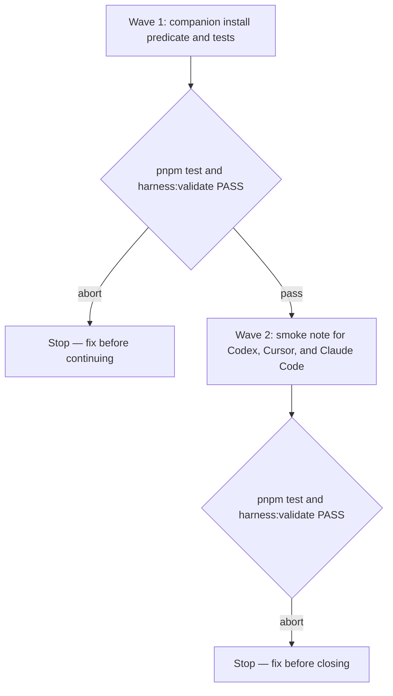

# Cloud session skill discovery

**Source:** confirmed ask, [issue 50](https://github.com/WolvenTech/wolven-harness/issues/50), including the issue comment that records the Antigravity / Gemini session on PR #49.
**Next:** Plan is `docs/specs/cloud-session-skills/cloud-session-skills-plan.md`. After the Human approves the plan → `code-execute`, wave **1 → 2**.
**Named proof (this spec's own structural gate):** `proof-cloud-session-skills-spec-obligations`

A **session skill list** is the list of skills the runtime provided for this session. A **required companion** is a skill the current skill must have installed before it performs that companion's procedure: `code-pr` before a host action in `code-review` and `code-ci`, and `code-commit` before `git commit` in `code-pr`, `code-ci`, and `code-pr/references/pre-merge-closure.md`. **Installed** means `SKILL.md` is at `.agents/skills/<name>/SKILL.md` or `.claude/skills/<name>/SKILL.md` in the checkout. A remembered name is not installed. An **optional consult** is `pragmatic-guard`, `grilling`, or the `adr` offer. Those stay on the session skill list.

The issue comment decides the companion predicate. Ask-only skills set `disable-model-invocation: true` and `allow_implicit_invocation: false`, and hosts that honor those flags leave them off the implicit session skill list. The standalone-skills rule still stops when the companion was never installed. The stop looks at the checkout file, because an ask-only companion is off that implicit list even when the file is there.

The Human confirmed three further choices. Grokbot is outside this spec; `docs/deferrals/grok-cloud-runtime/grok-cloud-runtime-deferral.md` holds the revisit. Both required companions use the checkout file. After wave 1 is in the checkout, the Human runs Codex, Cursor, and Claude Code and brings back a report; wave 2 fills the smoke note from that report.

## Term challenge

| Term | Where it already lives | Use in this spec |
|------|------------------------|------------------|
| Session skill list | `code-review`, `code-ci`, `code-pr`, `create-prd` | Still the predicate for optional consults and for the `code-spec` / `code-plan` handoff |
| Load path | ADR-004 | Installed companions are `SKILL.md` on the Claude path or the shared Codex/Cursor path |
| Ask-only | `disable-model-invocation: true` and `agents/openai.yaml` `allow_implicit_invocation: false` on `code-review`, `code-pr`, `code-ci`, and `handoff` | Those flags stay set |
| Required companion | Host-step and commit-step sentences in `code-review`, `code-ci`, `code-pr`, and `pre-merge-closure.md` | Predicate becomes the checkout `SKILL.md` |

## Repository grounding

| Surface | Present today | Role for this initiative |
|---------|----------------|----------------------------|
| `.agents/skills/code-review/SKILL.md`, `code-ci/SKILL.md`, `code-pr/SKILL.md`, `code-pr/references/pre-merge-closure.md` | yes | Dogfood copies. `proof-lean-init-copies-identical` in `test/skill-copies.test.ts` keeps them identical to the template copies |
| `templates/.agents/skills/` copies of those four files | yes | Package copy. `test/helpers/skill-contract.ts` `readSkill` reads this tree |
| `disable-model-invocation: true` and `allow_implicit_invocation: false` | yes, on `code-review`, `code-pr`, `code-ci`, `handoff` | Left set. `code-commit`, `code-spec`, `code-plan`, `adr`, `pragmatic-guard`, and `grilling` do not set them |
| ADR-004 | yes, `stable` | Project load paths. `.wolven-harness.json` has no per-skill inventory |
| `src/setup/runtimes.ts` | yes | Claude symlink `.claude/skills` → `../.agents/skills`. Unchanged |
| `test/skill-code-review.test.ts` | yes | Locks the `code-spec` / `code-plan` handoff on the session skill list (`proof-skills-command-handoff-absent`) |
| `docs/notes/cloud-session-skills/` | no | Wave 2 writes the smoke note |

## Surface walk

- **In scope:** the `code-pr` host-step sentence in both copies of `code-review/SKILL.md` and `code-ci/SKILL.md`; the `code-commit` commit sentence in both copies of `code-pr/SKILL.md`, `code-ci/SKILL.md`, and `code-pr/references/pre-merge-closure.md`; assertions in `test/skill-code-review.test.ts`, `test/skill-code-ci.test.ts`, and `test/skill-code-pr.test.ts`; wave 2 note `docs/notes/cloud-session-skills/cloud-session-skills-note.md`.
- **Out of mutate scope (unchanged):** optional-consult paragraphs (`pragmatic-guard`, `grilling`, `adr`); the `code-review` review-fix handoff for `code-spec` and `code-plan`; `disable-model-invocation` and `agents/openai.yaml`; `src/setup/**`; `src/skills/**`; ADR-004; `.wolven-harness.json`; `.cursor/environment.json`; `AGENTS.md`.

## Waves

A failed gate aborts before the next wave. Wave 2 starts only after wave 1 passes and the Human brings back the three-runtime report.

## Requirements (obligation ↔ proof)

### R1 — Companion presence is the checkout file

| ID | Obligation | Named proof | Evidence shape |
|----|------------|--------------|------------------|
| R1.1 | In both copies of `code-review` and `code-ci`, a host action follows `code-pr/references/host-operations.md` when `code-pr/SKILL.md` is installed. When that file is on neither project load path, the skill stops before the host action, names `code-pr`, and does not copy the host procedure. That sentence does not consult the session skill list | `proof-cloud-session-skills-code-pr-installed` | `pnpm test` — `readSkill` matches the install sentence and the stop sentence in `code-review` and `code-ci`. `proof-lean-init-copies-identical` passes |
| R1.2 | In both copies of `code-pr`, `code-ci`, and `pre-merge-closure.md`, a commit goes through `code-commit` when `code-commit/SKILL.md` is installed. When that file is on neither project load path, the skill stops, names `code-commit`, and does not run `git commit`. That sentence does not consult the session skill list | `proof-cloud-session-skills-code-commit-installed` | `pnpm test` — `readSkill('code-pr')` and `readSkill('code-ci')` match the commit sentence; the `code-pr` test reads `references/pre-merge-closure.md` for the same sentence. `proof-lean-init-copies-identical` passes |

### R2 — Ask-only flags and optional consults stay

| ID | Obligation | Named proof | Evidence shape |
|----|------------|--------------|------------------|
| R2.1 | `code-review`, `code-pr`, `code-ci`, and `handoff` still set `disable-model-invocation: true` in `SKILL.md` and `allow_implicit_invocation: false` in `agents/openai.yaml`, in both trees | `proof-cloud-session-skills-ask-only` | `pnpm test` reads those four frontmatter flags and the four `openai.yaml` files under `templates/.agents/skills/`. `proof-lean-init-copies-identical` passes |
| R2.2 | `pragmatic-guard` and `grilling` consults, the `create-prd` `adr` offer, the `pre-merge-closure.md` `adr` promotion step, and the `code-review` handoff for `code-spec` or `code-plan` still key off the session skill list. Those paragraphs still say a folder on disk or a remembered name is not loaded where they say it today | `proof-cloud-session-skills-consults-stay` | `pnpm test` — existing `proof-skills-command-handoff-absent` plus assertions that `code-ci`, `code-pr`, and `create-prd` still contain `A folder on disk or a remembered name is not loaded` for the consult, and that `pre-merge-closure.md` still keys `adr` off the session skill list |

### R3 — Smoke after the predicate change

| ID | Obligation | Named proof | Evidence shape |
|----|------------|--------------|------------------|
| R3.1 | `docs/notes/cloud-session-skills/cloud-session-skills-note.md` has `type: note` and a section each for Codex, Cursor, and Claude Code. The Human runs those three sessions after wave 1 is in the checkout and brings back a report. Each section is filled from that report with one line `Smoke: proceeded —` or `Smoke: stopped —` plus one sentence. A proceeded line states that an explicit `code-review` or `code-ci` ask performed a host action while `code-pr` was off the implicit session skill list. A stopped line states why the session stopped | `proof-cloud-session-skills-smoke` | `pnpm test` reads the three lines and rejects a missing line, a placeholder, or a line without both the label and a sentence |

## Nine-dimension landings

| Dimension | Landing kind | Landing |
|-----------|---------------|---------|
| validation | obligation ↔ proof | R1.1 / `proof-cloud-session-skills-code-pr-installed` and R1.2 / `proof-cloud-session-skills-code-commit-installed` |
| failure modes | obligation ↔ proof | R1.1 and R1.2 — a companion with no `SKILL.md` on either project load path still stops the host action or the commit and names the skill |
| idempotency and retry | `n/a` | Unchanged surface: `wireClaudeSkillsSymlink` in `src/setup/runtimes.ts` skips `.claude/skills` when the path already exists |
| authorization | obligation ↔ proof | R2.2 / `proof-cloud-session-skills-consults-stay` — optional consults and the `code-spec` / `code-plan` handoff still ignore a folder on disk. R1.1 is the companion check: host operations run only when `code-pr/SKILL.md` is installed |
| concurrency and ordering | `n/a` | Unchanged surface: the cloud session uses the git checkout it cloned. This initiative adds no writer and no lock |
| data lifecycle | `n/a` | Unchanged surface: `.wolven-harness.json` stays the ADR-004 object. No per-skill inventory is added |
| external-dependency failure | obligation ↔ proof | R1.1 / `proof-cloud-session-skills-code-pr-installed` — a host that leaves ask-only skills off the implicit session skill list still allows the host action when `code-pr/SKILL.md` is installed |
| state transitions | obligation ↔ proof | R2.1 / `proof-cloud-session-skills-ask-only` — `code-review`, `code-pr`, `code-ci`, and `handoff` stay ask-only |
| observability | obligation ↔ proof | R1.1 and R3.1 — a missing companion is named in the stop, and each wave 2 section records proceeded or stopped |

## Unresolved

| Identifier | Decision needed | Owner | Blocking effect | Disposition |
|------------|-------------------|-------|-------------------|--------------|

## Out of scope

- Grokbot, a `grok` runtime, and a `.grok/skills/` tree. Revisit lives in `docs/deferrals/grok-cloud-runtime/grok-cloud-runtime-deferral.md`.
- Home-directory installs (`~/.agents/skills/`, `~/.claude/skills/`) and Cursor Sync Skills for Cloud Agents.
- A plugin manifest or a marketplace entry.
- A per-skill key in `.wolven-harness.json`.
- Changing ask-only frontmatter, or teaching `code-review` to draft an iteration spec when `code-spec` or `code-plan` is only on disk.
- Performing the PR 49 review.
- Site command pages.

## Pragmatic-guard refuses

- A session-time registrar or a Codex plugin so ask-only skills appear on the implicit catalog. Need 2 once the companion check reads the checkout. Complexity 8. Verdict: refuse. Deferral: `docs/deferrals/codex-cloud-plugin/codex-cloud-plugin-deferral.md`.
- A Grok runtime or a `.grok/skills/` tree. Need 3. Complexity 7. Verdict: refuse. Deferral: `docs/deferrals/grok-cloud-runtime/grok-cloud-runtime-deferral.md`.
- A duplicated `.claude/skills/` tree beside the symlink. Need 2. Complexity 6. Verdict: refuse. Deferral: `docs/deferrals/skill-tree-copy/skill-tree-copy-deferral.md`.
- A new `.wolven-harness.json` skill inventory. Need 1 — ADR-004 has no per-skill list, and the checkout `SKILL.md` is the install signal the comment names. Complexity 4. Verdict: refuse. No deferral.

Companion install check: need 9 (the PR #49 session stopped with `code-pr` on disk), complexity 3 (predicate sentences and tests). Verdict: approve.

## Acceptance

### Wave 1

- [ ] `proof-cloud-session-skills-code-pr-installed` PASS — host actions key off an installed `code-pr`
- [ ] `proof-cloud-session-skills-code-commit-installed` PASS — commits key off an installed `code-commit`
- [ ] `proof-cloud-session-skills-ask-only` PASS — ask-only flags stay set
- [ ] `proof-cloud-session-skills-consults-stay` PASS — optional consults and the review-fix handoff stay on the session skill list

### Wave 2

- [ ] `proof-cloud-session-skills-smoke` PASS — Codex, Cursor, and Claude Code each have a proceeded or stopped line taken from the Human's report

## Eval / gates

| Gate | Command / check | When | PASS | Abort |
|------|-------------------|------|------|-------|
| Integrity | `pnpm harness:validate` | End of each wave | exit 0 | Fix; do not proceed |
| Wave proofs | `pnpm test` | End of each wave | Wave 1: R1.1, R1.2, R2.1, R2.2. Wave 2: those plus R3.1 | Fix; do not proceed |
| Spec obligations | `proof-cloud-session-skills-spec-obligations` — obligation ↔ proof matrix; all nine landings; every `n/a` cites an unchanged surface | Before `code-plan` | all hold | Do not plan |

## Cross-domain leak table

| Leak | Refuse |
|------|--------|
| Reviewing or merging PR 49 | The reproducing session. Outside this spec |
| Cursor account sync, Claude account skills, Grok Bot Settings → Plugins | Host account settings, outside the checkout |
| A new runtime or a changed load path inside ADR-004 | The `adr` skill, and only after the grok-cloud-runtime deferral trigger says the contract changes |
| An executable plan from this skill | `code-plan` only |

## ADR

None needed this initiative. ADR-004 already records the load paths. The companion predicate is skill text. A later decision that adds a runtime or a load path uses the `adr` skill for numbering and supersession.

## Section checklist

| Section | Required when |
|---------|-----------------|
| Source | Always |
| Repository grounding | Always |
| Surface walk | Always |
| Waves | The work spans more than one mutate batch |
| Requirements with obligation ↔ proof | Always |
| Nine-dimension landings | Always — all nine named |
| Unresolved | Always — an empty table is fine when no product or contract decision is open |
| Out of scope | Always |
| Pragmatic-guard refuses | Always |
| Acceptance | Always — tick a box only once its evidence exists |
| Eval / gates | Always |
| Cross-domain leak table | Always |
| ADR | Always — even when the answer is "none needed this initiative" |
