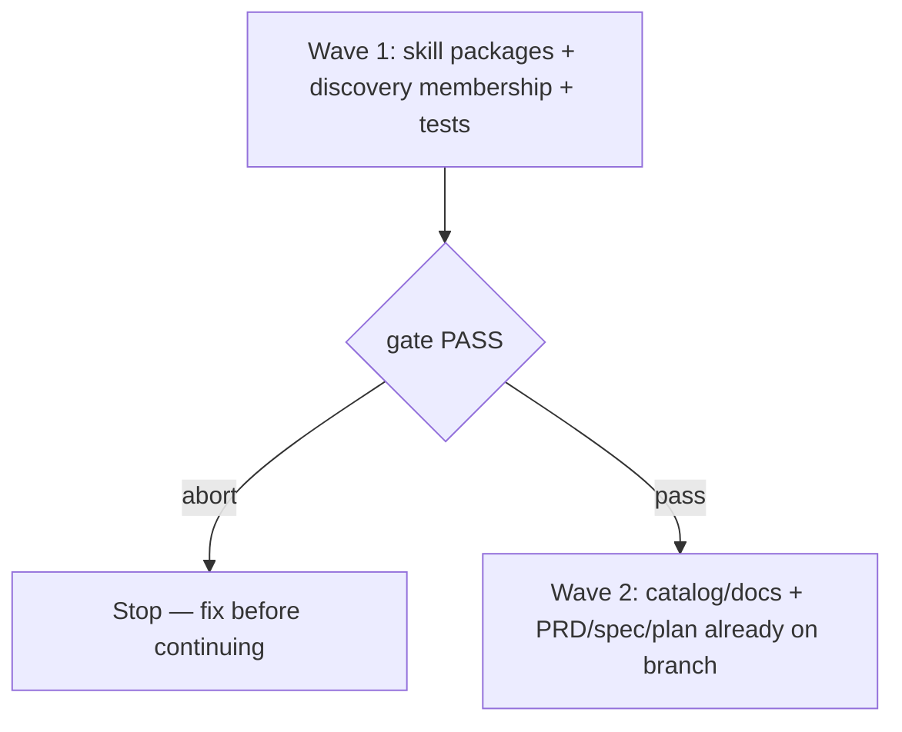

# Fool and Jury discovery skills

**Source:** `docs/prds/fool-jury-skills/fool-jury-skills-prd.md` (status `stable`).
**Next:** After the Human approves → `code-plan` → `code-execute`, wave **1 → 2**.
**Named proof (this spec's own structural gate):** `proof-fool-jury-skills-spec-obligations`

## Repository grounding

| Surface | Present today | Role for this initiative |
|---------|----------------|----------------------------|
| `src/setup/skill-sets.ts` | yes | Add both folders to `SET_SKILLS.discovery` |
| `templates/.agents/skills/*` | yes (16 folders before this initiative) | Add `the-fool` and `the-jury` packages; Jury ships five juror agent files |
| `test/ask-only.test.ts`, `test/skill-sets.test.ts`, `test/setup-skill-sets.test.ts` | yes | Partition/count/install expectations become 18 |
| `site/skills.md`, `site/layout.md`, `README.md` | yes | Catalog copy for discovery membership and distinctions |
| `src/setup/options.ts` discovery prompt | yes | Hint text lists discovery skills |
| `src/setup/render-wolven.ts` | yes | Auto-picks up new skill frontmatter — no code change required |
| `grilling` skill | yes | Remains distinct; catalog must contrast it |
| Issue #22 `setup --skill` | no (sibling) | Out of mutate scope; folders must stay ordinary skills |

## Surface walk

- **In scope:** `templates/.agents/skills/the-fool/**`, `templates/.agents/skills/the-jury/**` (including `agents/` juror artifacts), `src/setup/skill-sets.ts`, discovery hint in `src/setup/options.ts`, tests that enumerate skills/counts and Jury isolation proofs, `site/skills.md`, `site/layout.md`, `README.md`, this PRD/spec/plan under `docs/`
- **Out of mutate scope (unchanged):** `grilling` skill body, ship/core set membership, ADR-003 public CLI verbs (no new flags), consumer `AGENTS.md` behavior, #22 pick-skill implementation

## Waves

- Wave 1 gate: `pnpm test` (skill-set/ask-only/setup-skill-sets/Jury agent proofs) and skill folders present with frontmatter
- Wave 2 gate: `pnpm lint && pnpm build && pnpm test && pnpm validate` (docs + full gate)
- A failed gate aborts before the next wave

## Requirements (obligation ↔ proof)

### R1 — Discovery membership and install

| ID | Obligation | Named proof | Evidence shape |
|----|------------|--------------|------------------|
| R1.1 | `SET_SKILLS.discovery` includes `the-fool` and `the-jury` | `proof-fool-jury-discovery-membership` | Inspect `src/setup/skill-sets.ts`; `pnpm test` skill-sets partition |
| R1.2 | `setup --skills discovery` installs both skill folders; `--skills none` does not | `proof-fool-jury-setup-install` | `pnpm test` setup-skill-sets / targeted assert |
| R1.3 | Template skill folders are exactly the eighteen expected names, including both new ones | `proof-fool-jury-eighteen-folders` | `test/ask-only.test.ts` EXPECTED_SKILLS |

### R2 — Fool skill behavior

| ID | Obligation | Named proof | Evidence shape |
|----|------------|--------------|------------------|
| R2.1 | `the-fool` SKILL.md requires steelman, 3–5 challenges, user response before synthesis, and does not force a decision | `proof-fool-workflow` | Grep/inspect skill text |
| R2.2 | Mode selection is explicit (ask or structured recommend); modes documented with references as needed | `proof-fool-modes` | Inspect SKILL.md + references |
| R2.3 | MIT provenance attributed in the skill folder | `proof-fool-attribution` | LICENSE or NOTICE / frontmatter license + upstream credit |

### R3 — Jury skill behavior

| ID | Obligation | Named proof | Evidence shape |
|----|------------|--------------|------------------|
| R3.1 | `the-jury` ships exactly five distinct juror agent artifacts under `agents/`, requires spawning them in parallel with isolated first-round contexts, then deliberates only after those opinions are recorded (with shared visibility of first-round verdicts), and preserves dissent | `proof-jury-independence` | Assert five `agents/juror-*.md` files exist; inspect skill text for parallel spawn + isolation + post-round visibility; reject persona-simulation-only independence language |
| R3.2 | Verdict output requires confidence and one concrete test | `proof-jury-verdict` | Inspect skill text |
| R3.3 | Jury is harness-authored (no unknown-license vendor copy) | `proof-jury-authorship` | Inspect skill; no third-party LICENSE claiming foreign ownership |
| R3.4 | Single-agent persona simulation is refused as the independence path; when isolated juror spawn is unavailable, the skill degrades or stops explicitly rather than claiming independent reviewers | `proof-jury-no-persona-fallback` | Inspect skill refuses/anti-patterns; test asserts absence of "simulate independence" / single-context persona language as the approved path |
| R3.5 | Verdict is advisory; the Human retains decision authority | `proof-jury-human-authority` | Inspect skill text for Human authority / no execute-from-verdict |

### R4 — Catalog distinction and invocability

| ID | Obligation | Named proof | Evidence shape |
|----|------------|--------------|------------------|
| R4.1 | `site/skills.md` and README discovery list describe both skills and contrast with grilling | `proof-fool-jury-catalog` | Grep/inspect docs |
| R4.2 | Neither skill is ask-only | `proof-fool-jury-invocable` | `test/ask-only.test.ts` model-invocable path |
| R4.3 | Discovery prompt hint mentions the expanded set accurately | `proof-fool-jury-prompt-hint` | Inspect `src/setup/options.ts` |

### R5 — Validate across runtimes wiring

| ID | Obligation | Named proof | Evidence shape |
|----|------------|--------------|------------------|
| R5.1 | Both skills pass skill-frontmatter validation when installed | `proof-fool-jury-validate` | `pnpm build && pnpm validate` in this package repo after templates land |
| R5.2 | No new runtime dependency added | `proof-fool-jury-no-new-dep` | `package.json` dependencies unchanged for this initiative |

## Nine-dimension landings

| Dimension | Landing kind | Landing |
|-----------|---------------|---------|
| validation | obligation ↔ proof | R5.1 / `proof-fool-jury-validate` |
| failure modes | obligation ↔ proof | R1.2 / `proof-fool-jury-setup-install` — core-only path excludes the new skills; R3.4 / `proof-jury-no-persona-fallback` — no isolated spawn → explicit degrade/stop |
| idempotency and retry | `n/a` | Unchanged surface: `setup` still only creates missing paths (`src/setup/apply.ts`) |
| authorization | obligation ↔ proof | R3.5 / `proof-jury-human-authority` — Human retains decision authority over verdict side effects |
| concurrency and ordering | obligation ↔ proof | R3.1 / `proof-jury-independence` — five jurors first-round in parallel isolation, then shared deliberation |
| data lifecycle | `n/a` | Unchanged surface: skill files are static templates; no persisted runtime state |
| external-dependency failure | obligation ↔ proof | R3.4 / `proof-jury-no-persona-fallback` — missing subagent spawn is an explicit stop/degrade, not a silent persona fallback |
| state transitions | obligation ↔ proof | R2.1 / `proof-fool-workflow` — Fool engage→synthesize; R3.1 / `proof-jury-independence` — isolated first round→shared deliberation→verdict |
| observability | `n/a` | Unchanged surface: setup summary already lists installed skill folders |

## Unresolved

| Identifier | Decision needed | Owner | Blocking effect | Disposition |
|------------|-------------------|-------|-------------------|--------------|
| *(none)* | | | | |

## Out of scope

- #22 `setup --skill` / `--list-skills` / lean init
- Changing `grilling` skill body
- New CLI verbs or runtime npm dependencies
- Editing consumer `AGENTS.md`
- Vendoring third-party Jury prose under a foreign license

## Pragmatic-guard refuses

- Implementing pick-skill "while we're here"
- Vendoring unknown-license Jury text
- Folding Fool into grilling
- Ask-only flags on discovery critique/verdict skills without a product reason
- Treating single-agent persona labels as independent jurors

## Acceptance

### Wave 1

- [ ] R1.1–R1.3, R2.*, R3.*, R4.2, R5.2 hold via tests/inspect
- [ ] `pnpm test` exit 0

### Wave 2

- [ ] R4.1, R4.3, R5.1 hold
- [ ] `pnpm lint && pnpm build && pnpm test && pnpm validate` exit 0

## Eval / gates

| Gate | Command / check | When | PASS | Abort |
|------|-------------------|------|------|-------|
| Integrity | `pnpm validate` (after `pnpm build`) | End of wave 2 | exit 0 | Fix; do not PR |
| Spec obligations | `proof-fool-jury-skills-spec-obligations` — every AC maps to an obligation; nine landings present | Before `code-plan` | all hold | Do not plan |
| Unit tests | `pnpm test` | End of each wave | exit 0 | Fix before next wave |
| Lint | `pnpm lint` | End of wave 2 | exit 0 | Fix |

## Cross-domain leak table

| Leak | Refuse |
|------|--------|
| Individual skill CLI (#22) | Sibling issue / separate PRD |
| An executable plan from this skill | `code-plan` only |
| CI babysitting / merge | `code-ci` / human |

## ADR

None needed this initiative — discovery set membership expansion is an additive catalog change under existing setup contract, not a new durable architecture decision.
