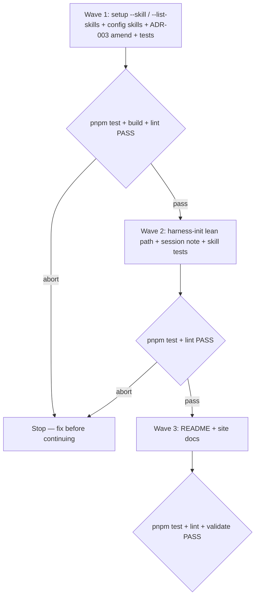

# Lean new-repo init and individually installable skills

**Source:** `/cursor/stores/self/internal/issue-22-prd.md` (status `stable`) — issue #22.
**Next:** After the Human approves → `code-plan` → `code-execute`, wave **1 → 2 → 3**.
**Named proof (this spec's own structural gate):** `proof-lean-init-skills-spec-obligations`

## Term challenge

| Term | Resolution |
|------|------------|
| `harness-init` | Agent skill playbook under `templates/.agents/skills/harness-init/` — not a CLI command |
| `setup` | Public CLI command (`wolven-harness setup`) — ADR-003 |
| `skill set` / `ship` / `discovery` / `core` | Existing partition in `src/setup/skill-sets.ts` and ADR-003 `--skills` |
| `session note` | Existing harness-init artifact under `docs/notes/harness-init-<date>/` |
| lean path | harness-init behavior for thin-evidence fresh repos: may defer deep discovery Q&A, web research, and per-dimension score-gap questions; never defers skill proposals |
| individual skill / `--skill` | Additive install of one template skill folder without opting into its whole set |
| `skills` (config) | New optional `.wolven-harness.json` array of individually installed skill folder names (distinct from `skillSets`) |

## Repository grounding

| Surface | Present today | Role for this initiative |
|---------|----------------|----------------------------|
| `src/setup/skill-sets.ts` | yes | Extend with catalog helpers (all known skill names, owners) and folder union for sets + individual skills |
| `src/setup/options.ts` | yes | Parse `--skill`, `--list-skills`; merge individual skills with set-derived folders |
| `src/setup/config.ts` | yes | Read/write optional `skills: string[]`; keep `skillSets` meaning whole sets only |
| `src/setup/apply.ts` | yes | Already filters by `skillFolders` — reused for union of set+individual folders |
| `src/setup/index.ts` | yes | Wire list-skills early exit; pass merged folders into `applyTemplates` |
| `templates/.agents/skills/harness-init/` | yes | Lean path rules, explicit deferral presentation, always-on step 4 proposals, session-note fields |
| `templates/.agents/skills/harness-init/references/session-note-template.md` | yes | Record deferred/skipped steps with reasons |
| `docs/adrs/adr-003-public-contract.md` | yes | Amend Decision tables + Amendments for `--skill`, `--list-skills`, optional `skills` |
| `README.md`, `site/skills.md`, `site/harness-init.md`, `site/commands.md` | yes | Document lean flow and individual skill install |
| `test/setup-skill-sets.test.ts`, `test/setup-options.test.ts`, `test/contract.test.ts`, `test/skill-harness-init.test.ts`, `test/harness-init-*.test.ts` | yes | Extend / add proofs |
| `harness:validate` / `pnpm test` / `pnpm lint` | yes | Integrity gates |

## Surface walk

- **In scope:** `src/setup/**` (options, config, skill-sets, index, summary as needed), `docs/adrs/adr-003-public-contract.md`, `templates/.agents/skills/harness-init/**`, related skill tests under `test/`, consumer-facing docs (`README.md`, `site/harness-init.md`, `site/skills.md`, `site/commands.md`), and packaging this initiative’s PRD/spec/plan under `docs/` in-repo when plan/execute land them.
- **Out of mutate scope (unchanged):** `validate` / `comments` command contracts; consumer `AGENTS.md` never created/edited by `setup`; skill set membership lists for `ship`/`discovery` contents (may still install a subset via `--skill`); issue #23 skills; abolishing skill sets.

## Waves

A failed gate aborts before the next wave.

## Requirements (obligation ↔ proof)

### R1 — Additive individual skill install

| ID | Obligation | Named proof | Evidence shape |
|----|------------|--------------|------------------|
| R1.1 | `setup` accepts `--skill <name>` and `--skill=<name>` (comma-separated names allowed in one value); each name must be a known template skill folder; unknown name exits 1 with a message naming valid skills | `proof-setup-skill-flag` | `test/setup-options.test.ts` / new test — invalid name fails; valid name resolves into install list |
| R1.2 | Resolved install folders = core ∪ folders from chosen/kept `skillSets` ∪ individually requested `skills` (deduped); `applyTemplates` receives that union | `proof-setup-skill-union` | Unit/integration: `--skills none --skill create-prd` installs core + `create-prd` only from discovery |
| R1.3 | Config records whole opted-in sets in `skillSets` only; individually installed names land in optional `skills` array; installing one discovery skill does not add `discovery` to `skillSets` | `proof-config-skills-partial` | Assert `.wolven-harness.json` after `--skill create-prd` |
| R1.4 | Re-run with `--skill` for an already-present skill is additive/idempotent: does not remove other skills or overwrite existing skill files; merges into existing `skills` / `skillSets` | `proof-setup-skill-rerun` | Repeat install test |
| R1.5 | `--skill` may be combined with `--skills`; `none` still means no optional sets, but `--skill` names still install | `proof-setup-skill-with-none` | Flag matrix test |

### R2 — List skills without mutating

| ID | Obligation | Named proof | Evidence shape |
|----|------------|--------------|------------------|
| R2.1 | `setup --list-skills` requires git top-level, prints available skills grouped by `core` / `ship` / `discovery` to stdout, exits 0, and does not copy templates or rewrite `.wolven-harness.json` | `proof-setup-list-skills` | CLI test observing stdout and filesystem unchanged |

### R3 — Lean harness-init path

| ID | Obligation | Named proof | Evidence shape |
|----|------------|--------------|------------------|
| R3.1 | harness-init documents a lean path for thin-evidence fresh repos that may propose deferring: deep discovery Q&A beyond files (step 2 extras), optional web research (step 3), and per-dimension score-gap keep/drop questions (part of step 6) | `proof-harness-init-lean-rules` | `test/skill-harness-init.test.ts` (or sibling) pins required phrases/structure in `SKILL.md` / references |
| R3.2 | Before proceeding with deferrals, the agent must present each deferred/skipped step by number/name with why and remaining work; the session note records those choices | `proof-harness-init-deferral-record` | Session-note template + skill text require a deferred-steps section; skill test pins it |
| R3.3 | Skill proposals (step 4) are never listed as deferred/skippable on the lean path; proposals cite the stated goal and available references or an explicit thin-evidence basis; unsupported tool/architecture decisions stay open | `proof-harness-init-proposals-always` | Skill test pins “never defer” / always-reach proposals language |
| R3.4 | Lean path still runs entry (0), migration when needed (1), file-based discovery (2), proposals (4), stubs user picks (5), a score run that records level without forcing every gap question, validate-wiring as one essential choice or an explicitly deferred item with reason, and closes the session note | `proof-harness-init-lean-must-run` | Skill text structure test |

### R4 — Docs and contract

| ID | Obligation | Named proof | Evidence shape |
|----|------------|--------------|------------------|
| R4.1 | ADR-003 Decision tables document `--skill`, `--list-skills`, and optional config `skills`; Amendments entry records the additive change | `proof-adr-003-skills-amend` | Inspect ADR body / contract tests updated |
| R4.2 | README and site docs (`harness-init`, `skills`, `commands`) explain lean init and how to list/install one skill non-interactively | `proof-docs-lean-skill` | Grep/doc tests or content assertions |

## Nine-dimension landings

| Dimension | Landing kind | Landing |
|-----------|---------------|---------|
| validation | obligation ↔ proof | R1.1 / `proof-setup-skill-flag` — unknown skill name fails setup before writes; R4.1 keeps contract tests green |
| failure modes | obligation ↔ proof | R1.1 / `proof-setup-skill-flag` — invalid `--skill` exits 1; R2.1 still errors when not at git top-level |
| idempotency and retry | obligation ↔ proof | R1.4 / `proof-setup-skill-rerun` — repeat `--skill` is safe; existing files skipped per setup guarantees |
| authorization | `n/a` | Unchanged surface: local CLI with no auth model (`src/cli.ts` / `setup`) |
| concurrency and ordering | `n/a` | Unchanged surface: single-process `setup` / agent session; no concurrent writer contract |
| data lifecycle | obligation ↔ proof | R1.3 / `proof-config-skills-partial` — `skills` and `skillSets` merge across re-runs; setup never removes installed skill folders |
| external-dependency failure | `n/a` | Unchanged surface: lean path still treats optional web research as Human-gated / deferrable (step 3); no new network dependency in CLI |
| state transitions | obligation ↔ proof | R3.2 / `proof-harness-init-deferral-record` — session note moves draft→stable with deferred steps recorded; R2.1 list-skills is a terminal early state (no config write) |
| observability | obligation ↔ proof | R2.1 / `proof-setup-list-skills` — list output on stdout; lean deferrals visible to Human before proceed and in session note |

## Unresolved

| Identifier | Decision needed | Owner | Blocking effect | Disposition |
|------------|-------------------|-------|-------------------|--------------|
| _(none)_ | — | — | — | Open product questions resolved in grilling (Q4–Q9) |

## Out of scope

- Issue #23 (The Fool / The Jury).
- Removing or renaming skill sets.
- `setup` creating or editing consumer `AGENTS.md`.
- Auto-completing stubs or building score-gap checks during init.
- New runtime dependencies.

## Pragmatic-guard refuses

- A new top-level CLI verb when `--skill` on `setup` suffices.
- Marking `discovery` in `skillSets` when only one discovery skill was installed.
- Silently skipping harness-init steps without naming them.
- Deferring skill proposals on the lean path.
- Inventing `--list-skills` behavior that rewrites config.

## Acceptance

### Wave 1

- [ ] `proof-setup-skill-flag` PASS
- [ ] `proof-setup-skill-union` PASS
- [ ] `proof-config-skills-partial` PASS
- [ ] `proof-setup-skill-rerun` PASS
- [ ] `proof-setup-skill-with-none` PASS
- [ ] `proof-setup-list-skills` PASS
- [ ] `proof-adr-003-skills-amend` PASS

### Wave 2

- [ ] `proof-harness-init-lean-rules` PASS
- [ ] `proof-harness-init-deferral-record` PASS
- [ ] `proof-harness-init-proposals-always` PASS
- [ ] `proof-harness-init-lean-must-run` PASS

### Wave 3

- [ ] `proof-docs-lean-skill` PASS

## Eval / gates

| Gate | Command / check | When | PASS | Abort |
|------|-------------------|------|------|-------|
| Integrity | `pnpm build && pnpm test && pnpm lint` (and `pnpm validate` when built artifacts needed) | End of each wave | exit 0 | Fix; do not proceed |
| Spec obligations | `proof-lean-init-skills-spec-obligations` — obligation ↔ proof matrix; all nine landings; every `n/a` cites an unchanged surface | Before `code-plan` | all hold | Do not plan |
| Comments | `pnpm comments` (or `wolven-harness comments`) on added `src/` / `test/` comment lines | Before PR merge | exit 0 | Fix narration/tag violations |

## Cross-domain leak table

| Leak | Refuse |
|------|--------|
| Implementing The Fool / The Jury (#23) | Separate issue / PRD |
| Abolishing skill sets in this change | Non-goal; keep `--skills` |
| Emitting plan units from this skill | `code-plan` only |
| Editing consumer AGENTS.md from setup | ADR-003 / AGENTS.md hard rule |

## ADR

Amend existing `docs/adrs/adr-003-public-contract.md` (additive flag + optional config key under change policy). No superseding ADR. Use the `adr` skill conventions for the Amendments entry and Decision table updates when Wave 1 lands.

## Section checklist

| Section | Required when |
|---------|-----------------|
| Source | done |
| Repository grounding | done |
| Surface walk | done |
| Waves | done (3 waves) |
| Requirements with obligation ↔ proof | done |
| Nine-dimension landings | done — all nine |
| Unresolved | done (empty) |
| Out of scope | done |
| Pragmatic-guard refuses | done |
| Acceptance | done |
| Eval / gates | done |
| Cross-domain leak table | done |
| ADR | done — amend ADR-003 |