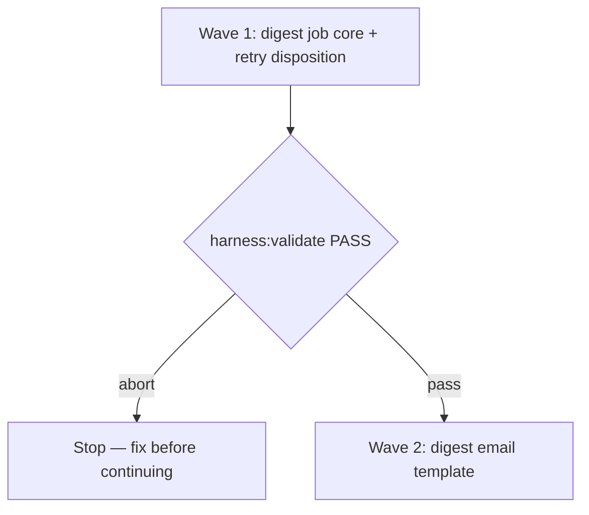

# Worked example — spec shapes (short cite)

Illustrates repository grounding, surface walk, obligation ↔ proof, mixed
nine-dimension landings, typed Unresolved, and a waves/eval excerpt. This is
a specimen only, not a live spec — paths use `<slug>` placeholders so
local link-checking never needs a file that doesn't exist.

Worked example: a small notification-digest feature — a scheduled job that
batches a user's unread notifications into one email per run instead of
sending one email per event.

## Repository grounding (excerpt)

| Surface | Present today | Role |
|---------|----------------|------|
| `src/jobs/digest/` | no | New — the digest job (this spec) |
| `src/notify/email/` | yes | Reused — the existing email sender |
| `harness:validate` | yes | Integrity gate reused |
| Prior ADRs | yes (none on this surface) | Checked before offering a new one |

## Surface walk (excerpt)

- **In scope:** `src/jobs/digest/**`, the digest template under
  `src/notify/email/templates/`
- **Out of mutate scope:** the existing per-event email path — left
  unchanged this initiative

## Obligation ↔ proof

| ID | Obligation | Named proof | Evidence shape |
|----|------------|--------------|------------------|
| R1.1 | The digest job batches every unread notification since the user's last digest into one email, in chronological order | `proof-digest-job-batch` | Inspect `src/jobs/digest/**` — run against a fixture inbox; output order checked |
| R1.2 | A user with zero unread notifications receives no digest email that run | `proof-digest-empty-skip` | Inspect — a fixture with zero unread notifications produces no send |

Acceptance boxes paired with the obligations above:

```markdown
- [ ] `proof-digest-job-batch` PASS — digest batches unread notifications in order
- [ ] `proof-digest-empty-skip` PASS — a user with nothing unread gets no email
```

## Nine-dimension landings (mixed)

| Dimension | Landing kind | Landing |
|-----------|---------------|---------|
| validation | obligation ↔ proof | R1.1 / `proof-digest-job-batch` — a notification missing its timestamp is dropped from the batch, not sent with a blank date |
| failure modes | obligation ↔ proof | R1.1 / `proof-digest-job-batch` — an email-send failure marks that user's digest failed, not silently skipped |
| idempotency and retry | Unresolved | See `U-example-retry` — fixed interval vs. exponential backoff still open |
| authorization | `n/a` | Unchanged surface: the digest job sends under the existing service account already used by `src/notify/email/**` |
| concurrency and ordering | existing + source | The existing per-user job lock in `src/jobs/**` already prevents two digests from running for the same user at once — reused as-is |
| data lifecycle | obligation ↔ proof | R1.1 / `proof-digest-job-batch` — a notification included in a digest is marked delivered; it is never sent twice |
| external-dependency failure | obligation ↔ proof | R1.1 / `proof-digest-job-batch` — the email provider's timeout retries per the existing sender's policy, then marks the digest failed |
| state transitions | obligation ↔ proof | R1.1 / `proof-digest-job-batch` — a digest run states `queued → sending → sent \| failed`, all enumerated and tested |
| observability | `n/a` | Unchanged surface: the existing job-queue logging in `src/jobs/**` already emits state transitions; this initiative adds no new log surface |

## Unresolved (minimum form)

| Identifier | Decision needed | Owner | Blocking effect | Disposition |
|------------|-------------------|-------|-------------------|--------------|
| `U-example-retry` | Fixed interval vs. exponential backoff for a failed digest send | Human | Blocks wave 1 acceptance until resolved | *(empty until the Human decides — do not invent)* |

## Waves (excerpt)



## Eval / gates excerpt

| Gate | Command / check | When | PASS | Abort |
|------|-------------------|------|------|-------|
| Integrity | `harness:validate` | End of each wave | exit 0 | Fix before continuing |
| Spec obligations | `proof-digest-spec-obligations` | Before `code-plan` | matrix + nine landings + `n/a` cites | Do not approve the spec |

## Cross-domain leak excerpt

| Leak | Refuse |
|------|--------|
| A ticket-tracker slice for this feature | Not this lane |
| A release or deploy step inside this spec | Belongs to a different initiative |
| An executable plan from this skill | Handoff to `code-plan` only |

## Term challenge (domain fold)

| Term | Resolution |
|------|--------------|
| "Digest" | One batched email per user per run — not a per-event notification |
| "Unread" | Not yet marked delivered in a prior digest or a per-event send |

## ADR note (as it would appear inside a frozen spec)

This is **not** an ADR file. A real ADR lives under `docs/adrs/` as
`adr-NNN-<slug>.md`. Inside the spec itself:

```markdown
## ADR

- **Offer?** Only if the digest job introduces new queue or scheduling
  wiring beyond feature code.
- **Skip:** A template-only or copy-only change with no infrastructure
  shift.
- **Read first:** Prior ADRs under `docs/adrs/` before proposing
  `adr-NNN-<slug>.md`.
```

For numbering and supersession, see `adr`.
