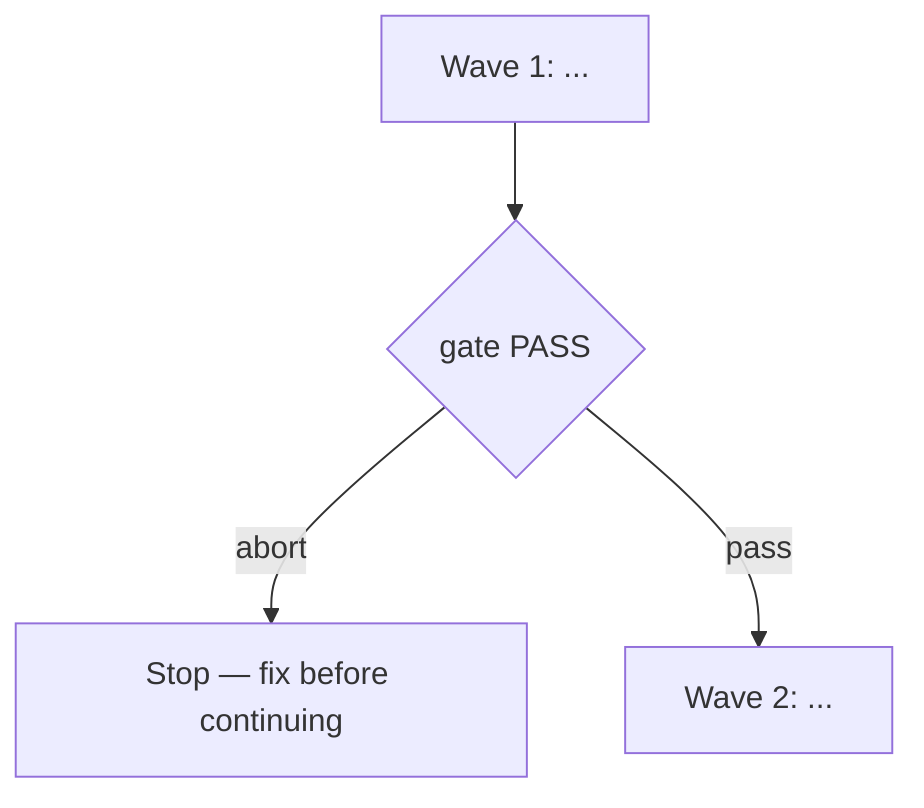

<!-- Copy this whole file into docs/specs/<slug>/<slug>-spec.md, fill every
placeholder, and delete the instructional comments before presenting. -->

# <title>

**Source:** `docs/prds/<slug>/<slug>-prd.md` (status `stable`) — or the
confirmed ask, quoted in one line, when there is no PRD.
**Next:** After the Human approves → `code-plan` → `code-execute`, wave
**1 → 2** if the work spans more than one mutate batch.
**Named proof (this spec's own structural gate):** `proof-<slug>-spec-obligations`

## Repository grounding

<!-- What already exists — disk and any prior ADRs. Do not invent a surface. -->

| Surface | Present today | Role for this initiative |
|---------|----------------|----------------------------|
| … | yes / no | … |

## Surface walk

<!-- Paths and systems in mutate scope vs. deliberately left untouched. -->

- **In scope:** …
- **Out of mutate scope (unchanged):** … — cite these again from any `n/a`
  landing below

## Waves

<!-- Required once the work spans more than one mutate batch; omit for
single-wave work. Name each wave and its gate command; state that a failed
gate aborts before the next wave; encode the same stops as unit boundaries
in code-plan. Prefer not mixing waves inside one batch. -->

## Requirements (obligation ↔ proof)

<!-- Every frozen criterion pairs one obligation with one named proof. -->

### R1 — ...

| ID | Obligation | Named proof | Evidence shape |
|----|------------|--------------|------------------|
| R1.1 | … | `proof-<slug>-…` | Inspect / command / grep |

## Nine-dimension landings

<!-- Name all nine. Each row is an obligation/proof pair, an `n/a` naming
the unchanged surface it means, or a typed row under Unresolved — never
invented behavior. -->

| Dimension | Landing kind | Landing |
|-----------|---------------|---------|
| validation | … | … |
| failure modes | … | … |
| idempotency and retry | … | … |
| authorization | … | … |
| concurrency and ordering | … | … |
| data lifecycle | … | … |
| external-dependency failure | … | … |
| state transitions | … | … |
| observability | … | … |

## Unresolved

<!-- Absent product or contract decisions land here — never invent behavior. -->

| Identifier | Decision needed | Owner | Blocking effect | Disposition |
|------------|-------------------|-------|-------------------|--------------|
| `U-<topic>` | … | Human | Blocks wave N / non-blocking | Resolve before … / defer with a trigger / refuse |

## Out of scope

- …

## Pragmatic-guard refuses

- …

## Acceptance

### Wave 1

- [ ] Checkbox tied to a verifiable artifact or command (pairs with an
      obligation ID above)

## Eval / gates

| Gate | Command / check | When | PASS | Abort |
|------|-------------------|------|------|-------|
| Integrity | `harness:validate` | End of each wave | exit 0 | Fix; do not proceed |
| Spec obligations | `proof-<slug>-spec-obligations` — obligation ↔ proof matrix; all nine landings; every `n/a` cites an unchanged surface | Before `code-plan` | all hold | Do not plan |

## Cross-domain leak table

| Leak | Refuse |
|------|--------|
| … | … |
| An executable plan from this skill | `code-plan` only |

## ADR

If this spec settles a durable architecture decision, use the `adr` skill —
by name — to create, promote, or supersede it. Numbering and supersession
live in `adr`, not here. Use placeholder tokens only: `ADR-NNN` /
`adr-NNN-<slug>` — never a concrete number until `adr` creates the file.

## Section checklist

| Section | Required when |
|---------|-----------------|
| Source | Always |
| Repository grounding | Always |
| Surface walk | Always |
| Waves | The work spans more than one mutate batch |
| Requirements with obligation ↔ proof | Always |
| Nine-dimension landings | Always — all nine named |
| Unresolved | Always when a product or contract decision is open; an empty table is fine when none is |
| Out of scope | Always |
| Pragmatic-guard refuses | Always |
| Acceptance | Always — tick a box only once its evidence exists |
| Eval / gates | Always |
| Cross-domain leak table | Always |
| ADR | Always — even when the answer is "none needed this initiative" |

**`n/a` rule:** every `n/a` landing cites the unchanged surface (a path, a
gate, or a section left alone). A boilerplate `n/a` fails this spec's own
`proof-<slug>-spec-obligations` structural gate.
